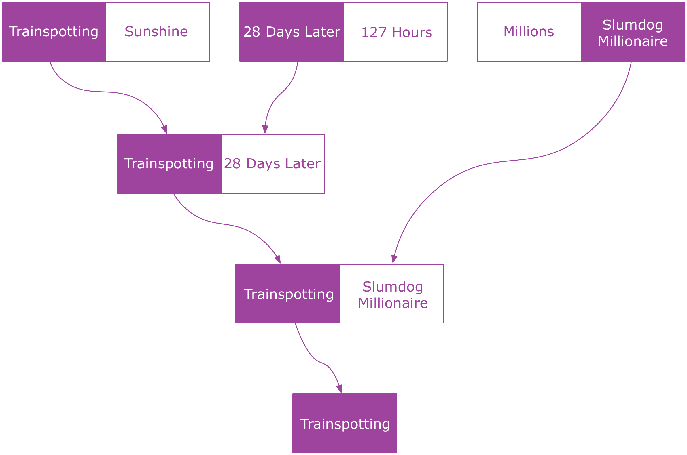

## Full-Stack Redux Tuturial（译）
> 原文链接： [Full-Stack Redux Tuturial](http://teropa.info/blog/2015/09/10/full-stack-redux-tutorial.html)
> 
>作者: [Tero Parviainen](http://teropa.info/) ([@teropa](https://twitter.com/teropa))

### 使用Redux, React,Immutable并且基于测试优先开发的综合指南
Redux是目前JavaScript领域中最令人兴奋的事情之一。它从众多库和框架中脱颖而出，做了很多绝对正确的事情：一个简单、可预测的状态模型。强调函
数式编程和不可便数据。一个微小但集中的API...怎能让我们不喜欢它？

Redux是一个非常小的库，学习它的所有API并不是很困难。但是对于很多人来说，它创建了一种范式转换：微量的构建块和一些自我约束的限制(包括纯函
数和不可变数据)可能让人感觉受到限制。所以到底应该如何完成工作？

本教程将指导您从头开始构建一个全栈的Redux和ImmutableJs应用。我们将使用测试优先开发真实应用程序，该程序后端基于Node+Redux构建，前端基于
React+Redux构建。在我们的工具箱里还包括ES6,Babel,Socket.io,Webpack以及Mocha.它非常有趣，你可以在任何时候跟上它的节奏。

### 目录
* [目录](#1)
* 你所需要的
* App
* 体系结构
* 服务端应用程序
  * 设计应用程序状态树(State Tree)
  * 项目安装
  * 使用不可变数据的舒适
  * 使用纯函数编写逻辑层
    * 加载实体
    * 开始投票
    * 投票中
    * 移动到下一对
    * 结束投票
  * 介绍 Actions 和 Reducers
  * 组合 Reducers 的味道
  * 介绍Redux Store
  * 设置Socket.io服务器
  * 广播来自Redux监听器的状态
  * 接收远程Redux Actions
* 客户端应用程序
  * 客户端项目安装
    * 支持单元测试
  * React 以及 React热加载(react-hot-loader)
  * 编写投票界面UI
  * 编写投票结果界面UI以及处理路由
  * react从Redux获得数据
  * 安装Socket.io客户端
  * 从服务端接收Actions
  * 从react组件分发Actions
  * 使用Redux中间件向服务端发送Actions
  
### 你所需要的

本教程对知道如何编写JavaScript应用程序的工程师是最有用的。我们将使用Node,ES6, React, Webpack和Babel,因此如果你已经熟悉了这些工具,
你学习接下来的内容应该不会遇到麻烦。否则，你应该先去学习一些相关基础知识。

谈及工具,你只要有带有NPM的Node和一款喜欢的文本编辑器即可，事实就是这样。

### APP

我们将开发一款投票APP，它可以为党派、会议和聚会提供现场投票。   

这个想法是，我们将有一系列要投票的东西： 电影、歌曲、编程语言、Horse JS quotes等任何东西。APP将它们成对放在一起PK，所以在每一轮人们都
可以在二者中投票给喜欢的。当只剩下一个时，它便是胜者。

例如，下面是关于Danny Boyle的最佳电影的投票流程图：
