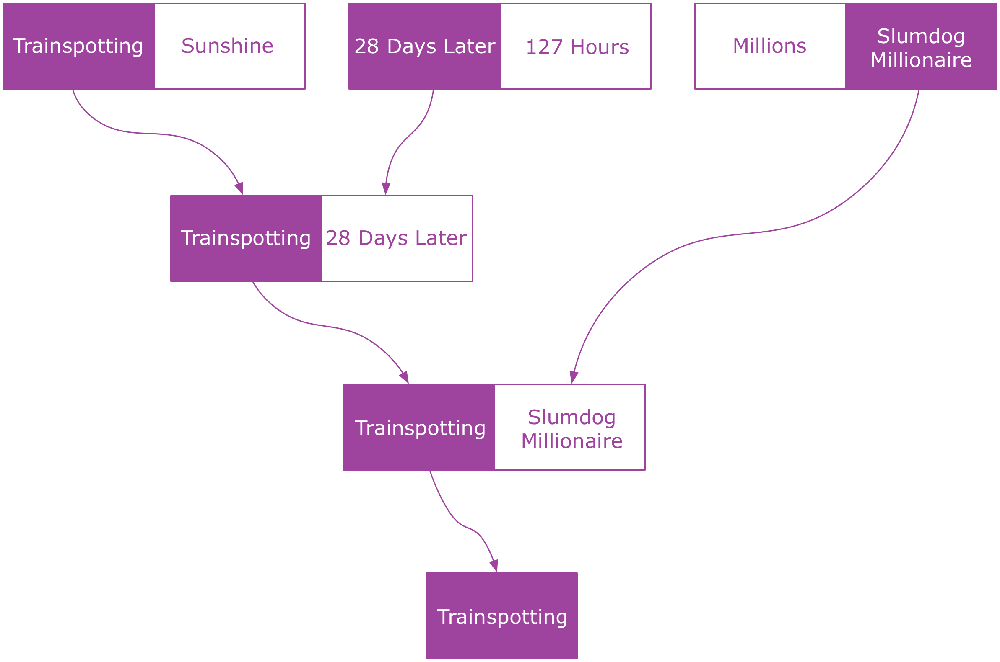
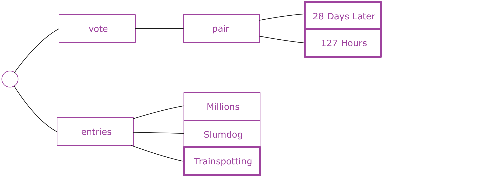
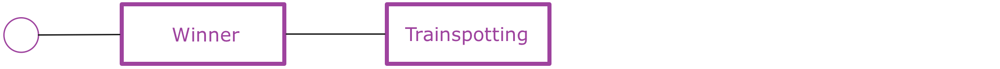
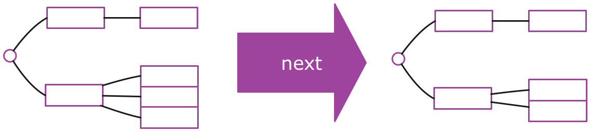

## Full-Stack Redux Tuturial（译）
> 原文链接： [Full-Stack Redux Tuturial](http://teropa.info/blog/2015/09/10/full-stack-redux-tutorial.html)
>
>作者: [Tero Parviainen](http://teropa.info/) ([@teropa](https://twitter.com/teropa))

### 使用Redux, React,Immutable并且基于测试优先开发的综合指南
Redux是目前JavaScript领域中最令人兴奋的事情之一。它从众多库和框架中脱颖而出，做了很多绝对正确的事情：一个简单、可预测的状态模型。强调函
数式编程和不可便数据。一个微小但集中的API...怎能让我们不喜欢它？

Redux是一个非常小的库，学习它的所有API并不是很困难。但是对于很多人来说，它创建了一种范式转换：微量的构建块和一些自我约束的限制(包括纯函
数和不可变数据)可能让人感觉受到限制。所以到底应该如何完成工作？

本教程将指导您从头开始构建一个全栈的Redux和ImmutableJs应用。我们将使用测试优先开发真实应用程序，该程序后端基于Node+Redux构建，前端基于
React+Redux构建。在我们的工具箱里还包括ES6,Babel,Socket.io,Webpack以及Mocha.它非常有趣，你可以在任何时候跟上它的节奏。

<h3 id="content"> 目录</h3>
* [目录](#content)
* [你所需要的](#What_You_Will_Need)
* [App](#App)
* [体系结构](#The_Architecture)
* [服务端应用程序](#The_Server_Application)
  * [设计应用程序State Tree](#Designing_The_Application_State_Tree)
  * [项目安装](#Project_Setup)
  * [熟悉不可变数据](#Getting_Comfortable_With_Immutable)
  * [使用纯函数编写逻辑层](#Writing_The_Application_Logic_With_Pure_Functions)
    * [加载条目](#Loading_Entries)
    * [开始投票](#Starting_The_Vote)
    * [投票中](#Voting)
    * [开始下一对](#Moving_to_The_Next_Pair)
    * [结束投票](#Ending_The_Vote)
  * 介绍 Actions 和 Reducers
  * 组合 Reducers 的味道
  * 介绍Redux Store
  * 设置Socket.io服务器
  * 广播来自Redux监听器的状态
  * 接收远程Redux Actions
* 客户端应用程序
  * 客户端项目安装
    * 支持单元测试
  * React 以及 React热加载(react-hot-loader)
  * 编写投票界面UI
  * 编写投票结果界面UI以及处理路由
  * react从Redux获得数据
  * 安装Socket.io客户端
  * 从服务端接收Actions
  * 从react组件分发Actions
  * 使用Redux中间件向服务端发送Actions

<h3 id="What_You_Will_Need"> 你所需要的</h3>

本教程对知道如何编写JavaScript应用程序的工程师是最有用的。我们将使用Node,ES6, React, Webpack和Babel,因此如果你已经熟悉了这些工具,
你学习接下来的内容应该不会遇到麻烦。否则，你应该先去学习一些相关基础知识。

谈及工具,你只要有带有NPM的Node和一款喜欢的文本编辑器即可，事实就是这样。

<h3 id="App"> App</h3>

我们将开发一款投票APP，它可以为党派、会议和聚会提供现场投票。

这个想法是，我们将有一系列要投票的东西： 电影、歌曲、编程语言、Horse JS quotes等任何东西。APP将它们成对放在一起PK，所以在每一轮人们都
可以在二者中投票给喜欢的。当只剩下一个时，它便是胜者。

例如，下面是关于Danny Boyle的最佳电影的投票流程图：


本APP将有两个独立的用户界面：投票UI可以适用于移动设备，或者其他可以使用浏览器的东西。投票结果UI设计为投影在投影仪或者其他大屏幕上。它将
实时显示正在投票的结果。


<h3 id="The_Architecture"> 体系结构</h3>

本系统在技术上由两部分组成：基于React的浏览器APP提供用户界面和一个服务器应用程序，我们使用Node处理投票逻辑。两者之间使用WebSockets进行
通信。

我们将使用Redux来组织客户端和服务端的代码。为了保持状态，我们将使用不可变的数据结构。

---
尽管客户端和服务端的代码会有许多相似的地方——例如，都将使用Redux——但它并不是真的同构应用(universal/isomorphic application)，它们实际
上并不能共享任何代码。

它更像是一个通过传递消息进行通信的应用程序组成的分布式系统。

---

<h3 id="The_Server_Application"> 服务端应用程序</h3>

我们打算先编写Node程序，之后再编写React程序。这可以使我们在开始思考UI界面前专注于核心逻辑。

随着我们创建服务端程序，我们将熟悉Redux和Immutable，并将看到如何使用它们构建应用程序。Redux大多数情况下与React应用程序相关，但是它实际
上并不局限于这一种用例。我们将要学习的一部分是Redux在其他上下文中是多么有用。

我推荐跟着教程从头开始写APP，但是如果你也可以选择直接从[github](https://github.com/teropa/redux-voting-server)上clone代码。

<h3 id="Designing_The_Application_State_Tree"> 设计应用程序State Tree</h3>

设计一个Redux应用程序经常从考虑应用程序的state开始。它描述了在任何给定的时间，您的应用程序将要发生什么。

所有的框架和体系结构都有state。在Ember应用程序和Backbone应用程序中,state在Model里面。在Augular应用程序中，state经常存放在
Factories和Services里面。在大部分的Flux实现中，state存放在Stores里面。Redux和上面提到的有何不同呢？

主要的不同是在Redux中，应用程序的state被存放在单一的树结构中。换句话说，一切你所知道的关于你的应用程序的state全部存放在一个由maps和
arrays组成的数据结构中。

这产生了很多后果，马上我们就会看到。最重要的后果之一是这如何让你从应用程序的行为中独立出来思考应用程序的state(how this lets you think
about the application state in isolation from the application's behavior).State是纯数据。它没有方法或者函数。它并没有卷在对象
当中。所有的都存放在同一个地方。

这可能听起来像是一种局限，尤其是你有OO的经历来学习Redux。但实际上它更像是一种解放，因为这种方式可以让你专注于数据并且只是数据。如果你花
一点时间来设计应用程序state, 几乎一切都会遵循。

这并不是说你总是先设计整个state树，然后才是APP剩下的部分。通常你最终以并行方式演进。但是，我发现在开始写代码之前，对state树应该如何设计
有一个初步的认识是非常有用的。

所以，让我们看下我们的投票系统的state树应该是什么样的。该系统的目的是在一些东西(电影、乐队等等)上投票。一种合理的初始state可能是将要被
投票的东西的集合。我们可以称这个集合为entries:


当第一次投票开始，此时应该有一些方式来区分哪个是当前被投票的。在这种情况下，应该有一个vote entry在state中，它保留着目前处于投票状态的
物品对。物品对或许应该从entries集合中拿出来。


在投票开始之后，票数也应该被存储起来。我们可以用vote中另外的数据结构来做这件事。


当一次投票结束，失败的entry将会被舍弃，胜利的entry将会被放回entries，作为最后一个物品(item).它之后将会与其他物品进行PK。接下来的两个
entry同样会被放在vote中。


只要还有待投票的entries，我们可以想象出这种state循环。在某些时候，将只剩下一个entry。这时，我们就可以称它为胜者并结束投票:


这看起来似乎是一种可行的设计。有很多不同的方法来设计这些要求的state，这可能不是最佳的。但是这并不重要。只需要在开始的时候足够好就行，
重要的是我们已经建立了一种具体的应用程序该如何执行任务的想法。这是我们甚至没有考虑任何代码之前就完成的！

<h3 id='Project_Setup)'> 项目安装</h3>

说了这么多废话，是时候开始干活了。在我们做任何事情之前，我们需要建立一个项目目录并且初始化它作为一个NPM项目：
```
mkdir voting-server
cd voting-server
npm init -y
```
输入命令后的结果是在voting-server目录下有一个文件package.json.

我们打算使用ES6语法来编写程序。虽然node从4.0.0版本支持很多ES6特性，但是它仍然不支持模块化(modules),而模块化正是我们想用的。我们需要向
项目中添加babel, 这样我们能够随心所欲的使用ES6特性，babel会将代码转换成ES5:
```
npm install --save-dev babel-core babel-cli babel-preset-es2015
```
因为我们将写一系列的单元测试，我们同样需要一些库来写它们：
```
npm install --save-dev  mocha chai
```
[Mocha](https://mochajs.org/)是我们将要使用的测试框架，[Chai](http://chaijs.com/)是一个断言(assertion)/期望(expectation)库，我
们在测试中使用它来指定我们期望发生的事情。

我们可以使用node_modules下的mocha命令来运行测试。
```
./node_modules/mocha/bin/mocha --compilers js: babel-core/register --recursive
```
这条命令告诉Mocha递归的寻找项目中的所有测试并且运行它们。在运行前它先使用babel转化ES6代码。

从长远来看，在我们的package.json中存储这条命令将会更容易：
```
//package.json
"script": {
  "test": "Mocha --compilers js: babel-core/register --recursive"
},
```
我们需要做的另外一件事是使babel的ES6/ES2015语法支持功能生效。这可以通过激活我们已经安装过的**babel-preset-es2015**包来完成。我们只需
要在package.json中添加babel部分：

```
//package.json
"babel": {
  "preset": ["es2015"]
},
```
现在我们可以使用npm命令来运行测试。

```
npm run test
```
**test:watch** 命令可以用来启动一个进程监控代码中的变化并且在每次变化后运行测试:
```
//package.json
"script": {
  "test": "mocha --compolers js:babel-core/register recursive",
  "test:watch": "npm run test -- --watch"
},
```
我们首先打算用的库是Facebook的immutable, 它可以为我们提供一些数据结构使用。我们将在下一个章节讨论immutable，现在我们仅仅将它加入到项
目中来，同时安装的有chai-immutable库，它可以扩展Chai来支持比较Immutable数据结构(comparing Immutable data structures):
```
npm install --save immutable
npm install --save-dev chai-immutable
```
我们需要在任何测试运行前插入chai-immutable.我们可以在一个很小的test_heler文件中做到这一点，所以我们接下来应该创建它：
```
// test/test_helper.js

import chai from 'chai';
import chaiImmutable from 'chai-immutable';

chai.use(charImmutable);
```
接下来我们需要在Mocha启动测试之前导入test_helper文件：
```
//package.json

"script": {
  "test": "mocha --compilers js:babel-core/register --require ./test/test_helper.js --recursive"
},
```
这就是我们在开始阶段所有需要安装的！！！

<h3 id="Getting_Comfortable_With_Immutable"> 熟悉不可变数据</h3>

关于Redux架构的第二个重点是，state不仅仅是一颗树，实际上他是一个immutable tree.

看上一节中的树，只通过更新树中的代码来更改应用程序的状态，这似乎是一个合理的想法：在maps中执行修改操作，在arrays中执行删除操作等等。然而
这并不是Redux所做的事。

一个Redux的状态树是一个immutable data structure. 这意味着一旦你有一颗state tree, 只要它还存在它将再也不会改变。它将永远保持相同的状
态。接下来你该如何进入下一个state是通过生成另外一颗state tree来反映你想要作出的改变。

这意味着应用程序的任意两个连续状态是存储在两个分开且独立的树中(separate and independent)。从一个状态跳到下一状态是通过执行一个函数，它
会获取当前的状态并返回一个新的状态。



这为什么会是好想法呢？ 人们首先提到的是如果你拥有一棵树中所有的state,并且进行了一些非破坏性的更新，你可以不需要坐太多额外的工作来保存应用
程序的历史： 仅需要保留以前state trees的集合。然后你可以执行 undo/redo 等“免费”操作——只需要将当前应用程序状态设置为历史记录中的上一个
state tree或者下一个state tree. 你同样可以序列化历史记录并且将它发送到一些存储介质中保存，这样你可以在之后重播(replay)它,这在debugging
的时候非常有用。

然而，我想说除了这些功能之外，关于immutable data最重要的是它将如何简化你的代码。你可以使用纯函数(pure function)来编程:这些函数除了获
取数据和返回数据外，不做任何其他操作。这些是可以信赖的、行为可预测的函数。你可以随意的调用它们，并且它们的行为不会改变。给它们相同的参数，
它们就会返回相同的结果。它们不会改变世界的state(they`re not going to change the state of world. //懵逼脸，为什么突然冒出这句话)。
测试将变得很随意，因为在你调用之前，不需要设置一些stub或者其他假的操作（other fakes to "prepare the universe"）.它仅仅是输入数据，
输出数据。

Immutable data structures是我们建立应用程序state需要用的材料。所以让我们花点时间来编写一些单元测试来说明它是如何工作的。

---

如果你已经熟悉了immutable data和immutable库，可以随意的跳过下一部分。

---

为了熟悉immutability的想法，我们先讨论可能是最简单的数据结构:如果有一个“计数器”应用程序，它的state仅仅是单个数字。state将会从0到1,2,...

我们已经习惯了将数字考虑为immutable data.当“计数器”增加，我们不会变化这个数字。因为在数字上没有setter，让数字变化实际上是不可能的。你
不能说**42.setValue(43)**.

取而代之的是我们获得另外一个数字，它是将之前的数字加1后的结果。我们可以纯函数来实现。它的参数是当前的state并且它的返回值将作为下一个state
被使用。下面是这个函数以及与它相关的单元测试：

```
// test/immutable_spec.js

import {expect} from 'chai'

describe('immutability', ()=> {

  describe('a number', ()=> {

    function increment(currentState) {
      return currentState+1;
    }

    it('is immutable', ()=> {
      let state = 42;
      let nextState = increment(state);

      expect(nextState).to.equal(43);
      expect(state).to.equal(42);
    });

  });

});
```

当调用increment时state不会改变的事实是显而易见的。怎么可能呢？数字是immutable!!!

---

你可能已经注意到这个测试和我们的应用程序完全无关——我们甚至没有任何应用程序代码！

这个测试只是一个学习工具而已。我发现如果你打算研究一个新的API或者技术时，通过编写一些单元测试来证明一些想法是有用的，这正是我们在这里所
做的。Kent Beck在它的[TDD书](https://www.amazon.com/Test-Driven-Development-By-Example/dp/0321146530)中称这种测试为“学习型测
试”.

---

我们接下来要做的是拓展这种不变量的想法到所有类型的数据结构中，而不仅仅是数字。

例如，一个应用程序的state是一系列的电影，我们可以使用Immutable的list。添加一部电影生成新的电影列表的操作是通过将旧的电影列表和新的电影
相结合来完成的。至关重要的是，旧的电影列表在操作后仍然没有改变。

```
// test/immutable_spec1.js

/**
 * Created by qixin on 27/11/2016.
 */

import {expect} from 'chai';
import {List} from 'immutable';

describe('immutability', () => {

    //..

    describe('A list', () => {

        function addMovie(currentState, movie) {
            return currentState.push(movie);
        };

        it('is immutable', () => {
            let state = List.of('Transplotting', '28 Days Later');
            let nextState = addMovie(state, 'Sunshine');

            expect(nextState).to.equal(List.of(
                'Transplotting',
                '28 Days Later',
                'Sunshine'
            ));
            expect(state).to.equal(List.of(
                'Transplotting',
                '28 Days Later'
            ));
        });

    });

});

```
如果我们向普通的数组中push一项之后，旧的state是不会保持不变的！因为我们使用了Immutable List来替代，我们就有了与number示例一样的语义。

这个想法扩展到整个state tree也是如此。一个state tree只是由Lists, Maps或者一些其他类型的集合嵌套形成的。在它上面进行操作相当于生成一颗
新的state tree,并保留下来旧的state tree. 如果state tree是一个Map,里面有一个键'Movie'指向了一个电影列表，添加一部电影意味着我们需要
新创建一个map,键'Movie'指向一个新的lis：
```
// test/immutable_spec2.js

/**
 * Created by qixin on 27/11/2016.
 */
import {expect} from 'chai';
import {List, Map} from 'immutable';

describe('immutability', () => {

    //..

    describe('a tree', () => {

        function addMovie(currentState, movie) {
            return currentState.set(
                'movies',
                currentState.get('movies').push(movie)
            );
        };

        it('is immutable', ()=> {
           let state = Map({
              movies: List.of(
                  'Transplotting',
                  '28 Days Later'
              )
           });
           let nextState = addMovie(state, 'Sunshine');

           expect(nextState).to.equal(Map({
               movies: List.of(
                   'Transplotting',
                   '28 Days Later',
                   'Sunshine'
               )
           }));
           expect(state).to.equal(Map({
               movies: List.of(
                   'Transplotting',
                   '28 Days Later'
               )
           }));
        });

    });

})
```
这和之前的操作是同样的方法，仅仅是为了拓展展示在嵌套的数据结构中同样有效。同样的想法适用于所有类型和大小的数据。

对于如此类的嵌套数据结构的操作，immutable提供了几个帮助函数，可以更容易的"到达"嵌套数据结构来产生新的值。在
这种情况下，我们可以使用update函数来使代码更加简洁：
```
// test/immutable_spec3.js

fuction addMovie(currentState, movie) {
  return currentState.update('movies', movies => movies.push(movie));
};
```
上述例子可以让我们了解immutable数据。它将被用作我们应用程序的state. 还有很多功能包含在immutable API中，我们
仅仅简单的介绍一些"皮毛"。

---

虽然immutable data是Redux体系架构中的关键点，但是使用Immutable库并不是必须的。事实上，在Redux官方文档中大部
分使用的还是plain old JavaScript objects和数组，简单的避免按照惯例改变它们的值。

在这篇教程中，我们使用Immutable库来代替它，主要有以下几个原因：
* Immutable`s data structures是从头开始设计被用来不可变使用，因此提供了一些使immutable操作更方便的API。
* 我赞同Rich Hickey的观点[there is no such as things as immutability by convention](http://codequarterly.com/2011/rich-hickey/)
。如果你使用可变的数据结构，你或者其他人迟早会错误地改变它们。当你刚刚开始的时候尤其如此，像object.freeze()这类
东西可能会有帮助。
* Immutable·s data structure是持久的([persistent](https://en.wikipedia.org/wiki/Persistent_data_structure))
，这意味着它们是内部结构化的，使得新的版本在时间和存储上都是高效的，即使对于大型的state tree也是如此。使用plain
objects和数组可能会造成过量的复制，这会降低性能。

---

<h3 id="Writing_The_Application_Logic_With_Pure_Functions"> 使用纯函数编写逻辑层</h3>

在了解了immutable state trees和在树上进行操作的纯函数。我们可以将我们的注意力转移到投票系统的逻辑层上。应用程序
的核心将由我们一直在讨论的部分组成：一个tree structure以及一些产生新版tree structure的函数。

<h3 id="loading_entries"> 加载条目</h3>

首先，正如我们前面所讨论的，应用程序允许"加载"一系列想要被投票的条目。我们应该有一个**setEntries**函数，它可以获取之
前的state和一系列条目，生成一个包括所有条目的state,下面是相关的测试代码：
```
/**
 * Created by qixin on 27/11/2016.
 */

import {List, Map} from 'immutable';
import {expect} from 'chai';

import {setEntries} from '../src/core';

describe('application logic', () => {

    describe('setEntries', () =>{

        it('add the entries to the state', () => {
           const state = Map();
           const entries = List.of('Transplotting', '28 Days Later');
           const nextState = setEntries(state, entries);
           expect(nextState).to.equal(Map({
               entries: List.of('Transplotting', '28 Days Later')
           }));
        });
    });
})
```

**setEntries**的最初实现尽可能做最简单的事情：它可以在Map中设置一项键为'entries'，值为给定的一系列entries.这
生成了我们之前设计的第一个state tree.

```
/**
 * Created by qixin on 27/11/2016.
 */
export function setEntries(state, entries) {
    return state.set('entries', entries);
}

```

为了方便，我们允许输入的条目是一个普通的js数组(或者是其他可迭代的集合)。当在state tree中，它仍然是一个immutable List。

```
// test/core.js

        it('converts to immutable', () =>{
            const state = Map();
            const entries = ['Transplotting', '28 Days Later'];
            const nextState = setEntries(state, entries);
            expect(nextState).to.equal(Map({
                entries: List.of('Transplotting', '28 Days Later')
            }));
        });
```
在实现中，我们应该传递给定的entries给List构造器来满足这个需求：
```
/**
 * Created by qixin on 27/11/2016.
 */
import {List} from 'immutable';


export function setEntries(state, entries) {
    return state.set('entries', List(entries));
}


```

<h3 id="Starting_The_Vote"> 开始投票</h3>

在已经拥有entries set的state上，调用next函数后我们开始投票。这意味着，从我们设计的状态树的第一个到第二个(图1 --- 图2)。

函数不需要额外的参数。在state中应该建立一个**vote** Map, 并且两个条目包含在键为pair的键值对中。处于投票阶段的条目不应
该再出现在entries List中。

```
// test/core_spec1.js

/**
 * Created by qixin on 30/11/2016.
 */

import {List, Map} from 'immutable';
import {expect} from 'chai';
import {setEntries, next, mapTest1} from '../src/core';


describe('application logic', () => {

    //..

    describe('next', () => {

        it('take the next two entries under vote', () => {
            const state = Map({
                entries: List.of('Transpotting', '28 Days Later', 'Sunshine')
            });
            const nextState = next(state);
            expect(nextState).to.equal(Map({
                vote: Map({
                    pair: List.of('Transpotting', '28 Days Later')
                }),
                entries: List.of('Sunshine')
            }));
        });

    });

});
```
实现这个操作将会[merge](https://facebook.github.io/immutable-js/docs/#/Map/merge)一个更新进old state,更新包括
将头两个条目放到一个List中，其他在仍存放在新版的**entries**中：
```
// test/core.js

import {List, Map} from 'immutable';

//...

export function next(state) {
    const entries = state.get('entries');
    return state.merge({
        vote: Map({pair: entries.take(2)}),
        entries: entries.skip(2)
    });
}
```

<h3 id="Voting"> 投票中</h3>

当一个投票进行时，应该可以让人们对条目进行投票。当对一个条目进行新的投票时，它的"计数"（tally)也应该出现在投票中。如果一个
条目已经有了计数，它应该被增加：
```
// test/core_spec3.js

/**
 * Created by qixin on 30/11/2016.
 */

import {List, Map} from 'immutable';
import {expect} from 'chai';
import {setEntries, next, vote} from '../src/core';

describe('application logic', () => {

    //..

    describe('vote', () => {

        it('creates a tally for the voted entry', () => {
            const state = Map({
                vote: Map({
                    pair: List.of('Transplotting', '28 Days Later')
                }),
                entries: List()
            });

            const nextState = vote(state, 'Transplotting');
            expect(nextState).to.equal(Map({
                vote: Map({
                    pair: List.of('Transplotting', '28 Days Later'),
                    tally: Map({
                        'Transplotting': 1
                    })
                }),
                entries: List()
            }));
        });

        it('adds to existing tally for the voted entry', () => {
            const state = Map({
                vote: Map({
                    pair: List.of('Transplotting', '28 Days Later'),
                    tally: Map({
                        'Transplotting': 3,
                        '28 Days Later': 2
                    })
                }),
                entries: List()
            })

            const nextState = vote(state, 'Transplotting');
            expect(nextState).to.equal(Map({
                vote: Map({
                    pair: List.of('Transplotting', '28 Days Later'),
                    tally: Map({
                        'Transplotting': 4,
                        '28 Days Later': 2
                    })
                }),
                entries: List()
            }));

        });
    });
});
```

---

 你可以使用Immutable中的[fromJS](https://facebook.github.io/immutable-js/docs/#/fromJS)函数更简洁的构建这些嵌
 套的Maps和Lists。

---

我们可以下面的代码来通过这些测试：
```
// test/core.js

export function vote(state, entry) {
    return state.updateIn(
        ['vote', 'tally', entry],
        0,
        tally => tally+1
    );
}
```
使用[updateIn](https://facebook.github.io/immutable-js/docs/#/Map/updateIn)是多么的优雅！这段代码的意思是"进入
潜逃路由结构路径['vote', 'tally', 'Transplotting'], 并且在这里应用该函数。如果在路径中有键不存在，将会在该位置创建
新的Maps。如果最后的值缺失，用"0"来进行初始化。

它包装了很多层(It packs a lot of punch)，但这正是让我们可以愉快得使用Immutable data structures的那类代码，因此花点
时间来熟悉它是值得的。
```
updateIn()

updateIn(keyPath: Array<any>, updater: (value: any) => any): Map<K, V>
updateIn(
    keyPath: Array<any>,
    notSetValue: any,
    updater: (value: any) => any
): Map<K, V>

updateIn(keyPath: Iterable<any, any>, updater: (value: any) => any): Map<K, V>

updateIn(
    keyPath: Iterable<any, any>,
    notSetValue: any,
    updater: (value: any) => any
): Map<K, V>
```

<h3 id="Moving_to_The_Next_Pair"> 开始下一对</h3>

一旦关于一对条目的投票结束，我们应该开展下一对条目的投票。当前投票结果获胜的条目应该被保存，并且添加在entries的最后，以便
后来仍然可以被用来与其他条目配对pk。如果票数相同，两个条目都应该保存。

我们在已经实现的**next**函数中添加这个逻辑：
```
/**
 * Created by qixin on 30/11/2016.
 */

import {List, Map, fromJS} from 'immutable';
import {expect} from 'chai';
import {next} from '../src/core';

describe("application logic", () => {

    //..

   describe('winnerAndNext', () => {

       it('put winner of current vote back to entries', () => {
           const state = fromJS({
               vote: {
                   pair: ['Transplotting', '28 Days Later'],
                   tally: {
                       'Transplotting': 4,
                       '28 Days Later': 2
                   }
               },
               entries: ['Sunshine', 'Millions', '127 Hours']
           });

           const nextState = next(state);
           expect(nextState).to.equal(fromJS({
               vote: {
                   pair: ['Sunshine', 'Millions']
               },
               entries: ['127 Hours', 'Transplotting']
           }));
       });

       it('puts both from tied vote back to entries', () => {
           const state = Map({
               vote: Map({
                   pair: List.of('Trainspotting', '28 Days Later'),
                   tally: Map({
                       'Trainspotting': 3,
                       '28 Days Later': 3
                   })
               }),
               entries: List.of('Sunshine', 'Millions', '127 Hours')
           });
           const nextState = next(state);
           expect(nextState).to.equal(Map({
               vote: Map({
                   pair: List.of('Sunshine', 'Millions')
               }),
               entries: List.of('127 Hours', 'Trainspotting', '28 Days Later')
           }));
       });
   });
});

```
在实现中，我们只是将当前投票的“获胜者”连接到entries后面.我们可以使用getWinners新功能找到这些赢家：
```
// src/core.js

function getWinners(vote) {
  if (!vote) return [];
  const [a, b] = vote.get('pair');
  const aVotes = vote.getIn(['tally', a], 0);
  const bVotes = vote.getIn(['tally', b], 0);
  if      (aVotes > bVotes)  return [a];
  else if (aVotes < bVotes)  return [b];
  else                       return [a, b];
}

export function next(state) {
  const entries = state.get('entries')
                       .concat(getWinners(state.get('vote')));
  return state.merge({
    vote: Map({pair: entries.take(2)}),
    entries: entries.skip(2)
  });
}
```

<h3 id="Ending_The_Vote"> 结束投票</h3>

在某一时刻，当投票结束时将只剩下一个条目。这时我们将有一个获胜的entry.我们应该做的不是试图形成下一个
投票，而是明确的在state中设置赢者。与此同时，投票结束了。
```
// test/core_spec5.js

describe('next', () => {

  // ...

  it('marks winner when just one entry left', () => {
    const state = Map({
      vote: Map({
        pair: List.of('Trainspotting', '28 Days Later'),
        tally: Map({
          'Trainspotting': 4,
          '28 Days Later': 2
        })
      }),
      entries: List()
    });
    const nextState = next(state);
    expect(nextState).to.equal(Map({
      winner: 'Trainspotting'
    }));
  });

});
```
在**next**的实现中，我们应该有一个特殊条件来处理当entries的大小变为1的情况：
```
// src/core.js

export function next(state) {
  const entries = state.get('entries')
                       .concat(getWinners(state.get('vote')));
  if (entries.size === 1) {
    return state.remove('vote')
                .remove('entries')
                .set('winner', entries.first());
  } else {
    return state.merge({
      vote: Map({pair: entries.take(2)}),
      entries: entries.skip(2)
    });
  }
}
```
我们在这里可以仅仅返回**Map({winner: entries.first()})**。但是我们并没有这么做，取而代之的是我们仍然
接受old state做为起点并且明确的从中去除了键'vote'和'entries'。这么做的原因是面向未来的(future-proofing):
在某些时候，我们可能在state中有一些不相关的数据，它应该不变地通过这个函数。这些状态转换函数中总是将old state
渐变为new state而不是从头开始构建new state通常是个好主意。

关于我们应用程序的核心逻辑，这里已经有了一个由几个函数组成的可接受版本。我们同样还有关于它们的单元测试，写这些
测试是相对容易的：no setup, no mock, no stub. 这是纯函数的魅力。我们可以调用它们并检查返回值。

注意：到目前为止，我们还没有安装redux. 我们可以全身心的投入到应用程序的逻辑中，不需要将"框架"带进来。这是一件
非常令人愉快的事情。