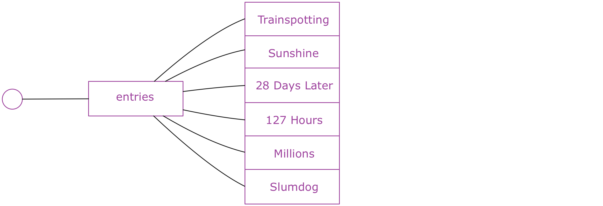

## Full-Stack Redux Tuturial（译）
> 原文链接： [Full-Stack Redux Tuturial](http://teropa.info/blog/2015/09/10/full-stack-redux-tutorial.html)
> 
>作者: [Tero Parviainen](http://teropa.info/) ([@teropa](https://twitter.com/teropa))

### 使用Redux, React,Immutable并且基于测试优先开发的综合指南
Redux是目前JavaScript领域中最令人兴奋的事情之一。它从众多库和框架中脱颖而出，做了很多绝对正确的事情：一个简单、可预测的状态模型。强调函
数式编程和不可便数据。一个微小但集中的API...怎能让我们不喜欢它？

Redux是一个非常小的库，学习它的所有API并不是很困难。但是对于很多人来说，它创建了一种范式转换：微量的构建块和一些自我约束的限制(包括纯函
数和不可变数据)可能让人感觉受到限制。所以到底应该如何完成工作？

本教程将指导您从头开始构建一个全栈的Redux和ImmutableJs应用。我们将使用测试优先开发真实应用程序，该程序后端基于Node+Redux构建，前端基于
React+Redux构建。在我们的工具箱里还包括ES6,Babel,Socket.io,Webpack以及Mocha.它非常有趣，你可以在任何时候跟上它的节奏。

### 目录
* [目录](#1)
* 你所需要的
* App
* 体系结构
* 服务端应用程序
  * 设计应用程序状态树(State Tree)
  * 项目安装
  * 使用不可变数据的舒适
  * 使用纯函数编写逻辑层
    * 加载实体
    * 开始投票
    * 投票中
    * 移动到下一对
    * 结束投票
  * 介绍 Actions 和 Reducers
  * 组合 Reducers 的味道
  * 介绍Redux Store
  * 设置Socket.io服务器
  * 广播来自Redux监听器的状态
  * 接收远程Redux Actions
* 客户端应用程序
  * 客户端项目安装
    * 支持单元测试
  * React 以及 React热加载(react-hot-loader)
  * 编写投票界面UI
  * 编写投票结果界面UI以及处理路由
  * react从Redux获得数据
  * 安装Socket.io客户端
  * 从服务端接收Actions
  * 从react组件分发Actions
  * 使用Redux中间件向服务端发送Actions
  
### 你所需要的

本教程对知道如何编写JavaScript应用程序的工程师是最有用的。我们将使用Node,ES6, React, Webpack和Babel,因此如果你已经熟悉了这些工具,
你学习接下来的内容应该不会遇到麻烦。否则，你应该先去学习一些相关基础知识。

谈及工具,你只要有带有NPM的Node和一款喜欢的文本编辑器即可，事实就是这样。

### APP

我们将开发一款投票APP，它可以为党派、会议和聚会提供现场投票。   

这个想法是，我们将有一系列要投票的东西： 电影、歌曲、编程语言、Horse JS quotes等任何东西。APP将它们成对放在一起PK，所以在每一轮人们都
可以在二者中投票给喜欢的。当只剩下一个时，它便是胜者。

例如，下面是关于Danny Boyle的最佳电影的投票流程图：

本APP将有两个独立的用户界面：投票UI可以适用于移动设备，或者其他可以使用浏览器的东西。投票结果UI设计为投影在投影仪或者其他大屏幕上。它将
实时显示正在投票的结果。

.png)

### 体系结构

本系统在技术上由两部分组成：基于React的浏览器APP提供用户界面和一个服务器应用程序，我们使用Node处理投票逻辑。两者之间使用WebSockets进行
通信。

我们将使用Redux来组织客户端和服务端的代码。为了保持状态，我们将使用不可变的数据结构。

---
尽管客户端和服务端的代码会有许多相似的地方——例如，都将使用Redux——但它并不是真的同构应用(universal/isomorphic application)，它们实际
上并不能共享任何代码。

它更像是一个通过传递消息进行通信的应用程序组成的分布式系统。

---

### 服务端应用程序

我们打算先编写Node程序，之后再编写React程序。这可以使我们在开始思考UI界面前专注于核心逻辑。

随着我们创建服务端程序，我们将熟悉Redux和Immutable，并将看到如何使用它们构建应用程序。Redux大多数情况下与React应用程序相关，但是它实际
上并不局限于这一种用例。我们将要学习的一部分是Redux在其他上下文中是多么有用。

我推荐跟着教程从头开始写APP，但是如果你也可以选择直接从[github](https://github.com/teropa/redux-voting-server)上clone代码。

### 设计应用程序状态树(Designing The Application State Tree)

设计一个Redux应用程序经常从考虑应用程序的state开始。它描述了在任何给定的时间，您的应用程序将要发生什么。

所有的框架和体系结构都有state。在Ember应用程序和Backbone应用程序中,state在Model里面。在Augular应用程序中，state经常存放在
Factories和Services里面。在大部分的Flux实现中，state存放在Stores里面。Redux和上面提到的有何不同呢？

主要的不同是在Redux中，应用程序的state被存放在单一的树结构中。换句话说，一切你所知道的关于你的应用程序的state全部存放在一个由maps和
arrays组成的数据结构中。

这产生了很多后果，马上我们就会看到。最重要的后果之一是这如何让你从应用程序的行为中独立出来思考应用程序的state(how this lets you think
about the application state in isolation from the application's behavior).State是纯数据。它没有方法或者函数。它并没有卷在对象
当中。所有的都存放在同一个地方。

这可能听起来像是一种局限，尤其是你有OO的经历来学习Redux。但实际上它更像是一种解放，因为这种方式可以让你专注于数据并且只是数据。如果你花
一点时间来设计应用程序state, 几乎一切都会遵循。

这并不是说你总是先设计整个state树，然后才是APP剩下的部分。通常你最终以并行方式演进。但是，我发现在开始写代码之前，对state树应该如何设计
有一个初步的认识是非常有用的。

所以，让我们看下我们的投票系统的state树应该是什么样的。该系统的目的是在一些东西(电影、乐队等等)上投票。一种合理的初始state可能是将要被
投票的东西的集合。我们可以称这个集合为entries:

当第一次投票开始，此时应该有一些方式来区分哪个是当前被投票的。在这种情况下，应该有一个vote entry在state中，它保留着目前处于投票状态的
物品对。物品对或许应该从entries集合中拿出来。
！[vote_server_tree_pair](vote_server_tree_pair.png)

在投票开始之后，票数也应该被存储起来。我们可以用vote中另外的数据结构来做这件事。

当一次投票结束，失败的entry将会被舍弃，胜利的entry将会被放回entries，作为最后一个物品(item).它之后将会与其他物品进行PK。接下来的两个
entry同样会被放在vote中。

只要还有待投票的entries，我们可以想象出这种state循环。在某些时候，将只剩下一个entry。这时，我们就可以称它为胜者并结束投票:

这看起来似乎是一种可行的设计。有很多不同的方法来设计这些要求的state，这可能不是最佳的。但是这并不重要。只需要在开始的时候足够好就行，
重要的是我们已经建立了一种具体的应用程序该如何执行任务的想法。这是我们甚至没有考虑任何代码之前就完成的！
