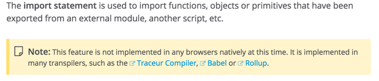

#JavaScript Modules Part 2: Module Bundling

>此文是js模块系列的第二部分。主要讲述了模块打包的基本知识。
>原文链接:[JavaScript Modules Part 2: Module Bundling](https://medium.freecodecamp.com/javascript-modules-part-2-module-bundling-5020383cf306#.6rqfy2ibc)

---
在这一系列的[part 1](https://medium.freecodecamp.com/javascript-modules-a-beginner-s-guide-783f7d7a5fcc#.rsq6qhvrt)部分，我们讨论了模块是什么，为什么开发者使用它以及在程序中使用它们的不同方式。

在第二部分，我将解决“打包”模块具体意味着什么：为什么我们打包模块，不同的打包方式和在web开发中模块的未来。

## what is module bundling?
在高层次来看，模块打包就是将一组模块(和他们的依赖)以正确的顺序拼接到单个文件(或文件组)中。

与web开发的其他方面一样，恐怖的地方在细节上。 :)

## Why bundle module at all?
当你把程序分解成模块，通常你会把这些模块组织到不同的文件和文件夹中。有可能，你还使用了一些库中的模块，比如Underscore或者React。

结果，这些文件中的每一个都用`<script>`标签包括在主HTML文件中，接下来当用户访问你的主页时，这些脚本会被加载。每个文件有单独的`<script>`标签意味着浏览器必须单独加在每个文件：一个接着一个...

这对于页面加载时间来说是个坏消息。

为了解决这个问题，我们打包，或者“集中”所有的文件到一个大文件中(或者几个文件，这视情况而定),目的是为了减少请求数。当你听到开发者讨论“构建步骤”（build step）或者"构建过程"（build process）时，这就是他们正在讨论的东西。

另一种加速打包操作的常见方法时“压缩”(minify)打包过的代码。压缩是去除源码中不必要的字符（比如空格, 主持，换行符）的过程，在不改变代码功能性的同时减少文件尺寸。

越少的数据意味着越少的浏览器处理时间，反过来也减少了下载文件需要的时间。如果你曾经看到一个文件的扩展名包含"min"，比如"underscore-min.js"，你可能已经注意到，压缩版本与完整版本相比是相当微小（和不可读的）。

像Gulp和Grunt这类的任务执行工具（Task runners）可以让开发者直接进行拼接和压缩操作，保证代码对开发者可读的，对浏览器是打包优化过的。

## What are the different ways to bundle modules?
当你使用part 1中提到的标准模块模式来定义你的模块的话，拼接和压缩你的文件是没问题的。你只需要把普通的js代码聚集在一起。

但是，当你坚持使用浏览器不能解释的非原生模块，比如CommonJS或AMD(甚至原生的ES6模块)，你都需要使用专用工具将模块转换为正确顺序、对浏览器友好的代码。这就是Browserify, RequireJS, Webpack和其他“模块打包工具“或者”模块加载工具“的用武之地。

除了捆绑 和／或 加载模块之外，模块打包工具还提供了大量附加功能，例如在修改代码后或者生成source maps进行调试时自动重编译代码。

让我们来看一些常见的模块打包方法：

## bundling CommonJS
从part 1中可以知道，CommonJS同步加载模块，这很好但在浏览器中不实用。我在这里提到一个解决方法，模块打包工具之一的Browserify。Browserify是一个用于编译浏览器CommonJS模块的工具。

例如，假设你有一个`main.js`文件，它导入一个模块来计算数字数组的平均值：

```js
//main.js

var myDependency = require('myDependency');

var myGrades = [93, 95, 85, 0, 91];

var myAverageGrade = myDependency.average(myGrades);
```

在这种情况下，我们有一个依赖（myDependency）.使用下面的命令，Browserify从main.js开始递归地将所有需要的模块打包到一个名为bundle.js的文件中：

```sh
browserify main.js -o bundle.js
```

Browserify通过解析每个`require`调用的AST来遍历整个项目的依赖图。当它了解依赖之间的结构后，它会按照正确的顺序将它们打包到单个文件中。此时，你只需要在HTML中插入`bundle.js`的`<script>`标签，以确保所有源代码在一次HTTP请求中下载。

类似的，如果你有多个依赖关系的文件，只需要告诉Browserify你的入口文件，然后坐着看它表演魔术。

最终的产品：打包好的文件，已经准备好使用类似于Minify-JS这类工具来缩小打包好的代码。

## Bundling AMD

如果你想要使用AMD，你将会用AMD loader类似于`RequireJS`或者`Curl`。一个module loader(不同于bundler)可以动态加载你的程序需要执行的模块。

仍然要提醒一下，AMD和CommonJS的一个主要区别是AMD异步加载模块。从这个意义上讲，如果使用AMD的话，在技术上实际并不需要一个构建步骤来讲模块打包到一个文件中，因为模块都是异步加载的——这意味着你只需逐步下载执行程序所必需的那些文件，而不是在用户首次访问页面时一次性下载所有文件。

然而，在实际生产环境下，随着时间的推移，对于每个用户操作带来的大量请求开销是没有意义的。大多数web开发者为了优化性能，仍然会使用构建工具（比如RequireJS optimizer, r.js等）来打包和压缩他们的AMD模块。

总的来讲，AMD和CommonJS在打包方面的区别是：在开发过程中，AMD可以没有构建步骤。至少，在你将代码执行之前，你都可以使用r.js优化器来处理它。（during development, AMD apps can get away without a build step. At least, until you push the code live, at which point optimizers like r.js can step in to handle it.）这句话没怎么看懂...

关于CommonJS和AMD的一个有趣的讨论，可以点击[这里](http://tomdale.net/2012/01/amd-is-not-the-answer/

## Webpack
说到模块打包工具，Webpack算是这一领域的新生儿。它被设计为与使用的模块系统无关，允许开发者适当的使用CommonJS, AMD或者ES6。

你可能想知道，当我们已经有了其他的模块打包工具如Browserify和RequireJS，他们已经能够很好的完成工作，为什么还需要Webpack？其中一个原因是，**Webpack提供了一些有用的功能，比如“代码拆分”—— 一种将你的代码分成按需加载的“块（chunks）”。**

如果你的web应用程序包含了仅在特定情况下需要的代码块，将所有的代码打包成一个大型的文件可能并不高效。在这种情况下，你可以使用代码拆分来提取一些代码成打包代码块（bundled chunks），来实现按需加载，避免了在大部分用户只需要使用应用程序的核心功能时，大量前端负载的麻烦。

代码拆分只是webpack提供的诸多引人注目功能的一部分，互联网上有很多关于Webpack和Browserify哪个更好的观点。，我们在这里只是浅显的讨论，关于这个问题下面有一些资料：

* [https://gist.github.com/substack/68f8d502be42d5cd4942
](https://gist.github.com/substack/68f8d502be42d5cd4942
)
* [http://mattdesl.svbtle.com/browserify-vs-webpack](http://mattdesl.svbtle.com/browserify-vs-webpack)
* [http://blog.namangoel.com/browserify-vs-webpack-js-drama](http://blog.namangoel.com/browserify-vs-webpack-js-drama)

## ES6 modules
接下来我们开始讨论ES6模块，未来它在某种程度上能够减少模块打包工具的需求（一会你会明白我这么说的含义）。首先，我们要理解ES6模块是如何加载的。

它与当前js模块标准（CommonJS、AMD）最重要的不同点是ES6模块设计时考虑了静态分析。这意味着当导入模块时，导入部分会在编译时被解析——也就是说在脚本开始执行前，它允许我们去除掉没有被其他模块使用的导出部分。去除掉未被使用的导出部分可以显著的节省空间，减轻浏览器的压力。

随之而来的是一个常见问题：这与使用UglifyJS来压缩代码时进行的dead code elimination有什么区别？答案是当然有区别。

（注意：Dead code elimination是去除未被使用的代码和变量的优化方法——你可以认为它删除掉你要打包的应用程序不需要运行的部分，然后再进行打包）

有时, dead code elimination可能在UglifyJS和ES6模块起到同样的作用，有时却不会。如果你想了解，[Rollup`s wiki](https://github.com/rollup/rollup)有一个非常酷的例子。

使ES6模块使用的是不同的dead code elimination方法，叫做"树摇晃（tree shaking）". Tree shaking实际上是dead code elimination的逆方法。你只会包括打包程序需要运行的模块，而不是去除掉打包模块不需要的。让我们来看一个tree shaking的例子：

建设有下列方法的`utils.js`的文件，其中每个方法都使用ES6语法导出：

```js

export function each(collection, iterator) {
  if (Array.isArray(collection)) {
    for (var i = 0; i < collection.length; i++) {
      iterator(collection[i], i, collection);
    }
  } else {
    for (var key in collection) {
      iterator(collection[key], key, collection);
    }
  }
 }

export function filter(collection, test) {
  var filtered = [];
  each(collection, function(item) {
    if (test(item)) {
      filtered.push(item);
    }
  });
  return filtered;
}

export function map(collection, iterator) {
  var mapped = [];
  each(collection, function(value, key, collection) {
    mapped.push(iterator(value));
  });
  return mapped;
}

export function reduce(collection, iterator, accumulator) {
    var startingValueMissing = accumulator === undefined;

    each(collection, function(item) {
      if(startingValueMissing) {
        accumulator = item;
        startingValueMissing = false;
      } else {
        accumulator = iterator(accumulator, item);
      }
    });

	return accumulator;
}

```

接下来，假设我们不知道哪些utils方法将会被我们使用，因此我们在`main.js`中要将它们全部导入；

```js
import * as Utils from './utils.js'
```

最终，我们只用到了`each`方法：

```js
import * as Utils from './utils.js';

Utils.each([1, 2, 3], function(x) { console.log(x)});
```

`main.js`文件的"tree shaking"版本看起来只有一个模块被加载：

```js
function each(collection, iterator) {
  if (Array.isArray(collection)) {
    for (var i = 0; i < collection.length; i++) {
      iterator(collection[i], i, collection);
    }
  } else {
    for (var key in collection) {
      iterator(collection[key], key, collection);
    }
  }
 };

each([1, 2, 3], function(x) { console.log(x) });
```

注意我们如何使用唯一导出的模块：**each**.

类似的，如果我们决定使用`filter`函数来代替`each`函数，最后代码看起来类似于下面：

```js
import * as Utils from './utils.js';

Utils.filter([1, 2, 3], function(x) { return x === 2});
```

此时的"tree shaking"版本看起来像下面这样：

```js
function each(collection, iterator) {
  if (Array.isArray(collection)) {
    for (var i = 0; i < collection.length; i++) {
      iterator(collection[i], i, collection);
    }
  } else {
    for (var key in collection) {
      iterator(collection[key], key, collection);
    }
  }
 };

function filter(collection, test) {
  var filtered = [];
  each(collection, function(item) {
    if (test(item)) {
      filtered.push(item);
    }
  });
  return filtered;
};

filter([1, 2, 3], function(x) { return x === 2 });
```

此时会发现**each**和**filter**函数都被包括进来了。这是因为**filter**函数定义时使用了**each**, 因此这两个函数都需要被导入。

我建议你去研究一下tree shaking在Rollup.js [live demo and editor](http://rollupjs.org/)。

## building ES6 modules
好的，我们已经知道了ES6模块和其他模块类型的加载方式不同，但是我们仍没有讨论当你使用ES6模块时的构建步骤。

不幸的事，ES6模块仍然需要一些额外的工作，因为现在的浏览器的原生实现还不支持ES6模块。



下面是一些转换ES6模块可以在浏览器中使用的方法，目前最常见的方法是：

1. 使用一种编译器(比如Babel或者Traceur)将ES6代码转换为CommonJS, AMD或UMD格式的ES5代码。接下来使用模块打包工具比如Browserify或者Webpack将编译后的代码打包成一个或多个文件。

## Jumping through hoops
作为Web开发者，我们总会想跳过一些圈。但是将优雅的ES6模块转换成浏览器可以解释的东西并不是那么容易。

问题是，什么时候在浏览器中使用ES6模块不会有这些开销？

答案是，“不久以后”。

ECMAscript目前有一个被称为ECMAscript 6 模块加载起API的解决方案规范。简而言之，这是一个基于Promise的API，支持动态加载模块并缓存它们，以便后续导入不会重新加载新版本的模块。

它看起来类似于下面：

**myModule.js**

```js
export class myModule {
  constructor() {
    console.log('Hello, I am a module');
  }
  
  hello() {
    console.log('hello');
  }
  
  goodbye() {
    console.log('goodbye');
  }
}
```

**main.js**

```js
System.import('myModule').then(function(myModule){
  new myModule.hello();
});

// 'hello!, I am a module!'
```

可选择的，你也可以使用script标签中的"type=module"直接定义模块，类似于：

```js
<script type="module">

  //loads the 'myModule' export from 'mymodule.js'
  import {hello} from 'mymodule'
  new Hello();
</script>

```

如果你还没有看过模块加载器API [polyfill repo](https://github.com/ModuleLoader/es-module-loader), 我强烈建议你至少看一看.

此外，如果你想先试试这种方法，请看[System.js](https://github.com/systemjs/systemjs) repo, 它建立在ES6 Module Loader polyfill之上。SystemJS在浏览器中或node中动态加载任何模块类型(ES6模块，AMD，CommonJS和／或 global scripts)。它跟踪“模块注册表”中所有已经加载的模块，来避免重新加载已加载过的模块。更不用说，它还会自动转换ES6模块（如果你简单的设置一个选项），并且有能力从任何其他类型加载任何模块类型！相当整洁。

## Will we still need bundlers now that we have native ES6 modules?
ES6模块的流行带来了一些有趣的问题：

### Will HTTP/2 make module bundlers obsolete?
在HTTP/1时代，我们在每个TCP连接中只需要一个请求。这是为什么加载多个资源需要多个请求。在HTTP/2时代，一切都发生了变化。HTTP/2是全双工的，这意味着多请求和应答可以并行发生。结果，我们可以通过单个连接同时提供多个请求。

因为每个HTTP请求的代码显著低于HTTP/1时代，从长远来看加载一堆模块不会是一个巨大的性能问题。有的人说这意味着模块打包将不再是必要的。这当然是有可能的，但还要视情况而定。

例如，模块打包提过了一些HTTP/2未考虑的好处，比如删除为使用的导出来节省空间。如果你正在构建一个网站，每一个微小的性能都很重要，打包可能带给你长期的增量优势。也就是说，如果你对性能要求没那么严格，你完全可以跳过构建过程，用最小的成本并节省时间。

总的来说，现在大多数网站还没有使用HTTP/2技术。我觉得构建过程目前仍然是有必要的。


