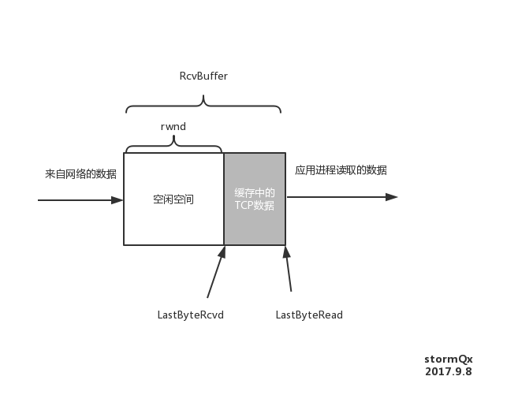

# 可靠数据传输机制和用途的总结
|机制 |用途|
| ---- | ---- |
| 检验和 | 检测在一个传输分组中的比特错误|
| 定时器 | 用于超时／重传一个分组。接收方可能会多个冗余副本|
| 序号 | 用来鉴别分组是重新发送的还是新传的|
| 确认 | 确认可以是逐个的(SR -- 选择重传) ／ 累计的(GBN -- 回退N步)|
| 窗口 | 流量控制。发送发被限制仅发送在窗口范围内的分组|

## TCP

一条TCP链接每一侧主机都该为该连接设置接受缓存。当该TCP连接受到**正确，按序**的字节后，就将数据放入接收缓存。

**流量控制** 和 **拥塞控制**动作相似，但针对的原因不同：

* **流量控制的目的**：指点对点通信量的控制，是端到端的问题。**消除发送方使接收方缓存溢出的可能性。**
* **拥塞控制的目的**: **防止过多的数据注入到网络中，这样可以使网络中的路由器或链路不致过载。**拥塞控制所要做的都有一个前提：网络能够承受现有的网络负荷。拥塞控制是一个**全局性**的过程，涉及到所有的主机、路由器，以及与降低网络传输性能有关的所有因素。

### 流量控制的做法

TCP通过让**发送方**维护一个称为**接收窗口（receive window）**的额变量来提供流量控制。

我们可以在**接收方**定义两个变量：

1. LastByteRead: 表示**接收方**的应用进程从缓存读出的数据流的最后一个字节的编号。
2. LastByteRcvd: 从网络中到达的并且已放入**接收方**缓存中的数据流的最后一个字节的编号。

由于TCP不需要已分配的缓存溢出，所以有:

**LastByteRcvd - LastByteRead <= RcvBuffer**

则接收窗口(rwnd)为：

**rwnd = RcvBuffer - (LastByteRcvd - LastByteRead)**

**接收方**将当前的rwnd值放入发给**发送方**的报文段的**接收窗口**字段，来通知**发送方**还有多少可用空间。

在**发送方**也定义两个变量：

1. LastByteSent
2. LastByteAcked

在**发送方**有公式：

**LastByteSend - LastByteAcked <= rwnd**

上述做法有一个小问题：当**接收方**发送的`rwnd = 0`， 并且没有数据再向**发送方**发送。那么即使**接收方**有了空间，**发送方**也会因为`rwnd = 0`不再向**接收方**发送数据。

所以TCP规范中规定：**当接收方的rwnd = 0使，发送方继续发送只有一个字节数据的报文段。**这些报文段被接受方接收， 缓存将开始清除并在确认报文中包含一个非0的rwnd值。