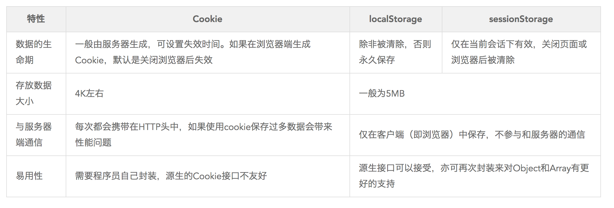
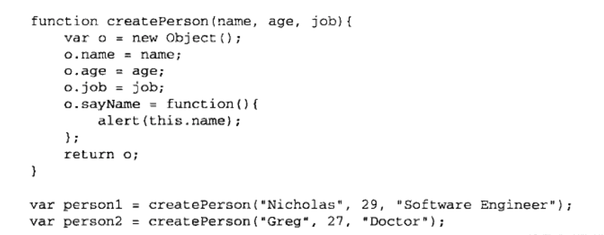
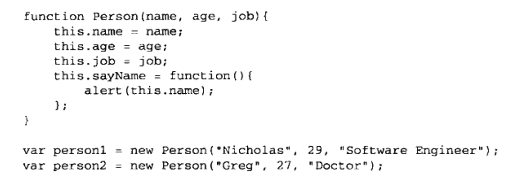
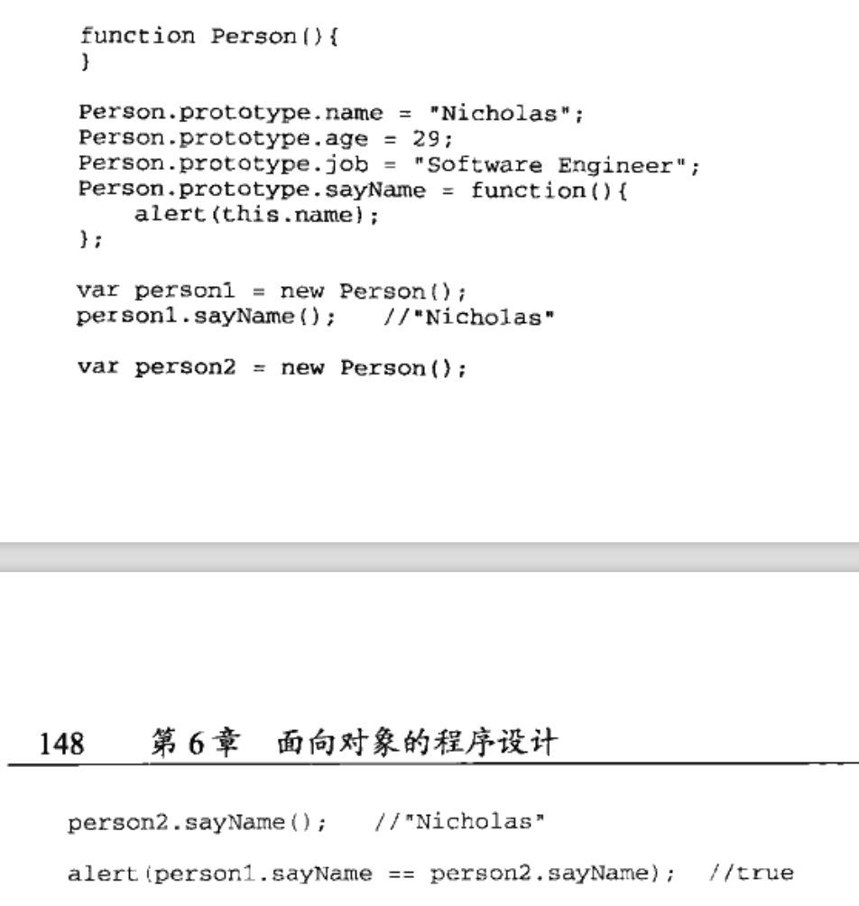
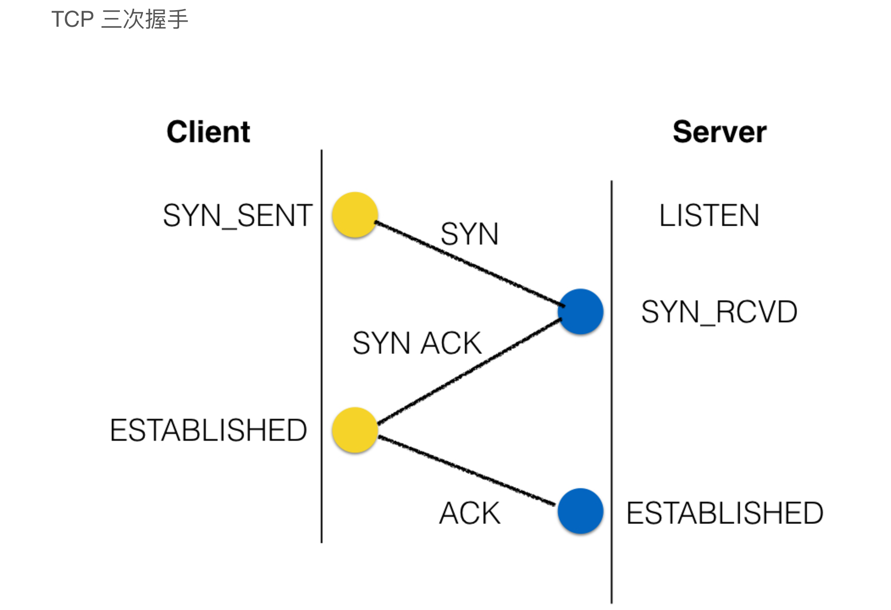
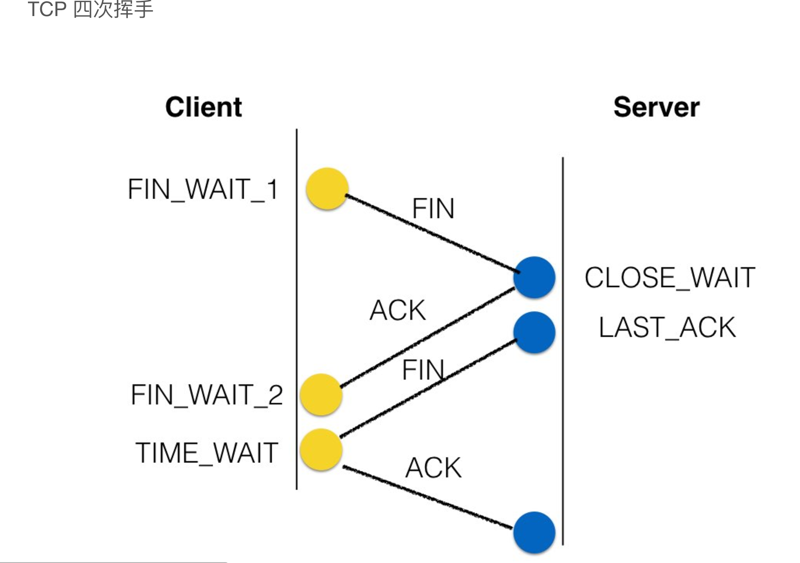
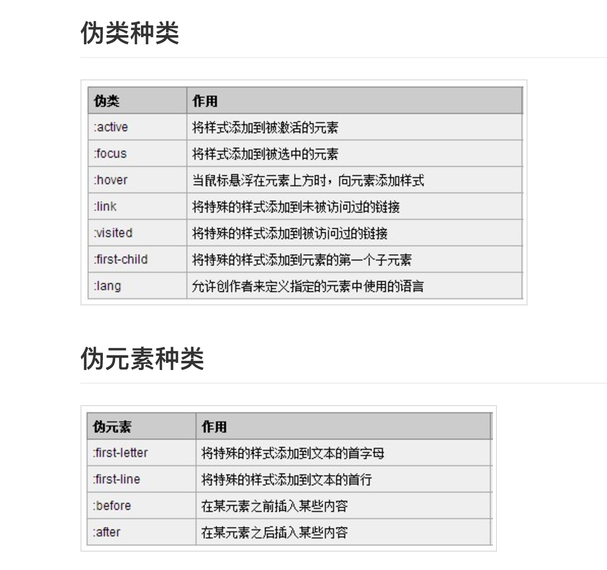

> 编程语言基础（C++、Java） + 算法题（中等难度） + 数据结构 （树、链表为主）+ 计算机网络（TCP/IP相关） + 操作系统（进程和线程、内存调度）+ 项目经历


# HTML5
### storage(localStorage是HTML5新增的特性)
#### Q1: cookie, sessionStorage, localStorage
1. cookie由服务端生成，用于标识用户身份；而两个storage用于浏览器端缓存数据
2. 三者都是键值对的集合
3. 一般情况下浏览器端不会修改cookie，但会频繁操作两个storage
4. 如果保存了cookie的话，http请求中一定会带上；而两个storage可以由脚本选择性的提交
5. sessionStorage会在会话结束后销毁；而local的那个会永久保存直到覆盖。cookie会在过期时间之后销毁。
6. 安全性方面，cookie中最好不要放置任何明文的东西。两个storage的数据提交后在服务端一定要校验（其实任何payload和qs里的参数都要校验）。




HTML转义字符：

```js
<  &lt;
>  &gt;
"  &quot;
空格  &nbsp;
```


### 更加语义化的标签

* `header`: 表示一组引导性的帮助，可能包含**标题元素**，也可以包含其他元素，像logo、分节头部、搜索表单等
* `footer`: **表示页脚。**一个页脚通常包含该章节作者、版权数据或者与文档相关的链接等信息。
* `nav`: **导航栏。**描绘一个含有多个超链接的区域，这个区域包含转到其他页面，或者页面内部其他部分的链接列表.
* `section`: 表示文档中的一个**区域**（或节），比如，内容中的一个专题组，一般来说会有包含一个标题（heading)。
* `aside`: 其通常表现为**侧边栏或者嵌入内容**。

### 支持audio和video
### 支持 canvas
### 新的文档类型  (New Doctype)
HTML5简化了文档类型的声明方式。HTML5的声明方式为：<!DOCTYPE html>。


# CSS3

### flexible box
flex-direction, justify-content, align-items，flex-wrap（是否换行）
### gradients(渐变)
### transitions

# 事件模型
“DOM2级事件”规定的事件流包括三个阶段：事件捕获阶段、处于目标阶段和事件冒泡阶段。

* **事件冒泡**，即事件开始时由最具体的元素(文档中嵌套层次最深的那个节点)接收，然后逐级向上传播到较为不具体的节点(文档).
* **事件捕获**，即不太具体的节点应该更早接收到事件，而最具体的节点应该最后接受到事件。事件捕获的用意在于在事件到达预定目标之前捕获它。

  **缺点**：事件捕获最致命的是兼容性问题。在IE9版本以下是不能用的。 所以React的合成事件干脆就没有实现事件捕获，只支持了事件冒泡。

* **事件委托**，只需在DOM树中尽量最高的层次上添加一个事件处理程序。可以解决出现过多event handlers的情况。

# 作用域链

**作用域链查找过程**：

* 运行一个函数，生成了当前函数对象，这个函数对象会把传参、内部定义的局部变量和方法设置为自己的属性。
* 没找到就去`[[scope]]`属性里面找，然后还是找不到接着在`[[scope]]`里面找。
* 还查找不到，就爆出语法错误，记住作用域链上查找不到一个属性就爆语法错误。

**原型链查找过程**：

* 先在实例化对象里找属性。
* 找不到去`__proto__`里面找，然后还是找不到接着在`__proto__`里面找。
* `Object.prototype.__proto__`是原型链终点，值为null。 找不到输出undefined，不报语法错误。

# 原型链

> 每个函数都有一个`prototype`属性，这个属性就是一个指针，指向一个对象，这个对象的用途是包含可以由特定类型的所有实例共享的属性和方法。
 

## `__proto__` 和 `prototype`的区别

`__proto__`指向创建这个对象的函数(constructor)的`prototype`.

```js
var f = new F(); 
//于是有
f.__proto__ === F.prototype //true
```
**总结：**

1. 对象有属性`__proto__`,指向该对象的构造函数的原型对象。
2. 方法除了有属性`__proto__`,还有属性prototype，prototype指向该方法的原型对象,这个对象的用途就是包含所有实例共享的属性和方法。 方法的属性`__proto__`指向他的构造函数的原型对象，方法的构造函数就是Function.所以方法的`__proto__`指向了`Function.prototype`. 最后`Function.prototype`指向了`object.prototype`， 毕竟在JavaScript中，万物皆对象。


## 工厂模式



**缺点**：工厂模式没有解决对象识别的问题，怎么知道一个对象的类型。

## 构造函数模式



经历了4个步骤:
  
  1. 创建一个新对象
  2. 将构造函数的作用域赋给新对象（this就指向了这个对象）
  3. 执行构造函数中的代码
  4. 返回新对象

**缺点**：构造函数模式中每个方法都要在实例上重新创建一遍。
  
## 原型模式



**缺点**: 原型上的属性是会共享的，如果是一个引用类型的属性（比如数组），它们都会使用这个数组。

## 组合使用构造函数模式和原型模式

实例属性在构造函数中定义，共享属性在原型中定义。

# call和apply的区别

`call`和`apply`都可以改变运行时函数的上下文。`call()`方法接受的是若干个参数的列表，而`apply()`方法接受的是一个包含多个参数的数组。

注意：ES6 中的 spread运算符可以代替`apply`方法。

```js
// ES5的写法
function f(x, y, z) {
  // ...
}
var args = [0, 1, 2];
f.apply(null, args);

// ES6的写法
function f(x, y, z) {
  // ...
}
var args = [0, 1, 2];
f(...args);
```

# JS的垃圾回收机制
 标记清除。
 
 可以用一位来标记变量，当变量进入环境可以标记“进入环境”，当变量离开环境就可以标记为“离开环境”。
 
 引用计数。
 
 记录变量被引用次数，如果次数为0，就可以回收。会存在相互引用的问题。
 
# JS闭包 

闭包是指那些能够访问独立(自由)变量的函数 (变量在本地使用，但定义在一个封闭的作用域中)。换句话说，这些函数可以“记忆”它被创建时候的环境。
 
# 手写ajax

```js
var xmlhttp=null;//声明一个变量，用来实例化XMLHttpRequest对象
if (window.XMLHttpRequest)
  {
  xmlhttp=new XMLHttpRequest();// 新版本的浏览器可以直接创建XMLHttpRequest对象
  }
  
else if (window.ActiveXObject)
  {
  xmlhttp=new ActiveXObject("Microsoft.XMLHTTP");// IE5或IE6没有XMLHttpRequest对象，而是用的ActiveXObject对象
  }
  
  
if (xmlhttp!=null)
  {
  xmlhttp.onreadystatechange=state_Change;//指定响应函数为state_Change
  xmlhttp.open("GET","/example/xdom/note.xml",true);//指定请求，这里要访问在/example/xdom路径下的note.xml文件，true代表的使用的是异步请求
  xmlhttp.send(null);//发送请求
  } 
else
  {
  alert("Your browser does not support XMLHTTP.");
  }

//创建具体的响应函数state_Change
function state_Change()
{
if (xmlhttp.readyState==4)
  {
  if (xmlhttp.status==200)
    {
    // 这里应该是函数具体的逻辑
    }
  else
    {
    alert("Problem retrieving XML data");
    }
  }
}
```

# 什么是闭包

闭包是指那些能够访问独立(自由)变量的函数 (变量在本地使用，但定义在一个封闭的作用域中)。换句话说，这些函数可以“记忆”它被创建时候的环境。

# clone一个对象

* JSON.parse(JSON.stringify(o))//还行，深度复制的速度是最快的(和extends其实差不多)，浅度复制的话还是assign吧，但是函数对象，date对象等等json不支持的都没戏咧
 
* Object.create(o)//虽然是加了层原型链，但是我感觉还是不错的，不过前者的对象变化会影响到后面，基本不算是复制了
* Object.assign(就是一个浅复制呗，writable特性无法复制)
* $.extends(第一个参数为true的话是支持深度复制的)
* replaceState(奇葩啊，这也行..)

# CSRF(跨站点请求伪造)

* 传一个token

# macro-task与micro-task

在挂起任务时，JS 引擎会将所有任务按照类别分到这两个队列中，首先在 macrotask 的队列（这个队列也被叫做 task queue）中取出第一个任务，执行完毕后取出 microtask 队列中的所有任务顺序执行；之后再取 macrotask 任务，周而复始，直至两个队列的任务都取完。

## 具体分类

**macro-task**: script（整体代码）, setTimeout, setInterval, setImmediate, I/O, UI rendering 

**micro-task**: process.nextTick, Promises（这里指浏览器实现的原生 Promise）, Object.observe, MutationObserver


# 浏览器缓存机制

主要就是HTTP协议定义的缓存机制（如： Expires； Cache-control等）

`cache-control: max-age = 300.`

## Last-modified缺点
Last-Modified 说好却也不是特别好，因为如果在服务器上，一个资源被修改了，但其实际内容根本没发生改变，会因为Last-Modified时间匹配不上而返回了整个实体给客户端（即使客户端缓存里有个一模一样的资源）。


如果 Last-Modified 和 ETag 同时被使用，则要求它们的验证都必须通过才会返回304，若其中某个验证没通过，则服务器会按常规返回资源实体及200状态码。

#HTTP协议

## 头部含义

* Accept: 浏览器能够处理的内容类型
* Accept-Charset: 浏览器能够显示的字符集
* Accept-Encoding: 浏览器能够处理的编码
* Accept-Language: 浏览器当前设置的语言
* Connection: 浏览器与服务器之间的连接类型
* Cookie： 当前页面设置的任何Cokkie
* Host: 描述请求将被发送的目的地，包括，且仅仅包括域名和端口号。在任何类型请求中，request都会包含此header信息。
* origin: 用来说明请求从哪里发起的，包括，且仅仅包括协议和域名。这个参数一般只存在于CORS跨域请求中，可以看到response有对应的header：Access-Control-Allow-Origin。
* Referer: 发出请求的页面的URI。
* User-Agent: 浏览器的用户代理字符串

## get, put, post, delete
* **get**: GET请求会向数据库发索取数据的请求，从而来获取信息，该请求就像数据库的select操作一样.
* **put**: PUT请求是向服务器端发送数据的，从而改变信息，该请求就像数据库的update操作一样
* **post**: 向服务器端发送数据的，但是该请求会改变数据的种类等资源，就像数据库的insert操作一样
* **delete**: 用来删除某一个资源的，该请求就像数据库的delete操作。

**put 和 post的区别**： POST主要作用在一个集合资源之上的（url），而PUT主要作用在一个具体资源之上的（url/xxx），通俗一下讲就是，如URL可以在客户端确定，那么可使用PUT，否则用POST。就是post的请求是会产生副作用的。

## 状态码

* 1XX：信息性状态码，接收的请求正在处理
* 2XX：成功状态码：请求正常处理
* 3XX：重定向状态码，需要进行附加工作来完成请求
* 4XX：客户端错误状态码，服务器无法处理请求
* 5XX：服务器错误状态码，服务器处理请求出错


**200 OK**

就是被正常处理

**204 No Content**

就是请求正常处理，没有内容返回

**206 Partial Content**

表示客户端进行了范围请求，服务器成功执行了这个部分的GET请求

**301 Moved Permanently**

永久性重定向，资源被分配到了新的URL。注意，这个返回的code是服务器对浏览器说的，是想让浏览器记住这个新的url

**302 Found**

临时性重定向，表示资源被分配了新的URI，希望用户能用新的URI访问。

**303 See Other**

**所请求的页面可在别的url下被找到。**
303与302有着相同的功能，303状态明确表示客户端应该采取GET方法获取资源。

**304 Not Modified**

表示客户端发了附带条件的请求时，服务器表示资源未改变，**客户端可以使用未过期的缓存。**

**307 Temporary Redirect**

临时重定向，与302不同的是，不会从POST变成GET。

**400 Bad Request**

请求报文存在语法错误，需要修改请求内容再重发请求。浏览器会像200一样对待。

**401 Unauthorized**

未认证的，需要通过有HTTP认证。如果之前有过一次请求，代表认证失败

**403 Forbidden**

表示请求资源的访问被服务器拒绝了，服务器没有必要返回拒绝的详细理由，想要说明的话，可以在实体的主体部分对原因给出描述。

**404 Not Found**

表明服务器上无法找到请求的资源。

**500 Internal Server Error**

服务器在执行请求的过程中发生了错误，可能是应用的bug或者临时的故障

**503 Service Unavailable**

服务器暂时处于超负载或者正要进行停机维护，暂时无法处理请求

#网络知识

## OSI层次模型

 * 物理层、数据链路层、网络层（IP）、传输层（TCP）、会话层、表示层和应用层（HTTP）。
　
 * socket是对TCP/IP协议的封装，Socket本身并不是协议，而是一个调用接口(API)。

## TCP三次握手，四次挥手

为什么要三次握手: 为了防止已经失效的连接请求报文突然又传到了server端。

例：假如没有三次握手，如果client端发报文，但因为网络延迟而滞留，会被server端当成一个新的包，建立连接，但此时client并没有要建立连接的意思…然后server就会不断发包给client，client并不理睬，这样就造成了不必要的资源浪费。（这是发送第三次ACK的原因）



过程：

* TCP客户端发送一个FIN，用来关闭客户到服务器的数据传送. **这表示主机1没有数据要发送给主机2**了；
* 服务器收到这个FIN，它发回一个ACK.**我“同意”你的关闭请求；**
* 服务器关闭客户端的连接，发送一个FIN给客户端. **主机2向主机1发送FIN报文段，请求关闭连接**
* 客户端发回ACK报文确认，并将确认序号设置为收到序号.**主机1等待2MSL后依然没有收到回复，则证明Server端已正常关闭**

之所以要有CLOSE_WAIT的状态，是因为server端有可能没有发送完所有数据，需要等待将所有未发送完的数据都送到client端后，
才能发送FIN，而不能一起发【因为那样相当于客户端又接到数据不处理就关闭】

# React相关知识

## React使用虚拟DOM的原因

## React的优势

# 输入一个网址，发生了什么

1. 浏览器查看缓存；
2. 浏览器查找域名对应的 IP 地址；
  1. 如果资源未缓存，发起新请求
  2. 如果已缓存，检验是否足够新鲜，足够新鲜直接提供给客户端，否则与服务器进行验证。
  3. 检验新鲜通常有两个HTTP头进行控制Expires和Cache-Control：
       * HTTP1.0提供Expires，值为一个绝对时间表示缓存新鲜日期
       * HTTP1.1增加了Cache-Control: max-age=,值为以秒为单位的最大新鲜时间
2. 浏览器根据 IP 地址与服务器建立 socket 连接；
3. TCP链接建立后发送HTTP请求
3. 浏览器与服务器通信： 浏览器请求，服务器处理请求；
4. 浏览器与服务器断开连接。
5. 浏览器检查响应状态吗：是否为1XX，3XX， 4XX， 5XX，这些情况处理与2XX不同
6. 如果资源可缓存，进行缓存
7. 对响应进行解码（例如gzip压缩）
8. 解析HTML文档，构件DOM树，下载资源，构造CSSOM树，执行js脚本，这些操作没有严格的先后顺序


## 根据域名查找 IP 地址
1. 浏览器搜索自己的 DNS 缓存（维护一张域名与 IP 地址的对应表）；
2. 搜索操作系统中的 DNS 缓存（维护一张域名与 IP 地址的对应表）；
3. 搜索操作系统的 hosts 文件（ Windows 环境下，维护一张域名与 IP 地址的对应表）；
4. 操作系统将域名发送至 LDNS（本地区域名服务器，如果你在学校接入互联网，则 LDNS 服务器就在学校，如果通过电信接入互联网，则 LDNS 服务器就在你当地的电信那里。）LDNS 查询 自己的 DNS 缓存（一般查找成功率在 80% 左右），查找成功则返回结果，失败则发起一个迭代 DNS 解析请求；
LDNS 向 Root Name Server （根域名服务器，其虽然没有每个域名的的具体信息，但存储了负责每个域，如 com、net、org等的解析的顶级域名服务器的地址）发起请求，此处，Root Name Server 返回 com 域的顶级域名服务器的地址；
5. LDNS 向 com 域的顶级域名服务器发起请求，返回 baidu.com 域名服务器地址；
6. LDNS 向 baidu.com 域名服务器发起请求，得到 www.baidu.com 的 IP 地址；
7. LDNS 将得到的 IP 地址返回给操作系统，同时自己也将 IP 地址缓存起来；
操作系统将 IP 地址返回给浏览器，同时自己也将 IP 地址缓存起来；
至此，浏览器已经得到了域名对应的 IP 地址。

## 建立连接--三次握手

## 网页请求与显示
1. 浏览器根据 URL 内容生成 HTTP 请求，请求中包含请求文件的位置、请求文件的方式等等；
2. 服务器接到请求后，会根据 HTTP 请求中的内容来决定如何获取相应的 HTML 文件；
3. 服务器将得到的 HTML 文件发送给浏览器；
4. 在浏览器还没有完全接收 HTML 文件时便开始渲染、显示网页；
5. 在执行 HTML 中代码时，根据需要，浏览器会继续请求图片、CSS、JavsScript等文件，过程同请求 HTML ；

## 断开连接--四次挥手

# 伪类与伪元素

双冒号(::)表示伪元素。CSS 伪元素用于将特殊的效果添加到某些选择器

单冒号表示伪类。伪类用于向某些选择器添加特殊的效果



# 前端页面优化
* 减少HTTP请求
* 使Ajax可缓存
* 避免重定向
* 减小cookie大小
* 将样式表放到页面顶部
* 将脚本放到页面底部
* 压缩javascript和css

server端：
* 使用CDN
* 添加Expires或者Cache-Control响应头
* 配置ETag

#跨域技术 

## CORS
使用 XMLHttpRequest 和 Fetch 发起 HTTP 请求就必须遵守同源策略。

**同源策略**： 如果协议，端口（如果指定了一个）和主机对于两个页面是相同的，则两个页面具有相同的源。

跨域并非浏览器限制了发起跨站请求，而是跨站请求可以正常发起，但是返回结果被浏览器拦截了。

对那些会对服务器数据造成副作用的 HTTP 请求方法，标准强烈要求浏览器必须先以 OPTIONS 请求方式发送一个预请求(preflight request)，从而获知服务器端对跨源请求所支持 HTTP 方法。在确认服务器允许该跨源请求的情况下，以实际的 HTTP 请求方法发送那个真正的请求。

使用CORS头来处理跨域： Access-Control-Allow-Origin: * 

### JSONP

用 script 标签加载其他域中的文件是不会有问题。

解决思路： 允许用户传递一个callback参数给服务端，然后服务端返回数据时会将这个callback参数作为函数名来包裹住JSON数据，这样客户端就可以随意定制自己的函数来自动处理返回数据了

```js
function jsonp(url, params, callback) {
  const parsmQuery = [];
  Object.keys(params).forEach(key => {
    parsmQuery.push(`${encodeURIComponent(key)}=${encodeURIComponent(params[key])}`);
  })
  
  // 提供jsonp服务的url地址（不管是什么类型的地址，最终生成的返回值都是一段javascript代码）
  let _url;
  _url = url + (parsmQuery.length > 0 ? `?${parsmQuery.join('&')}` : `?`);
  _url = _url + `&callback=callback2017`;

  console.log(_url);
  
  // 创建script标签，设置其属性
  const script = document.createElement('script');
  script.setAttribute('src', _url);
  script.type = "text/javascript";
  
  // 把script标签加入head，此时调用开始
  document.getElementsByTagName('head')[0].appendChild(script);

  window['callback2017'] = (res) => {
    callback(res);
  }
}

jsonp('http://music.163.com/api/user/playlist/', {
  uid: 40652589,
  limit: 1,
  offset: 0
}, function(data) {console.log(data)})
```

#算法题

## 设计一种算法可以求出 某个数字是否 在10亿个数中出现过

海量数据压缩: bitmap

## 统计一个数组出现频率最高的元素，给出那个元素以及出现的次数，要求考虑时间和空间复杂度

hashMap， 记录当前出现次数最多的元素。