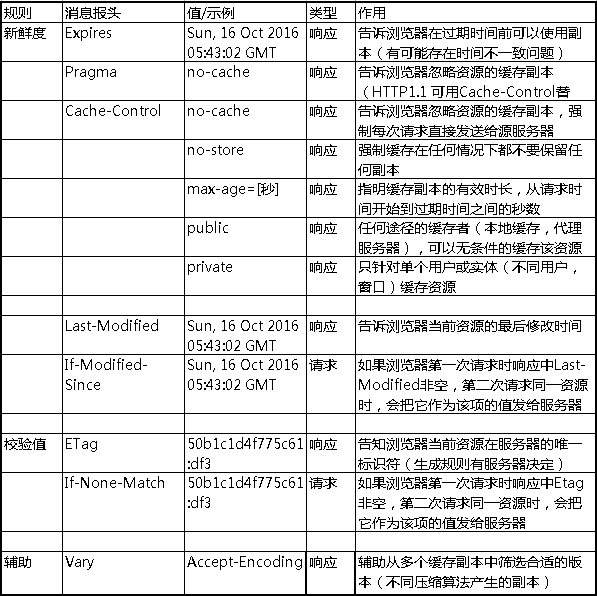

## 浏览器的缓存机制
对于浏览器的缓存来讲，这些规则是在HTTP协议头和HTML页面的Meta标签中定义的。从**新鲜度**和**校验值**两个维度来规定浏览器是否可以直接使用缓存中的副本，还是需要去源服务器获取更新的版本。

* 新鲜度（过期机制）：缓存副本有效期。一个缓存副本必须满足以下条件，浏览器会认为它是有效的、足够新的：

  1. 含有完整的过期时间控制头信息（HTTP协议报头），并且仍在有效期内；
  2. 浏览器已经使用过这个缓存副本，并且在一个会话中已经检查过新鲜度;
满足以上两种情况的一种，浏览器会直接从混啊村中获取副本并渲染。

* 校验值（验证机制）：服务器返回资源的时候优势会带上Etag(Entity Tag)，它可以用来作为浏览器再次请求过程的校验标识。如果校验标识不匹配，浏览器需要重新获取资源内容。

### 使用HTML Meta标签
可以在HTML页面的<head>节点中加入<meta>标签，代码如下：

```js
<META HTTP-EQUIV="Pragma" CONTENT="no-cache">
```
上述代码告诉浏览器当前页面不被缓存，每次访问都需要去服务器拉取。但是只有部分浏览器可以支持，并且所有缓存代理服务器都不支持，因为代理不解析HTML内容本身。

### 使用与缓存有关的HTTP消息报头
在HTTP请求和响应的消息报头中，常见的与缓存有关的消息报头有：



**1. Pragma**
在http 1.0时代，给客户端设定缓存方式可以通过两个字段Pragma 和 Expires,虽然这两个字端早可抛弃，但为了http协议的向下兼容，很多网站还是会带上这两个字段。

在响应报文中当该字段值为 "no-cache" 的时候，会通知客户端不要对该资源进行缓存，每次都得向服务器发一次请求才行。

**2. Expires**
有了Pragma来禁用缓存，那么如果需要设置缓存的话需要有个东西来设置缓存的时间，对于http 1.o来说，就是Expires来做这件事。

Expires的值对应一个GMT（格林尼治时间），比如 “Mon, 22 Mar 2017 11:12:01 GMT” 来告诉浏览器资源缓存过期时间，如果还没有超过该时间点则不发请求，直接返回 200 OK。(from cache)

**所以如果面试官问http响应200 OK(from cache)是否有发送http请求，请回答没有，它们是直接读取缓存资源的。**

当两者一起使用时候，Pragma优先级更高，即当Prgama设置禁用缓存时，又给Expires定义一个未到期的时间，仍然会发送新的请求。

这种方式有两个致命的缺点：

1. Expires定义的缓存时间时相对于服务器上的时间而言的，而浏览器在判断的时候是基于客户端的系统时间，如果用户修改了自己电脑的系统时间，这个缓存时间就没有任何意义。
2. 假如客户端上的某个资源缓存时间过期了，但此时其实服务器并没有更新过该资源，那么这时候客户端会要求服务器重新把东西在发送一次，会浪费带宽和时间，这也是不合理的。

**3. Cache-Control**
针对上述Expires时间是相对于服务器而言，无法保证和客户端时间统一的问题，http 1.1新增加了Cache-Control来定义缓存过期时间，若报文中同时出现Pragma、Expires和Cache-Control, 会以Cache-Control为准。
它可以由多个可选值组合而成，比如：

```js
Cache-Control: max-age=3600, must-revalidate
```
它意味着该资源从原服务器上取得的，且其缓存的有效时间为一小时，在后续一小时内，用户重新访问该资源则无需发送新的请求。

```js
Cache-Control: no-cache, no-store
```
它告诉浏览器不使用缓存，要求每次请求要向服务器发送请求，并且所有内容都不会被保存在缓存或者临时文件中。

组合方式也有一定限制，比如no-cache不能和max-age一起搭配使用。

**4. Last-Modified**
为了解决前面遗留下的第二个问题，Last-Modified来保证当客户端上某个资源保存的缓存时间过期了，但这时候其实服务器并没有更新过这个资源，服务器能够正确处理这样的请求而不是重新发送资源。

为了让客户端与服务器之间能实现缓存文件是否更新的验证、提升缓存的复用率，http 1.1新增了几个首部字段来做这件事情。

在响应报文头中，会将资源最后更改的时间以`Last-Modified: GMT`的形式返回给客户端。客户端会为资源标记上该信息，下次再次请求时，会把该信息附带到请求报文中发送，若传递的值与服务器上该资源的最终修改时间一致，则说明该资源没有被修改过。

请求报文有两个字段用传递该标记时间，分别是：

  * `If-Modified-Since: Last-Modified-value`
 
  该字段告诉服务器如果客户端传来的最后修改时间和服务器上的一致，直接返回304状态码即可，当前各大浏览器均是使用该字段来向服务器传递保存的Last-Modified值。**`If-Modified-Since`只可以被用于GET或者HEAD请求头部。**
  * `If-Unmodified-Since: Last-Modified-value`

  该字段告诉服务器如果客户端传来的最后修改时间和服务器上的不一致，直接返回412状态码(Precondition Failed).**`If-Unmodified-Since`可以用于POST请求或If-Range请求等**
  
**这两者有什么区别？**

**If-Modified-Since:**
从字面上看，就是说：如果从某个时间点算起，如果文件被修改了。

1. 如果真的被修改：那么就开始传输，服务器返回：200 OK
2. 如果没有被修改：那么就无需传输，服务器返回：304 Not Modified.

**If-Unmodified-Since:**
从字面上看, 意思是: 如果从某个时间点算起, 文件没有被修改。

1. 如果没有被修改：则开始继续传送文件，服务器返回: 200 OK
2. 如果文件被修改：则不传输，服务器返回：412 Precondition failed (预处理错误)

比如断点续传就会使用`If-Unmodified-Since`字段（一般会指定Range参数），要想断电续传，那么文件就一定不能被修改，否则就不是同一个文件。

**Last-Modifed也有一定的缺点，因为如果在服务器上,如果某些文件会被定期生成，但实际内容根本没有发生改变，会因为Last-Modified时间匹配不上而返回了整个实体给客户端（即使客户端缓存里有相同的资源）**

**5. Etag**

为了解决上述Last-Modified可能存在的不准确问题，http 1.1还推出了Etag实体字段。

服务器会通过某种算法,给资源计算得出一个唯一标识符，再把资源响应给客户端的时候，会在响应报文中加上`Etag: 唯一标识符`返回给客户端。

客户端会保存该Etag字段，并在下次请求的时候将其作为请求头某个字段的值发送请求，服务器只需要比较客户端传来的Etag和服务器上该资源的Etag是否一致，就可以判断资源是否被修改过。

**客户端如何把标记在资源上的Etag发送给服务器呢？**

 * `If-None-Match: ETag-value`
 
 该字段告诉服务器如果Etag没匹配成功需要重发资源数据，否则直接发送304状态码和相应报头即可。当前各浏览器均适用该字段来向服务器传递保存的Etag值。
 
 * `If-Match: ETag-value`

  该字段告诉服务器如果Etag没匹配成功，返回412状态码(Precondition Failed)。
  
  这两者于Last-Modified十分类似。
  
**如果Last-Modified和Etag同时被使用，则要求它们的验证都必须通过才能返回304，若其中某个验证没通过，则服务器会按常规返回资源实体及200状态码**

**Cache-Control/Expires 不同，如果检测到本地的缓存还是有效的时间范围内，浏览器直接使用本地副本，不会发送任何请求。两者一起使用时，Cache-Control/Expires的优先级要高于Last-Modified/ETag。即当本地副本根据Cache-Control/Expires发现还在有效期内时，则不会再次发送请求去服务器询问修改时间（Last-Modified）或实体标识（Etag）了。**


### 用户操作行为与缓存


当用户在按F5进行刷新的时候，会忽略Expires/Cache-Control的设置，会再次发送请求去服务器请求，而Last-Modified/Etag还是有效的，服务器会根据情况判断返回304还是200；而当用户使用Ctrl+F5进行强制刷新的时候，只是所有的缓存机制都将失效，重新从服务器拉去资源。

地址栏输入的地址按下回车键，该地址页面请求（仅仅是该url）的`request header`都会带上`cache-contro:max-age=0`，所以不会命中强缓存.但是通过链接点击的地址会命中缓存。

### 200 OK (from cache) 与 304 Not Modified 的区别
200 OK (from cache)  是浏览器没有跟服务器确认，直接用了浏览器缓存.304 Not Modified 是浏览器和服务器多确认了一次缓存有效性，再用的缓存。


### 总结

当一个项目做http缓存的应用时，还是会把上述提及的大多数首部字段使用上，比如使用Expires来保证兼容性，使用Cache-control来更精准的利用缓存，然后开启Etag和Last-Modified功能进一步服用缓存减少流量。

