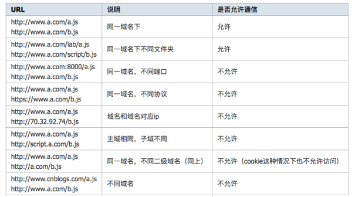

# 跨域

> 总结，非原创.
> 
> 引用内容: 
> 
> * [关于跨域，你想知道的全在这里](https://zhuanlan.zhihu.com/p/25778815)
> * [前端学习笔记](http://www.xiaojunxie.com/2015/09/18/%E5%89%8D%E7%AB%AF%E5%AD%A6%E4%B9%A0%E7%AC%94%E8%AE%B0/)
> * [跨域资源共享 CORS 详解](http://www.ruanyifeng.com/blog/2016/04/cors.html)


## 同源策略SOP
同源策略是浏览器出于安全考虑，限制了一个源中加载文本或者脚本与来自其他源中资源的交互方式。同源是指 **域名 协议 端口** 相同，不同的话都需要做跨域处理。



## 跨域方法

一共介绍七种常用跨域的方式，关于跨域大概可以分为 iframe 的跨域和纯粹的跨全域请求。

实际情况下，常用的还是前三种方法，后面四种更多的是一些小技巧。

## 跨全域方法
### 1. JSONP:

只要说到跨域，就必须聊到JSONP(JSON with Padding),可用于解决主流浏览器的跨域数据访问问题。

**主要思想：Web页面上调用Js文件不受浏览器同源策略的影响，所以通过Script标签可以进行跨域请求：**

1. 前端先设置好回调函数，并将其作为url的参数。
2. 服务器接收到请求后，通过该参数获得回调函数名，并将数据放在参数中将其返回。
3. 收到结果后因为是Script标签，所以浏览器会当作是脚本运行，从而达到跨域获取数据的目的。

实例：

后端逻辑：

```js
//server.js
const url = require('url');

require('http').createServer((req, res) => {
  const data = {
    x: 10,
  };
  
  const callback = url.parse(req.url, true).query.callback;
  res.writeHead(200);
  res.end(`${callback}(${JSON.Stringify(data)})`)
}).listen(3000, '127.0.0.1');

console.log('启动服务，监听 127.0.0.1:3000');
```

通过 `node server.js`启动服务， 监听端口3000，这样服务器就建立起来了。

前端页面：

```html
<!DOCTYPE html>
<html lang="en">
<head>
    <meta charset="UTF-8">
    <title>index.html</title>
</head>
<body>
    <script>
		function jsonpCallback(data) {
		    alert('获得 X 数据:' + data.x);
		}
    </script>
    <script src="http://127.0.0.1:3000?callback=jsonpCallback"></script>
</body>
</html>
```

#### JSONP跨域获取数据的优缺点：

**优点：**

1. 他不会像XMLHHttpRequest对象实现Ajax请求那样受到同源策略的限制
2. 兼容性好，在古老的浏览器中也能很好的运行
3. 不需要XMLHttpRequest或者ActiveX的支持；并且在请求完毕后可以通过调用callback的方式回传结果。

**缺点：**

1. 它支持`GET`请求，不支持`POST`等其他类型的HTTP请求。
2. 它只支持跨域HTTP请求这种情况，不能解决不同域的两个页面或`iframe`之间进行数据通信的问题。

### 2. CORS：

CORS是一个W3C标准，全称是"跨域资源共享"(Cross-origin resource sharing),它允许浏览器向跨源服务器，发出XMLHttpRequest请求，从而克服了ajax只能同源使用的限制。

CORS需要浏览器和服务器同时支持才可以生效，对于开发者来说，CORS通信与同源的ajax通信没有差别，代码完全一样。浏览器一旦发现ajax请求跨源，就会自动添加一些附加的头信息，有时还会多出一次附加的请求，用户不会察觉。下面介绍下这些信息。

实现CORS通信的关键还是服务器。只要服务器实现了CORS接口，就可以跨源通信。

#### 两种请求

浏览器将CORS请求分成两类： 

* 简单请求(simple request)
* 非简单请求(non-so-simple request)

只要同时满足以下两大条件，就属于简单请求。

```
(1) 请求方法是以下三种方法之一：
  1. HEAD
  2. GET
  3. POST

(2) HTTP的头信息不超出以下几种字段：
  1. Accept
  2. Accept-Language
  3. Content-Language
  4. Last-Event-ID
  5. Content-Type: 只显示三个值application/x-www-form-urlencoded、multipart/form-data、text/plain  

```

凡是不同时满足上面两个条件，就属于非简单请求。浏览器对于这两种请求的处理不同。

#### 简单请求
对于简单请求，浏览器直接发出CORS请求，就是在头信息中，增加`Origin`字段。

下面实例是浏览器发现这次跨域AJAX请求是简单请求，就自动在头信息中，添加一个`origin`字段。

```
GET /cors HTTP/1.1
Origin: http://api.bob.com
Host: api.alice.com
Accept-Language: en-US
Connection: keep-alive
User-Agent: Mozilla/5.0...
```

`Origin`字段用来说明，本次请求来自于哪个源(协议+域名+端口)。服务器根据这个值决定是否同意这次请求。

如果`origin`指定的源，不在许可范围内，服务器会反悔一个正常的HTTP回应。浏览器发现，这个回应的头信息没有包括`Access-Control-Allow-Origin`字段，就知道出错了，从而抛出一个错误，被`XMLHttpRequest`的`onerror`回调函数捕获。注意，这种错误无法通过状态码识别，因为HTTP回应的状态码有可能是200。

如果`origin`指定的域名在许可范围内，服务器返回的响应会多出几个头信息字段。

```
Access-Control-Allow-Origin: http://api.bob.com
Access-Control-Allow-Credentials: true
Access-Control-Expose-Headers: FooBar
Content-Type: text/html; charset=utf-8
```

**Access-Control-Allow-Origin**: 该字段是必须的。它的值要么是请求时`Origin`字段的值，要么是一个`*`，表示接受任意域名的请求。

**Access-Control-Allow-Credentials**: 该字段可选。它的值是一个布尔值，表示是否允许发送Cookie。默认情况下，Cookie不包括在CORS请求之中。设为`true`，即表示服务器明确许可，Cookie可以包含在请求中，一起发给服务器。这个值也只能设为`true`，如果服务器不要浏览器发送Cookie，删除该字段即可。

**Access-Control-Expose-Headers**: 该字段可选。CORS请求时，`XMLHttpRequest`对象的`getResponseHeader()`方法只能拿到6个基本字段：`Cache-Control`、`Content-Language`、`Content-Type`、`Expires`、`Last-Modified`、`Pragma`。如果想拿到其他字段，就必须在`Access-Control-Expose-Headers`里面指定。上面的例子指定，`getResponseHeader('FooBar')`可以返回`FooBar`字段的值。

**withCredentials**属性

上面说到，CORS请求默认不发送Cookie和HTTP认证信息，如果要把Cookie发到服务器，一方面要服务器同意，指定`Access-Control-Allow-Credentials`字段。

```
Access-Control-Allow-Credentials: true
```

另一方面，开发者必须在AJAX请求中打开`withCredentials`属性。

```
var xhr = new XMLHttpRequest();
xhr.withCredentials = true;
```

否则，即使服务器同意发送Cookie，浏览器也不会发送，或者，服务器要求设置Cookie, 浏览器也不会处理。(fetch在同源策略下默认也是不带cookie的)

此外，如果需要发送Cookie,`Access-Control-Allow-Origin`不能设为星号，必须指定明确的、与请求网页一致的域名。同时，Cookie依然遵循同源政策，只有用服务器域名设置的Cookie才会上传，其他域名的Cookie并不会上传，且（跨源）原网页代码中的`document.cookie`也无法读取服务器域名下的Cookie。

#### 非简单请求

非简单请求时那种对服务器有特殊要求的请求，比如请求方法是`PUT`或者`DELETE`,或者`Content-Type`字段类型是`application/json`.

非简单请求的CORS请求，会在正式通信之前，增加一次HTTP查询请求，称为“预检”请求(preflight).

浏览器会先询问服务器，当前页面所在的域名是否在服务器的许可名单之中，以及可以使用哪些HTTP动作和头信息字段。只有得到了肯定答复，浏览器才会发出正式的`XMLHttpRequest`请求，否则就报错。

下例是`PUT`请求的一段js脚本.

```js
var url = 'http://api.alice.com/cors';
var xhr = new XMLHttpRequest();
xhr.open('PUT', url, true);
xhr.setRequestHeader('X-Custom-Header', 'value');
xhr.send();
```

浏览器发现这是一个非简单请求，自动发出一个“预检”请求。

```
OPTIONS /cors HTTP/1.1
Origin: http://api.bob.com
Access-Control-Request-Method: PUT
Access-Control-Request-Headers: X-Custom-Header
Host: api.alice.com
Accept-Language: en-US
Connection: keep-alive
User-Agent: Mozilla/5.0...
```

**预检请求的回应**

服务器收到“预检”请求后，检查了`origin`, `Access-Orgin-Request-Method` 和 `Access-Origin-Request-Headers`字段，确认允许跨源请求，就可以做出回应。

```

HTTP/1.1 200 OK
Date: Mon, 01 Dec 2008 01:15:39 GMT
Server: Apache/2.0.61 (Unix)
Access-Control-Allow-Origin: http://api.bob.com
Access-Control-Allow-Methods: GET, POST, PUT
Access-Control-Allow-Headers: X-Custom-Header
Content-Type: text/html; charset=utf-8
Content-Encoding: gzip
Content-Length: 0
Keep-Alive: timeout=2, max=100
Connection: Keep-Alive
Content-Type: text/plain

```

**浏览器的正常请求和回应**

一旦浏览器通过了“预检”请求，以后没次浏览器正常的CORS请求，就都跟简单请求一样，会有一个Origin头信息字段。服务器的回应，也都会有一个`Access-Control-Allow-Origin`头信息字段。下面是“预检”请求之后，浏览器的正常CORS请求。

```
PUT /cors HTTP/1.1
Origin: http://api.bob.com
Host: api.alice.com
X-Custom-Header: value
Accept-Language: en-US
Connection: keep-alive
User-Agent: Mozilla/5.0...
```
上面头信息的`origin`字段是浏览器自动添加的。

下面是服务器正常的回应，

```
Access-Control-Allow-Origin: http://api.bob.com
Content-Type: text/html; charset=utf-8
```
上面头信息中，`Access-Control-Allow-Origin`字段是没次回应都必须包含的。

在详细介绍了CORS两种不同请求之后，我们来看一个CORS实例。

首先前端先创建一个`index.html`页面：

```
<!DOCTYPE html>
<html lang="en">
<head>
    <meta charset="UTF-8">
    <title>CORS</title>
</head>
<body>
    <script>
		const xhr = new XMLHttpRequest();
		xhr.open('GET', 'http://127.0.0.1:3000', true);
		xhr.onreadystatechange = function() {
		    if(xhr.readyState === 4 && xhr.status === 200) {
		        alert(xhr.responseText);
		    }
		}
		xhr.send(null);
    </script>
</body>
</html>
```

这和一次正常的异步ajax请求没什么区别，关键在服务端收到请求后的处理：

```js
require.createServer((req, res) => {
  
  res.writeHead(200, {
    'Access-Control-Allow-Origin': 'http://localhost:8080'
  });
  
  res.end('这是你要的数据：1111');
}).listen(3000, '127.0.0.1');

console.log('启动服务，监听 127.0.0.1:3000');
```

#### CORS的优缺点：
1. 使用简单方便，更为安全
2. 支持POST请求方式
3. CORS是一种新型的跨域问题解决方案，存在兼容问题，支持IE10以上

### 3.Server Proxy：
服务器代理，顾名思义，当你需要有跨域的请求操作时发送请求给后端，让后端帮你代为请求，然后将获取的结果发送给你。


假设有这样的一个场景，你的页面需要获取 `CNode：Node.js`专业中文社区 论坛上一些数据，如通过 `https://cnodejs.org/api/v1/topics`，当时因为不同域，所以你可以将请求后端，让其对该请求代为转发。

```js
const url = require('url');
const http = require('http');
const https = require('https');

const server = http.createServer((req, res) => {
    const path = url.parse(req.url).path.slice(1);
    if(path === 'topics') {
	https.get('https://cnodejs.org/api/v1/topics', (resp) => {
	    let data = "";
	    resp.on('data', chunk => {
		data += chunk;
	    });
	    resp.on('end', () => {
		res.writeHead(200, {
		    'Content-Type': 'application/json; charset=utf-8'
		});
		res.end(data);
	    });
	})		
    }
}).listen(3000, '127.0.0.1');

console.log('启动服务，监听 127.0.0.1:3000');

```

### 4.location.hash

在url中，#后面的是location.hash, 改变hash值不会导致页面刷新，所以可以利用hash值来进行数据的传递，但是数据量有限。

假设 localhost:8080 下有文件 cs1.html 要和 localhost:8081 下的 cs2.html 传递消息，cs1.html 首先创建一个隐藏的 iframe，iframe 的 src 指向 localhost:8081/cs2.html，这时的 hash 值就可以做参数传递。

```
<!DOCTYPE html>
<html lang="en">
<head>
    <meta charset="UTF-8">
    <title>CS1</title>
</head>
<body>
    <script>
	// http://localhost:8080/cs1.html
	let ifr = document.createElement('iframe');
	ifr.style.display = 'none';
	ifr.src = "http://localhost:8081/cs2.html#data";
	document.body.appendChild(ifr);
		
	function checkHash() {
	    try {
		let data = location.hash ? location.hash.substring(1) : '';
		console.log('获得到的数据是：', data);
	    }catch(e) {

	    }
	}
	window.addEventListener('hashchange', function(e) {
	    console.log('获得的数据是：', location.hash.substring(1));
        });
    </script>
</body>
</html>
```

cs2.html 收到消息后通过parent.location.hash值来修改cs1.html的hash值，从而达到了数据传递。

```
<!DOCTYPE html>
<html lang="en">
<head>
    <meta charset="UTF-8">
    <title>CS2</title>
</head>
<body>
    <script>
    // http://locahost:8081/cs2.html
    switch(location.hash) {
        case "#data":
	    callback();
	    break;
    }
    function callback() {
	const data = "some number: 1111"
	try {
	    parent.location.hash = data;
	}catch(e) {
	    // ie, chrome 下的安全机制无法修改 parent.location.hash
	    // 所以要利用一个中间的代理 iframe 
	    var ifrproxy = document.createElement('iframe');
		ifrproxy.style.display = 'none';
		ifrproxy.src = 'http://localhost:8080/cs3.html#' + data;     // 该文件在请求域名的域下
		document.body.appendChild(ifrproxy);
	    }
       }
    </script>
</body>
</html>

```

由于两个页面不在同一个域下IE、Chrome不允许修改parent.location.hash的值，所以要借助于 localhost:8080 域名下的一个代理 iframe 的 cs3.html 页面.

```
<script>
    parent.parent.location.hash = self.location.hash.substring(1);
</script>
```

#### 缺点
1. 数据直接暴露在url中
2. 数据容量和类型都有限

### 5. window.name:

window.name（一般在 js 代码里出现）的值不是一个普通的全局变量，而是当前窗口的名字，这里要注意的是每个 iframe 都有包裹它的 window，而这个 window 是top window 的子窗口，而它自然也有 window.name 的属性，window.name 属性的神奇之处在于 name 值在不同的页面（甚至不同域名）加载后依旧存在（如果没修改则值不会变化），并且可以支持非常长的 name 值（2MB）。

举例，在某个页面的控制台输入：

```js
window.name = "Hello World";
window.location = "http://www.baidu.com";
```

页面跳转到了百度首页，但是 window.name 却被保存了下来，还是 Hello World，跨域解决方案似乎可以呼之欲出了：

首先创建a.html文件：

```
<!DOCTYPE html>
<html lang="en">
<head>
    <meta charset="UTF-8">
    <title>a.html</title>
</head>
<body>
    <script>
	let data = '';
	const ifr = document.createElement('iframe');
	ifr.src = "http://localhost:8081/b.html";
	ifr.style.display = 'none';
	document.body.appendChild(ifr);
	ifr.onload = function() {
	    ifr.onload = function() {
	        data = ifr.contentWindow.name;
		console.log('收到数据:', data);
	    }
	    ifr.src = "http://localhost:8080/c.html";
	}
    </script>
</body>
</html>
```

再创建b.html文件:

```
<script>
   window.name = "你想要的数据!";
</script>

```

`http://localhost:8080/a.html` 在请求远端服务器 `http://localhost:8081/b.html` 的数据，我们可以在该页面下新建一个 iframe，该 iframe 的 src 属性指向服务器地址，(利用 iframe 标签的跨域能力)，服务器文件 b.html 设置好 window.name 的值。

但是由于 a.html 页面和该页面 iframe 的 src 如果不同源的话，则无法操作 iframe 里的任何东西，所以就取不到 iframe 的 name 值，所以我们需要在 b.html 加载完后重新换个 src 去指向一个同源的 html 文件，或者设置成 'about:blank;' 都行，这时候我只要在 a.html 相同目录下新建一个 c.html 的空页面即可。如果不重新指向 src 的话直接获取的 window.name 的话会报错.

### 6. postMessage:
postMessage 是 HTML5 新增加的一项功能，跨文档消息传输(Cross Document Messaging)，目前：Chrome 2.0+、Internet Explorer 8.0+, Firefox 3.0+, Opera 9.6+, 和 Safari 4.0+ 都支持这项功能，使用起来也特别简单。

首先创建 a.html 文件：

```
<!DOCTYPE html>
<html lang="en">
<head>
    <meta charset="UTF-8">
    <title>a.html</title>
</head>
<body>
    <iframe src="http://localhost:8081/b.html" style='display: none;'></iframe>
    <script>
	window.onload = function() {
	    let targetOrigin = 'http://localhost:8081';
	    window.frames[0].postMessage('我要给你发消息了!', targetOrigin);
	}
	window.addEventListener('message', function(e) {
	    console.log('a.html 接收到的消息:', e.data);
	});
    </script>
</body>
</html>
```

创建一个 iframe，使用window.postMessage 可以向 `http://localhost:8081/b.html` 发送消息，然后监听 message，可以获得其他文档发来的消息。

同样的 b.html 文件：

```
<script>
    window.addEventListener('message', function(e) {
        if(e.source != window.parent) {
	    return;
        }
        let data = e.data;
        console.log('b.html 接收到的消息:', data);
        parent.postMessage('我已经接收到消息了!', e.origin);
    });
</script>
```

### 7. document.domain:

对于主域相同而子域不同的情况下，可以通过设置 document.domain 的办法来解决，具体做法是可以在 `http://www.example.com/a.html` 和 `http://sub.example.com/b.html` 两个文件分别加上 `document.domain = "example.com"；`然后通过 a.html 文件创建一个 iframe，去控制 iframe 的 window，从而进行交互，**当然这种方法只能解决主域相同而二级域名不同的情况，**如果你异想天开的把 script.example.com 的 domain 设为 qq.com 显然是没用的.

先创建一个 a.html 文件：

```
<!DOCTYPE html>
<html lang="en">
<head>
    <meta charset="UTF-8">
    <title>a.html</title>
</head>
<body>
    <script>
	document.domain = 'example.com';
	let ifr = document.createElement('iframe');
	ifr.src = 'http://sub.example.com/b.html';
	ifr.style.display = 'none';
	document.body.append(ifr);
	ifr.onload = function() {
	    let win = ifr.contentWindow;
	    alert(win.data);
	}
    </script>
</body>
</html>
```

再创建一个b.html文件:

```
<script>
    document.domain = 'example.com';
    window.data = '传送的数据：1111';
</script>
```