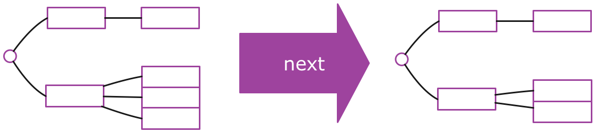

## Full-Stack Redux Tuturial（译）
> 原文链接： [Full-Stack Redux Tuturial](http://teropa.info/blog/2015/09/10/full-stack-redux-tutorial.html)
>
>作者: [Tero Parviainen](http://teropa.info/) ([@teropa](https://twitter.com/teropa))

### 使用Redux, React,Immutable并且基于测试优先开发的综合指南
Redux是目前JavaScript领域中最令人兴奋的事情之一。它从众多库和框架中脱颖而出，做了很多绝对正确的事情：一个简单、可预测的状态模型。强调函
数式编程和不可便数据。一个微小但集中的API...怎能让我们不喜欢它？

Redux是一个非常小的库，学习它的所有API并不是很困难。但是对于很多人来说，它创建了一种范式转换：微量的构建块和一些自我约束的限制(包括纯函
数和不可变数据)可能让人感觉受到限制。所以到底应该如何完成工作？

本教程将指导您从头开始构建一个全栈的Redux和ImmutableJs应用。我们将使用测试优先开发真实应用程序，该程序后端基于Node+Redux构建，前端基于
React+Redux构建。在我们的工具箱里还包括ES6,Babel,Socket.io,Webpack以及Mocha.它非常有趣，你可以在任何时候跟上它的节奏。

<h3 id="content"> 目录</h3>
* [目录](#content)
* [你所需要的](#What_You_Will_Need)
* [App](#App)
* [体系结构](#The_Architecture)
* [服务端应用程序](#The_Server_Application)
  * [设计应用程序State Tree](#Designing_The_Application_State_Tree)
  * [项目安装](#Project_Setup)
  * [熟悉不可变数据](#Getting_Comfortable_With_Immutable)
  * [使用纯函数编写逻辑层](#Writing_The_Application_Logic_With_Pure_Functions)
    * [加载条目](#Loading_Entries)
    * [开始投票](#Starting_The_Vote)
    * [投票中](#Voting)
    * [开始下一对](#Moving_to_The_Next_Pair)
    * [结束投票](#Ending_The_Vote)
  * [介绍 Actions 和 Reducers](#Introducing_Actions_and_Reducers)
  * [组合 Reducers 的味道](#A_Taste_of_Reducer_Composition)
  * [介绍Redux Store](#Introducing_The_Redux_Store)
  * [建立Socket.io服务器](#Setting_Up_a_Socket.io_Server)
  * [广播来自Redux监听器的state](#Broadcasting_State_from_A_Redux_Listener)
  * [接收远程Redux Actions](#Receiving_Remote_Redux_Actions)
* [客户端应用程序](#The_Client_Application)
  * [客户端项目安装](#Client_Project_Setup)
    * [支持单元测试](#Unit_Testing_support)
  * [React 以及 React热加载](#React_and_react-hot-loader)
  * [编写投票界面UI](#Writing_The_UI_for_The_Voting_Screen)
  * 编写投票结果界面UI以及处理路由
  * react从Redux获得数据
  * 安装Socket.io客户端
  * 从服务端接收Actions
  * 从react组件分发Actions
  * 使用Redux中间件向服务端发送Actions

<h3 id="What_You_Will_Need"> 你所需要的</h3>

本教程对知道如何编写JavaScript应用程序的工程师是最有用的。我们将使用Node,ES6, React, Webpack和Babel,因此如果你已经熟悉了这些工具,
你学习接下来的内容应该不会遇到麻烦。否则，你应该先去学习一些相关基础知识。

谈及工具,你只要有带有NPM的Node和一款喜欢的文本编辑器即可，事实就是这样。

<h3 id="App"> App</h3>

我们将开发一款投票APP，它可以为党派、会议和聚会提供现场投票。

这个想法是，我们将有一系列要投票的东西： 电影、歌曲、编程语言、Horse JS quotes等任何东西。APP将它们成对放在一起PK，所以在每一轮人们都
可以在二者中投票给喜欢的。当只剩下一个时，它便是胜者。

例如，下面是关于Danny Boyle的最佳电影的投票流程图：


本APP将有两个独立的用户界面：投票UI可以适用于移动设备，或者其他可以使用浏览器的东西。投票结果UI设计为投影在投影仪或者其他大屏幕上。它将
实时显示正在投票的结果。


<h3 id="The_Architecture"> 体系结构</h3>

本系统在技术上由两部分组成：基于React的浏览器APP提供用户界面和一个服务器应用程序，我们使用Node处理投票逻辑。两者之间使用WebSockets进行
通信。

我们将使用Redux来组织客户端和服务端的代码。为了保持状态，我们将使用不可变的数据结构。

---
尽管客户端和服务端的代码会有许多相似的地方——例如，都将使用Redux——但它并不是真的同构应用(universal/isomorphic application)，它们实际
上并不能共享任何代码。

它更像是一个通过传递消息进行通信的应用程序组成的分布式系统。

---

<h3 id="The_Server_Application"> 服务端应用程序</h3>

我们打算先编写Node程序，之后再编写React程序。这可以使我们在开始思考UI界面前专注于核心逻辑。

随着我们创建服务端程序，我们将熟悉Redux和Immutable，并将看到如何使用它们构建应用程序。Redux大多数情况下与React应用程序相关，但是它实际
上并不局限于这一种用例。我们将要学习的一部分是Redux在其他上下文中是多么有用。

我推荐跟着教程从头开始写APP，但是如果你也可以选择直接从[github](https://github.com/teropa/redux-voting-server)上clone代码。

<h3 id="Designing_The_Application_State_Tree"> 设计应用程序State Tree</h3>

设计一个Redux应用程序经常从考虑应用程序的state开始。它描述了在任何给定的时间，您的应用程序将要发生什么。

所有的框架和体系结构都有state。在Ember应用程序和Backbone应用程序中,state在Model里面。在Augular应用程序中，state经常存放在
Factories和Services里面。在大部分的Flux实现中，state存放在Stores里面。Redux和上面提到的有何不同呢？

主要的不同是在Redux中，应用程序的state被存放在单一的树结构中。换句话说，一切你所知道的关于你的应用程序的state全部存放在一个由maps和
arrays组成的数据结构中。

这产生了很多后果，马上我们就会看到。最重要的后果之一是这如何让你从应用程序的行为中独立出来思考应用程序的state(how this lets you think
about the application state in isolation from the application's behavior).State是纯数据。它没有方法或者函数。它并没有卷在对象
当中。所有的都存放在同一个地方。

这可能听起来像是一种局限，尤其是你有OO的经历来学习Redux。但实际上它更像是一种解放，因为这种方式可以让你专注于数据并且只是数据。如果你花
一点时间来设计应用程序state, 几乎一切都会遵循。

这并不是说你总是先设计整个state树，然后才是APP剩下的部分。通常你最终以并行方式演进。但是，我发现在开始写代码之前，对state树应该如何设计
有一个初步的认识是非常有用的。

所以，让我们看下我们的投票系统的state树应该是什么样的。该系统的目的是在一些东西(电影、乐队等等)上投票。一种合理的初始state可能是将要被
投票的东西的集合。我们可以称这个集合为entries:


当第一次投票开始，此时应该有一些方式来区分哪个是当前被投票的。在这种情况下，应该有一个vote entry在state中，它保留着目前处于投票状态的
物品对。物品对或许应该从entries集合中拿出来。


在投票开始之后，票数也应该被存储起来。我们可以用vote中另外的数据结构来做这件事。


当一次投票结束，失败的entry将会被舍弃，胜利的entry将会被放回entries，作为最后一个物品(item).它之后将会与其他物品进行PK。接下来的两个
entry同样会被放在vote中。


只要还有待投票的entries，我们可以想象出这种state循环。在某些时候，将只剩下一个entry。这时，我们就可以称它为胜者并结束投票:


这看起来似乎是一种可行的设计。有很多不同的方法来设计这些要求的state，这可能不是最佳的。但是这并不重要。只需要在开始的时候足够好就行，
重要的是我们已经建立了一种具体的应用程序该如何执行任务的想法。这是我们甚至没有考虑任何代码之前就完成的！

<h3 id='Project_Setup)'> 项目安装</h3>

说了这么多废话，是时候开始干活了。在我们做任何事情之前，我们需要建立一个项目目录并且初始化它作为一个NPM项目：
```zsh
mkdir voting-server
cd voting-server
npm init -y
```
输入命令后的结果是在voting-server目录下有一个文件package.json.

我们打算使用ES6语法来编写程序。虽然node从4.0.0版本支持很多ES6特性，但是它仍然不支持模块化(modules),而模块化正是我们想用的。我们需要向
项目中添加babel, 这样我们能够随心所欲的使用ES6特性，babel会将代码转换成ES5:
```zsh
npm install --save-dev babel-core babel-cli babel-preset-es2015
```
因为我们将写一系列的单元测试，我们同样需要一些库来写它们：
```zsh
npm install --save-dev  mocha chai
```
[Mocha](https://mochajs.org/)是我们将要使用的测试框架，[Chai](http://chaijs.com/)是一个断言(assertion)/期望(expectation)库，我
们在测试中使用它来指定我们期望发生的事情。

我们可以使用node_modules下的mocha命令来运行测试。
```zsh
./node_modules/mocha/bin/mocha --compilers js: babel-core/register --recursive
```
这条命令告诉Mocha递归的寻找项目中的所有测试并且运行它们。在运行前它先使用babel转化ES6代码。

从长远来看，在我们的package.json中存储这条命令将会更容易：
```js
//package.json
"script": {
  "test": "Mocha --compilers js: babel-core/register --recursive"
},
```
我们需要做的另外一件事是使babel的ES6/ES2015语法支持功能生效。这可以通过激活我们已经安装过的**babel-preset-es2015**包来完成。我们只需
要在package.json中添加babel部分：

```js
//package.json
"babel": {
  "preset": ["es2015"]
},
```
现在我们可以使用npm命令来运行测试。

```zsh
npm run test
```
**test:watch** 命令可以用来启动一个进程监控代码中的变化并且在每次变化后运行测试:
```js
//package.json
"script": {
  "test": "mocha --compolers js:babel-core/register recursive",
  "test:watch": "npm run test -- --watch"
},
```
我们首先打算用的库是Facebook的immutable, 它可以为我们提供一些数据结构使用。我们将在下一个章节讨论immutable，现在我们仅仅将它加入到项
目中来，同时安装的有chai-immutable库，它可以扩展Chai来支持比较Immutable数据结构(comparing Immutable data structures):
```zsh
npm install --save immutable
npm install --save-dev chai-immutable
```
我们需要在任何测试运行前插入chai-immutable.我们可以在一个很小的test_heler文件中做到这一点，所以我们接下来应该创建它：
```js
// test/test_helper.js

import chai from 'chai';
import chaiImmutable from 'chai-immutable';

chai.use(charImmutable);
```
接下来我们需要在Mocha启动测试之前导入test_helper文件：
```js
//package.json

"script": {
  "test": "mocha --compilers js:babel-core/register --require ./test/test_helper.js --recursive"
},
```
这就是我们在开始阶段所有需要安装的！！！

<h3 id="Getting_Comfortable_With_Immutable"> 熟悉不可变数据</h3>

关于Redux架构的第二个重点是，state不仅仅是一颗树，实际上他是一个immutable tree.

看上一节中的树，只通过更新树中的代码来更改应用程序的状态，这似乎是一个合理的想法：在maps中执行修改操作，在arrays中执行删除操作等等。然而
这并不是Redux所做的事。

一个Redux的状态树是一个immutable data structure. 这意味着一旦你有一颗state tree, 只要它还存在它将再也不会改变。它将永远保持相同的状
态。接下来你该如何进入下一个state是通过生成另外一颗state tree来反映你想要作出的改变。

这意味着应用程序的任意两个连续状态是存储在两个分开且独立的树中(separate and independent)。从一个状态跳到下一状态是通过执行一个函数，它
会获取当前的状态并返回一个新的状态。



这为什么会是好想法呢？ 人们首先提到的是如果你拥有一棵树中所有的state,并且进行了一些非破坏性的更新，你可以不需要坐太多额外的工作来保存应用
程序的历史： 仅需要保留以前state trees的集合。然后你可以执行 undo/redo 等“免费”操作——只需要将当前应用程序状态设置为历史记录中的上一个
state tree或者下一个state tree. 你同样可以序列化历史记录并且将它发送到一些存储介质中保存，这样你可以在之后重播(replay)它,这在debugging
的时候非常有用。

然而，我想说除了这些功能之外，关于immutable data最重要的是它将如何简化你的代码。你可以使用纯函数(pure function)来编程:这些函数除了获
取数据和返回数据外，不做任何其他操作。这些是可以信赖的、行为可预测的函数。你可以随意的调用它们，并且它们的行为不会改变。给它们相同的参数，
它们就会返回相同的结果。它们不会改变世界的state(they`re not going to change the state of world. //懵逼脸，为什么突然冒出这句话)。
测试将变得很随意，因为在你调用之前，不需要设置一些stub或者其他假的操作（other fakes to "prepare the universe"）.它仅仅是输入数据，
输出数据。

Immutable data structures是我们建立应用程序state需要用的材料。所以让我们花点时间来编写一些单元测试来说明它是如何工作的。

---

如果你已经熟悉了immutable data和immutable库，可以随意的跳过下一部分。

---

为了熟悉immutability的想法，我们先讨论可能是最简单的数据结构:如果有一个“计数器”应用程序，它的state仅仅是单个数字。state将会从0到1,2,...

我们已经习惯了将数字考虑为immutable data.当“计数器”增加，我们不会变化这个数字。因为在数字上没有setter，让数字变化实际上是不可能的。你
不能说**42.setValue(43)**.

取而代之的是我们获得另外一个数字，它是将之前的数字加1后的结果。我们可以纯函数来实现。它的参数是当前的state并且它的返回值将作为下一个state
被使用。下面是这个函数以及与它相关的单元测试：

```js
// test/immutable_spec.js

import {expect} from 'chai'

describe('immutability', ()=> {

  describe('a number', ()=> {

    function increment(currentState) {
      return currentState+1;
    }

    it('is immutable', ()=> {
      let state = 42;
      let nextState = increment(state);

      expect(nextState).to.equal(43);
      expect(state).to.equal(42);
    });

  });

});
```

当调用increment时state不会改变的事实是显而易见的。怎么可能呢？数字是immutable!!!

---

你可能已经注意到这个测试和我们的应用程序完全无关——我们甚至没有任何应用程序代码！

这个测试只是一个学习工具而已。我发现如果你打算研究一个新的API或者技术时，通过编写一些单元测试来证明一些想法是有用的，这正是我们在这里所
做的。Kent Beck在它的[TDD书](https://www.amazon.com/Test-Driven-Development-By-Example/dp/0321146530)中称这种测试为“学习型测
试”.

---

我们接下来要做的是拓展这种不变量的想法到所有类型的数据结构中，而不仅仅是数字。

例如，一个应用程序的state是一系列的电影，我们可以使用Immutable的list。添加一部电影生成新的电影列表的操作是通过将旧的电影列表和新的电影
相结合来完成的。至关重要的是，旧的电影列表在操作后仍然没有改变。

```js
// test/immutable_spec1.js

/**
 * Created by qixin on 27/11/2016.
 */

import {expect} from 'chai';
import {List} from 'immutable';

describe('immutability', () => {

    //..

    describe('A list', () => {

        function addMovie(currentState, movie) {
            return currentState.push(movie);
        };

        it('is immutable', () => {
            let state = List.of('Transplotting', '28 Days Later');
            let nextState = addMovie(state, 'Sunshine');

            expect(nextState).to.equal(List.of(
                'Transplotting',
                '28 Days Later',
                'Sunshine'
            ));
            expect(state).to.equal(List.of(
                'Transplotting',
                '28 Days Later'
            ));
        });

    });

});

```
如果我们向普通的数组中push一项之后，旧的state是不会保持不变的！因为我们使用了Immutable List来替代，我们就有了与number示例一样的语义。

这个想法扩展到整个state tree也是如此。一个state tree只是由Lists, Maps或者一些其他类型的集合嵌套形成的。在它上面进行操作相当于生成一颗
新的state tree,并保留下来旧的state tree. 如果state tree是一个Map,里面有一个键'Movie'指向了一个电影列表，添加一部电影意味着我们需要
新创建一个map,键'Movie'指向一个新的lis：
```js
// test/immutable_spec2.js

/**
 * Created by qixin on 27/11/2016.
 */
import {expect} from 'chai';
import {List, Map} from 'immutable';

describe('immutability', () => {

    //..

    describe('a tree', () => {

        function addMovie(currentState, movie) {
            return currentState.set(
                'movies',
                currentState.get('movies').push(movie)
            );
        };

        it('is immutable', ()=> {
           let state = Map({
              movies: List.of(
                  'Transplotting',
                  '28 Days Later'
              )
           });
           let nextState = addMovie(state, 'Sunshine');

           expect(nextState).to.equal(Map({
               movies: List.of(
                   'Transplotting',
                   '28 Days Later',
                   'Sunshine'
               )
           }));
           expect(state).to.equal(Map({
               movies: List.of(
                   'Transplotting',
                   '28 Days Later'
               )
           }));
        });

    });

})
```
这和之前的操作是同样的方法，仅仅是为了拓展展示在嵌套的数据结构中同样有效。同样的想法适用于所有类型和大小的数据。

对于如此类的嵌套数据结构的操作，immutable提供了几个帮助函数，可以更容易的"到达"嵌套数据结构来产生新的值。在
这种情况下，我们可以使用update函数来使代码更加简洁：
```js
// test/immutable_spec3.js

fuction addMovie(currentState, movie) {
  return currentState.update('movies', movies => movies.push(movie));
};
```
上述例子可以让我们了解immutable数据。它将被用作我们应用程序的state. 还有很多功能包含在immutable API中，我们
仅仅简单的介绍一些"皮毛"。

---

虽然immutable data是Redux体系架构中的关键点，但是使用Immutable库并不是必须的。事实上，在Redux官方文档中大部
分使用的还是plain old JavaScript objects和数组，简单的避免按照惯例改变它们的值。

在这篇教程中，我们使用Immutable库来代替它，主要有以下几个原因：
* Immutable`s data structures是从头开始设计被用来不可变使用，因此提供了一些使immutable操作更方便的API。
* 我赞同Rich Hickey的观点[there is no such as things as immutability by convention](http://codequarterly.com/2011/rich-hickey/)
。如果你使用可变的数据结构，你或者其他人迟早会错误地改变它们。当你刚刚开始的时候尤其如此，像object.freeze()这类
东西可能会有帮助。
* Immutable·s data structure是持久的([persistent](https://en.wikipedia.org/wiki/Persistent_data_structure))
，这意味着它们是内部结构化的，使得新的版本在时间和存储上都是高效的，即使对于大型的state tree也是如此。使用plain
objects和数组可能会造成过量的复制，这会降低性能。

---

<h3 id="Writing_The_Application_Logic_With_Pure_Functions"> 使用纯函数编写逻辑层</h3>

在了解了immutable state trees和在树上进行操作的纯函数。我们可以将我们的注意力转移到投票系统的逻辑层上。应用程序
的核心将由我们一直在讨论的部分组成：一个tree structure以及一些产生新版tree structure的函数。

<h3 id="loading_entries"> 加载条目</h3>

首先，正如我们前面所讨论的，应用程序允许"加载"一系列想要被投票的条目。我们应该有一个**setEntries**函数，它可以获取之
前的state和一系列条目，生成一个包括所有条目的state,下面是相关的测试代码：
```js
/**
 * Created by qixin on 27/11/2016.
 */

import {List, Map} from 'immutable';
import {expect} from 'chai';

import {setEntries} from '../src/core';

describe('application logic', () => {

    describe('setEntries', () =>{

        it('add the entries to the state', () => {
           const state = Map();
           const entries = List.of('Transplotting', '28 Days Later');
           const nextState = setEntries(state, entries);
           expect(nextState).to.equal(Map({
               entries: List.of('Transplotting', '28 Days Later')
           }));
        });
    });
})
```

**setEntries**的最初实现尽可能做最简单的事情：它可以在Map中设置一项键为'entries'，值为给定的一系列entries.这
生成了我们之前设计的第一个state tree.

```js
/**
 * Created by qixin on 27/11/2016.
 */
export function setEntries(state, entries) {
    return state.set('entries', entries);
}

```

为了方便，我们允许输入的条目是一个普通的js数组(或者是其他可迭代的集合)。当在state tree中，它仍然是一个immutable List。

```js
// test/core.js

        it('converts to immutable', () =>{
            const state = Map();
            const entries = ['Transplotting', '28 Days Later'];
            const nextState = setEntries(state, entries);
            expect(nextState).to.equal(Map({
                entries: List.of('Transplotting', '28 Days Later')
            }));
        });
```
在实现中，我们应该传递给定的entries给List构造器来满足这个需求：
```js
/**
 * Created by qixin on 27/11/2016.
 */
import {List} from 'immutable';


export function setEntries(state, entries) {
    return state.set('entries', List(entries));
}


```

<h3 id="Starting_The_Vote"> 开始投票</h3>

在已经拥有entries set的state上，调用next函数后我们开始投票。这意味着，从我们设计的状态树的第一个到第二个(图1 --- 图2)。

函数不需要额外的参数。在state中应该建立一个**vote** Map, 并且两个条目包含在键为pair的键值对中。处于投票阶段的条目不应
该再出现在entries List中。

```js
// test/core_spec1.js

/**
 * Created by qixin on 30/11/2016.
 */

import {List, Map} from 'immutable';
import {expect} from 'chai';
import {setEntries, next, mapTest1} from '../src/core';


describe('application logic', () => {

    //..

    describe('next', () => {

        it('take the next two entries under vote', () => {
            const state = Map({
                entries: List.of('Transpotting', '28 Days Later', 'Sunshine')
            });
            const nextState = next(state);
            expect(nextState).to.equal(Map({
                vote: Map({
                    pair: List.of('Transpotting', '28 Days Later')
                }),
                entries: List.of('Sunshine')
            }));
        });

    });

});
```
实现这个操作将会[merge](https://facebook.github.io/immutable-js/docs/#/Map/merge)一个更新进old state,更新包括
将头两个条目放到一个List中，其他在仍存放在新版的**entries**中：
```js
// test/core.js

import {List, Map} from 'immutable';

//...

export function next(state) {
    const entries = state.get('entries');
    return state.merge({
        vote: Map({pair: entries.take(2)}),
        entries: entries.skip(2)
    });
}
```

<h3 id="Voting"> 投票中</h3>

当一个投票进行时，应该可以让人们对条目进行投票。当对一个条目进行新的投票时，它的"计数"（tally)也应该出现在投票中。如果一个
条目已经有了计数，它应该被增加：
```js
// test/core_spec3.js

/**
 * Created by qixin on 30/11/2016.
 */

import {List, Map} from 'immutable';
import {expect} from 'chai';
import {setEntries, next, vote} from '../src/core';

describe('application logic', () => {

    //..

    describe('vote', () => {

        it('creates a tally for the voted entry', () => {
            const state = Map({
                vote: Map({
                    pair: List.of('Transplotting', '28 Days Later')
                }),
                entries: List()
            });

            const nextState = vote(state, 'Transplotting');
            expect(nextState).to.equal(Map({
                vote: Map({
                    pair: List.of('Transplotting', '28 Days Later'),
                    tally: Map({
                        'Transplotting': 1
                    })
                }),
                entries: List()
            }));
        });

        it('adds to existing tally for the voted entry', () => {
            const state = Map({
                vote: Map({
                    pair: List.of('Transplotting', '28 Days Later'),
                    tally: Map({
                        'Transplotting': 3,
                        '28 Days Later': 2
                    })
                }),
                entries: List()
            })

            const nextState = vote(state, 'Transplotting');
            expect(nextState).to.equal(Map({
                vote: Map({
                    pair: List.of('Transplotting', '28 Days Later'),
                    tally: Map({
                        'Transplotting': 4,
                        '28 Days Later': 2
                    })
                }),
                entries: List()
            }));

        });
    });
});
```

---

 你可以使用Immutable中的[fromJS](https://facebook.github.io/immutable-js/docs/#/fromJS)函数更简洁的构建这些嵌
 套的Maps和Lists。

---

我们可以下面的代码来通过这些测试：
```js
// test/core.js

export function vote(state, entry) {
    return state.updateIn(
        ['vote', 'tally', entry],
        0,
        tally => tally+1
    );
}
```
使用[updateIn](https://facebook.github.io/immutable-js/docs/#/Map/updateIn)是多么的优雅！这段代码的意思是"进入
潜逃路由结构路径['vote', 'tally', 'Transplotting'], 并且在这里应用该函数。如果在路径中有键不存在，将会在该位置创建
新的Maps。如果最后的值缺失，用"0"来进行初始化。

它包装了很多层(It packs a lot of punch)，但这正是让我们可以愉快得使用Immutable data structures的那类代码，因此花点
时间来熟悉它是值得的。
```js
updateIn()

updateIn(keyPath: Array<any>, updater: (value: any) => any): Map<K, V>
updateIn(
    keyPath: Array<any>,
    notSetValue: any,
    updater: (value: any) => any
): Map<K, V>

updateIn(keyPath: Iterable<any, any>, updater: (value: any) => any): Map<K, V>

updateIn(
    keyPath: Iterable<any, any>,
    notSetValue: any,
    updater: (value: any) => any
): Map<K, V>
```

<h3 id="Moving_to_The_Next_Pair"> 开始下一对</h3>

一旦关于一对条目的投票结束，我们应该开展下一对条目的投票。当前投票结果获胜的条目应该被保存，并且添加在entries的最后，以便
后来仍然可以被用来与其他条目配对pk。如果票数相同，两个条目都应该保存。

我们在已经实现的**next**函数中添加这个逻辑：
```js
/**
 * Created by qixin on 30/11/2016.
 */

import {List, Map, fromJS} from 'immutable';
import {expect} from 'chai';
import {next} from '../src/core';

describe("application logic", () => {

    //..

   describe('winnerAndNext', () => {

       it('put winner of current vote back to entries', () => {
           const state = fromJS({
               vote: {
                   pair: ['Transplotting', '28 Days Later'],
                   tally: {
                       'Transplotting': 4,
                       '28 Days Later': 2
                   }
               },
               entries: ['Sunshine', 'Millions', '127 Hours']
           });

           const nextState = next(state);
           expect(nextState).to.equal(fromJS({
               vote: {
                   pair: ['Sunshine', 'Millions']
               },
               entries: ['127 Hours', 'Transplotting']
           }));
       });

       it('puts both from tied vote back to entries', () => {
           const state = Map({
               vote: Map({
                   pair: List.of('Trainspotting', '28 Days Later'),
                   tally: Map({
                       'Trainspotting': 3,
                       '28 Days Later': 3
                   })
               }),
               entries: List.of('Sunshine', 'Millions', '127 Hours')
           });
           const nextState = next(state);
           expect(nextState).to.equal(Map({
               vote: Map({
                   pair: List.of('Sunshine', 'Millions')
               }),
               entries: List.of('127 Hours', 'Trainspotting', '28 Days Later')
           }));
       });
   });
});

```
在实现中，我们只是将当前投票的“获胜者”连接到entries后面.我们可以使用getWinners新功能找到这些赢家：
```js
// src/core.js

function getWinners(vote) {
  if (!vote) return [];
  const [a, b] = vote.get('pair');
  const aVotes = vote.getIn(['tally', a], 0);
  const bVotes = vote.getIn(['tally', b], 0);
  if      (aVotes > bVotes)  return [a];
  else if (aVotes < bVotes)  return [b];
  else                       return [a, b];
}

export function next(state) {
  const entries = state.get('entries')
                       .concat(getWinners(state.get('vote')));
  return state.merge({
    vote: Map({pair: entries.take(2)}),
    entries: entries.skip(2)
  });
}
```

<h3 id="Ending_The_Vote"> 结束投票</h3>

在某一时刻，当投票结束时将只剩下一个条目。这时我们将有一个获胜的entry.我们应该做的不是试图形成下一个
投票，而是明确的在state中设置赢者。与此同时，投票结束了。
```js
// test/core_spec5.js

describe('next', () => {

  // ...

  it('marks winner when just one entry left', () => {
    const state = Map({
      vote: Map({
        pair: List.of('Trainspotting', '28 Days Later'),
        tally: Map({
          'Trainspotting': 4,
          '28 Days Later': 2
        })
      }),
      entries: List()
    });
    const nextState = next(state);
    expect(nextState).to.equal(Map({
      winner: 'Trainspotting'
    }));
  });

});
```
在**next**的实现中，我们应该有一个特殊条件来处理当entries的大小变为1的情况：
```js
// src/core.js

export function next(state) {
  const entries = state.get('entries')
                       .concat(getWinners(state.get('vote')));
  if (entries.size === 1) {
    return state.remove('vote')
                .remove('entries')
                .set('winner', entries.first());
  } else {
    return state.merge({
      vote: Map({pair: entries.take(2)}),
      entries: entries.skip(2)
    });
  }
}
```
我们在这里可以仅仅返回**Map({winner: entries.first()})**。但是我们并没有这么做，取而代之的是我们仍然
接受old state做为起点并且明确的从中去除了键'vote'和'entries'。这么做的原因是面向未来的(future-proofing):
在某些时候，我们可能在state中有一些不相关的数据，它应该不变地通过这个函数。这些状态转换函数中总是将old state
渐变为new state而不是从头开始构建new state通常是个好主意。

关于我们应用程序的核心逻辑，这里已经有了一个由几个函数组成的可接受版本。我们同样还有关于它们的单元测试，写这些
测试是相对容易的：no setup, no mock, no stub. 这是纯函数的魅力。我们可以调用它们并检查返回值。

注意：到目前为止，我们还没有安装redux. 我们可以全身心的投入到应用程序的逻辑中，不需要将"框架"带进来。这是一件
非常令人愉快的事情。

<h3 id='Introducing_Actions_and_Reducers'> 介绍 Actions 和 Reducers</h3>

我们已经有了应用程序的核心函数，但是在Redux中，你实际上不需要直接调用这些函数。在函数和外部世界之间还有一个中间
层： Actions。

Action是一种简单的数据结构，描述了应用程序中应该发生的变化。它基本上描述了一个包装成小对象的函数调用。按照惯例，
每一个action都有type属性，它描述了动作的操作。Action也可能携带其他属性。下面是几个与我们的核心函数相匹配的样例
Action。
```js
{type: 'SET_ENTRIES', entries: ['Transplotting', '28 Days Later']}

{type: 'NEXT' }

{type: 'VOTE', entry: 'Transplotting'}
```
如果actions使用这种写法，我们同样需要一种方式将它们转换成实际的核心函数调用。例如，对于**VOTE** action,应进行
以下调用：
```js
// this action
let voteAction = {type: 'VOTE', entry: 'Transplotting'};
// should cause this to happen
return vote(state, voteAction.entry);
```
我们将要写的是能够根据当前state进行任何action的通用函数，并且能够调用与action相匹配的核心函数。这个函数被称为：
reducer:
```js
// src/reducer.js

/**
 * Created by qixin on 01/12/2016.
 */
export default function reducer(state, action) {
    //figure out which function to call and call it
}
```

我们应该测试reducer确实能够处理我们的三个action:
```js
// test/reducer_spec.js

/**
 * Created by qixin on 01/12/2016.
 */

import {Map, fromJS} from 'immutable';
import {expect} from 'chai';

import reducer from '../src/reducer';

describe('reducer', () => {

    it('handle SET_ENTRIES', () => {
       const initialState = Map();
       const action = {type: 'SET_ENTRIES', entries: ['Transplotting', '28 Days Later']};
       const nextState = reducer(initialState, action);

       expect(nextState).to.equal(fromJS({
           entries: ['Transplotting', '28 Days Later']
       }));
    });

    it('handle NEXT', () => {
        const initialState = fromJS({
            entries: ['Transplotting', '28 Days Later']
        });
        const action = {type: 'NEXT'};
        const nextState = reducer(initialState, action);

        expect(nextState).to.equal(fromJS({
            vote:{
                pair: ['Transplotting', '28 Days Later']
            },
            entries: []
        }));
    });

    it('handle VOTE', () => {
        const initialState = fromJS({
            vote: {
                pair: ['Transplotting', '28 Days Later']
            },
            entries: []
        });
        const action = {type: 'VOTE', entry: 'Transplotting'};
        const nextState = reducer(initialState, action);

        expect(nextState).to.equal(fromJS({
            vote: {
                pair: ['Transplotting', '28 Days Later'],
                tally: {
                    'Transplotting' : 1
                }
            },
            entries: []
        }));
    });

});
```


一个reducer应该根据action的类型委托相应的核心函数。它还知道如何从每个action对象中解压出每个函数的附加参数:
```js
// src/reducer.js

/**
 * Created by qixin on 01/12/2016.
 */
import {setEntries, next, vote} from './core'

export default function reducer(state, action) {
    //figure out which function to call and call it
    switch (action.type) {
        case 'SET_ENTRIES':
            return setEntries(state, action.entries);
        case 'NEXT':
            return next(state);
        case 'VOTE':
            return vote(state, action.entry);
    }
    return state;
}
```
注意：如果reducer不能识别the action, 它将会返回当前state.

Reducer另外一个重要的要求是如果它们以未定义的状态被调用时，它们知道如何将其初始化为有意义的值。在我们这种条件
下，初始值是Map。因此，给定一个未定义状态就等于给定一个空的Map,同样是有效的。
```js
// test/reducer_spec1.js

/**
 * Created by qixin on 01/12/2016.
 */
import {Map, fromJS} from 'immutable';
import {expect} from 'chai';

import reducer from '../src/reducer';

describe('reducer', () => {

    //..

    it('initial a undefined state', () => {
        const action = {type: 'SET_ENTRIE', entries: ['Transplotting']};
        const nextState = reducer(undefined, action);

        expect(nextState).to.equal(fromJS({
            entries: ['Transplotting']
        }));
    });
});
```
因为我们应用程序的逻辑存放在**core.js**中，在这里引入初始state是有道理的：
```js
// src/core.js

export const INITIAL_STATE = Map();
```

在reducer中，我们导入它，并且将它做为state参数的默认值：

```js
/**
 * Created by qixin on 01/12/2016.
 */
import {setEntries, next, vote, INITIAL_STATE} from './core'

export default function reducer(state = INITIAL_STATE, action) {
    //figure out which function to call and call it
    switch (action.type) {
        case 'SET_ENTRIES':
            return setEntries(state, action.entries);
        case 'NEXT':
            return next(state);
        case 'VOTE':
            return vote(state, action.entry);
    }
    return state;
}
```
关于这个reducer的工作方式有趣的是给定任何类型的action,它如何能够普遍的用于将应用程序的一个状态切换到
下一个。给定一个历史state的集合，你实际上可以通过[reduce](https://developer.mozilla.org/en/docs/Web/JavaScript/Reference/Global_Objects/Array/reduce)
集合到当前state.这也是为什么函数被称为reducer: 它满足了reduce回调函数的约定。
```js
// test/reducer_spec2.js

/**
 * Created by qixin on 01/12/2016.
 */

import {Map, fromJS} from 'immutable';
import {expect} from 'chai';

import reducer from '../src/reducer';

describe('reducer', () => {

    it('can be used with reduce', () => {
        const actions = [
            {type: 'SET_ENTRIES', entries: ['Trainspotting', '28 Days Later']},
            {type: 'NEXT'},
            {type: 'VOTE', entry: 'Trainspotting'},
            {type: 'VOTE', entry: '28 Days Later'},
            {type: 'VOTE', entry: 'Trainspotting'},
            {type: 'NEXT'}
        ];

        const finalState = actions.reduce(reducer, Map());
        expect(finalState).to.equal(fromJS({
            winner: 'Trainspotting'
        }));
    });
});
```
与直接调用核心函数相比，批量(batch) 和／或 重放(replay) action集合的能力是action/reducer状态转换模型
的主要优点。例如，给定actions是可以序列化成JSON的对象，你可以轻易的将它们发送到Web Worker,并在那里运行
你的reducer逻辑。或者你甚至可以通过网络来发送它们，这也是我们后面会做的！

---

注意：我们使用普通对象而不是immutable data来作为action, 实际上这是Rudex需要我们做的。

---

<h3 id='A_Taste_of_Reducer_Composition'> 组合 Reducers 的味道</h3>

我们目前定义的核心函数是每个函数都获取应用程序的整个state,然后返回应用程序下一个完整的state.

我们可以很容易理解为什么在大型程序中保持这种模式不是一个好的想法。如果应用程序中的每个操作都需要知道整个
state的结构，它会变得很脆弱。如果你想改变state的形状，需要修改大量的地方。

更好的想法是，每当可以操作的时候，尽量是操作进行在最小的一块state(或者子树)。 我们讨论的是模块化：让处理
一小部分state的函数只对那一小部分state进行操作，仿佛剩下的state不存在一样。

我们的应用程序太小了，所以没有这类问题，但是我们已经有了改进它的机会：**vote**函数是没有理由来接收应用程序
整个state的，因为它仅仅对'vote'部分进行操作。它只需要知道这些东西就够了。我们可以修改已经写好的与**vote**
相关的单元测试来实现这个想法：
```js
// test/core_spec3.js

/**
 * Created by qixin on 30/11/2016.
 */

import {List, Map} from 'immutable';
import {expect} from 'chai';
import {vote} from '../src/core';

describe('application logic', () => {

    //..

    describe('vote', () => {

        it('creates a tally for the voted entry', () => {
            const state = Map({
                pair: List.of('Transplotting', '28 Days Later')
            });

            const nextState = vote(state, 'Transplotting');
            expect(nextState).to.equal(Map({
                pair: List.of('Transplotting', '28 Days Later'),
                tally: Map({
                    'Transplotting': 1
                })
            }));
        });

        it('adds to existing tally for the voted entry', () => {
            const state = Map({
                pair: List.of('Transplotting', '28 Days Later'),
                tally: Map({
                    'Transplotting': 3,
                    '28 Days Later': 2
                })
            });

            const nextState = vote(state, 'Transplotting');
            expect(nextState).to.equal(Map({
                pair: List.of('Transplotting', '28 Days Later'),
                tally: Map({
                    'Transplotting': 4,
                    '28 Days Later': 2
                })
            }));

        });
    });
});
```

正如我们所看到这，这么做同时简化了测试代码，这通常是个好预兆！

**vote**函数实现部分现在只需要接收state中的vote部分，然后更新它的票数：
```js
export function vote(voteState, entry) {
    return voteState.updateIn(
        ['tally', entry],
        0,
        tally => tally+1
    );
}
```
现在，选取与**vote**函数相关的一部分state变成了reducer的部分工作：
```js
// src/reducer.js

export default function reducer(state = INITIAL_STATE, action) {
    //figure out which function to call and call it
    switch (action.type) {
        case 'SET_ENTRIES':
            return setEntries(state, action.entries);
        case 'NEXT':
            return next(state);
        case 'VOTE':
            return state.update('vote',
                                 voteState => vote(voteState, action.entry));
    }
    return state;
}
```

这是这种模式的一个小例子，它在大型应用程序中变得越来越重要：main reducer函数只是传送lower-level reducer
所需要的state。我们把 在state tree上找到正确位置的任务 和 将更新应用于该位置 分离开。

[Redux documentation for reducers](http://redux.js.org/docs/basics/Reducers.html)对于这种reducer
组成的模式有着更详细的描述，并且还描述了一些在大多数情况下使reducer组合更容易的帮助函数。

<h3 id='Introducing The Redux Store'> 介绍Redux Store</h3>
现在我们有一个reduce, 接下来我们可以看看这是怎么插入Redux中的。

正如我们所看到的，如果你拥有应用程序将要发生的所有action的集合, 你应该调用reduce。弹出应用程序的最终state。当然，
通常你不会拥有所有actions的集合。它们将随着时间的推移而传播，正像现实世界中发生的: 当用户使用app时，当从网络中接收
数据时，或者当超时触发时。

为了应对这种实际情况，我们可以使用Redux Store。正如名字所蕴含的一样，它是存储随着时间推移你的应用程序state的对象。

Redux Store用一个reducer函数进行初始化，例如我们已经实现的：
```js

import {createStore} from 'redux';

const store = createStore(reducer);
```

接下来你可以做的是分发(dispatch) actions到store中。Store将在内部使用你的reducer, 并将actions作用于当前state,然后
存储并生成下一状态：
```js

store.dispatch({type: 'NEXT'});
```

在任何时间点，你都可以从store内部获得当前的state:
```js
store.getState();
```

我们将要建立并导出Redux Store到一个名为store.js的文件中。让我们首先测试它。我们可以通过它建立一个store, 读取它的初始state,
分发action，并且看到已经改变的state:
```js
/**
 * Created by qixin on 04/12/2016.
 */

import {Map, fromJS} from 'immutable';
import {expect} from 'chai';

import makeStore from '../src/store';

describe('store', () => {

    it('is a Redux store configured with the corrent reducer', () => {

        const store = makeStore();
        expect(store.getState()).to.equal(Map());

        store.dispatch({
            type: 'SET_ENTRIES',
            entries: ['Transplotting', '28 Days Later']
        });

        expect(store.getState()).to.equal(fromJS({
            entries: ['Trainspotting', '28 Days Later']
        }));

    });

});

```
在创建Store之前，我们需要将redux加入工程中:
```zsh

npm install --save redux
```
接下来我们可以创建store.js文件，它只是简单了调用了createStore函数和之前的reducer.
```js
// src/store.js


import {createStore} from 'redux';
import reducer from './reducer';

export default function makeStore() {
    return createStore(reducer);
}
```

因此，Redux store将事物都联系在一起，我们可以使用它作为应用程序的中心点：它持有当前state,并且随着时间的推移,
可以接收从一个版本到下一个版本演化的动作，使用我们编写的应用程序核心逻辑。

---

问：在Redux应用中，你需要多少变量？

答：一个. store中的那一个。

这种理念开始时听起来很可笑——如果你不太熟悉函数式编程。如何才能只使用一个变量来做任何有用的事情？

但是实际上，我们并不需要任何其他的变量。在我们的应用程序中，current state tree是唯一随着时间变化的东西。其他
的都是常量或者不可变数据。

---

我们的应用程序代码和Redux是如此的小，这是非常显著的。因为我们有一个通用的reducer方法，所以我们仅仅需要让Redux
知道reducer。其他都是与我们自身相关的，与框架无关的，高度可移植和纯函数代码！

如果我们现在为应用程序创建入口index.js, 我们可以让它创建和导出store:
```js
// index.js

import makeStore from './src/store';

export const store = makeStore();

```
因为我们导出了store, 你现在可以启动一个node REPL(例如使用babel-node),require index.js文件，使用store与应用程序
进行交互。

<h3 id='Setting_Up_a_Socket.io_Server'> 建立Socket.io服务器</h3>

我们的应用程序将作为一个单独的浏览器应用程序的服务器，提供用于投票和查看结果的UI.为了到达这个目的，我们需要一种客户端
和服务器交流的方式。

这应该是一个实时通讯app，因为投票者如果看到自己投票后立即产生了效果，会感觉非常有趣。出于这个因素，我们使用WebSocket
进行通讯。更具体的，我们使用Socket.io库，为WebSocket提供了不错的抽象，它可以跨浏览器工作。它还为不支持WebSocket的
客户端提供了多种回退机制。

让我们在项目中添加Socket.i：
```zsh

npm install --save socket.io
```

接下来，我们新建一个server.js文件，它导出一个创建socket.io服务器的函数。
```js
import Server from 'socket.io';

export default function startServer() {
    const io = new Server().attach(8090);
}
```
这里创建了一个socket.io服务器，是一个绑定了8090端口的正常http服务器。端口的选择是任意的，但是我们后面从客户端链接时
需要匹配端口号。

我们可以让index.js调用这个函数，因此当app启动时服务器同时被启动：
```js
// index.js

import creatStore from './src/store';
import startServer from './src/server';

export const store = makeStore();
startServer();
```
如果我们在package.json文件中添加了start命令，我们让启动环节变得更简单一些：
```js

"script": {
    "start": "babel-node index.js",
    "test": "mocha: --compilers js:babel-core/register --require ./test/test_helper.js --recursive",
}   "test:watch": "npm run test -- --watch"

```

现在我们可以通过敲入下列命令简单的开启服务器(并创建Redux store：
```zsh
npm run start
```

---

**babel-node** 命令来自于之前安装的**babel-cli**包。它可以支持babel transpilling来运行node代码。它增加一些
性能开销，因此一般在生产环境中不推荐使用，但它适用于我们教程的目的。

---

<h3 id='Broadcasting_State_from_A_Redux_Listener'> 广播来自Redux监听器的state</h3>

我们有一个socket.io服务器和一个Redux state容器，但是我们还没有以任何方式整合它们。接下来我们要做的就是改变这种情况。

我们的服务器应该能够让客户端知道应用程序的current state。(例如："哪个条目正在被投票"，"当前投票票数是多少"，"有胜利
者吗?")。当发生变化时，它可以通过发送一个socket.io事件到所有已连接的客户端。

我们怎么能知道发生改变了呢？好吧，Redux为了达到这个目的提供了一些东西：你可以 **subsrcibe** 一个Redux store。你可以
提供一个函数来实现它，当state有可能改变时，这个函数在每次 **action** 应用后都会调用store。它本质上是store中state改
变的回调(callback).

我们将在startServer中实现这个，因此让我们首先给它Redux store:
```js
// index.js

import makeStore from './src/store';
import {startServer} from './src/server';

export const store = makeStore();
startServer(store);

```

我们接下来要做的是向store subscribe一个监听器,这个store可以读取current state, 将其转化为普通javascript对象，将其
作为socket.io服务器上的state action。结果是一个json序列化的状态快照通过所有活动的socket.io连接发送。
```js
import Server from 'socket.io';


export default function startServer() {
    const io = new Server().attach(8090);
}

store.subscribe(
    () => io.emit('state', store.getState.toJS())
);
```

---

当发生任何改变时，我们现在向所有人发布整个state。这可能导致大量的数据传输。可以想到很多优化方法(例如，只发送相关子集，
发送diffs而不是状态快照snapshots...),但是现在这种实现的好处是容易编写，所以我们只是将它用于我们的示例程序。

---

为了当状态改变时发送状态快照(state snapshot)，对于客户端来说，当它们连接上应用程序立即接收到current state是有用的。
这样可以立即同步客户端的state到最新的服务器state。

我们可以在socket.io服务器上监听'connection'事件。每次客户端连接时都会获得一个。在事件监听器中，我们可以立即发送current
state:
```js
import Server from 'socket.io';


export default function startServer() {
    const io = new Server().attach(8090);
}

store.subscribe(
    () => io.emit('state', store.getState.toJS())
);

io.on('connection', (socket) => {
    socket.emit('state', store.getState().toJS());
});
```
<h3 id='Receiving_Remote_Redux_Actions'> 接收远程Redux Actions</h3>

除了向客户端发出应用程序的state,我们还能够接收来自客户端的更新：投票人将要投出选票，投票组织者将使用NEXT action向前推进
比赛。

我们使用的解决方法其实非常简单。我们做的只是让客户端发出 'action' event直接进入到Redux Store中：
```js
// src/server.js

import Server from 'socket.io';


export default function startServer() {
    const io = new Server().attach(8090);
}

store.subscribe(
    () => io.emit('state', store.getState.toJS())
);

io.on('connection', (socket) => {
    socket.emit('state', store.getState().toJS());
    socket.on('action', store.dispatch.bind(store));
});
```

这是我们开始超越"常规Redux"的地方，因为现在我们实际上接收remote actions进入store。然而，Redux架构可以让它很容易做到：
因为actions都是简单的js对象，并且js对象很容易通过网络进行传输，我们立即得到了任何数量的用户都可以参与的投票的系统。这不是
小小的壮举！

---

这里有一些明显的安全性考虑，我们允许任何已连接的socket.io服务器将任何actions分发到Redux store中。在大多数现实情况下，这里
应该有一些防火墙。可能与[the Vert.x Event Bus Bridge](#http://vertx.io/docs/vertx-web/java/#_securing_the_bridge)
不一样。具有身份验证机制的应用程序也应该在此处插入。

---

我们的服务器现在实际操作与以下类似：

1. 一个客户端向服务器发送一个action.
2. 服务器将action发送给Redux store.
3. Store调用reducer, reducer执行与action相关的逻辑.
4. Store执行服务器subscribe的监听函数.
5. 服务器发送一个'state'事件.
6. 所有已连接的client ——包括启动原始操作的那个—— 接收到新的state.

在我们完成服务器之前，让我们为它加载一些测试条目，以便我们可以在整个系统运行时查看。我们可以添加**entries.json**文件列举出
比赛条目。例如，Danny Boyle到目前为止的电影列表，随时替换您最喜欢的主题。
```json
// entries.json

[
  "Shallow Grave",
  "Trainspotting",
  "A Life Less Ordinary",
  "The Beach",
  "28 Days Later",
  "Millions",
  "Sunshine",
  "Slumdog Millionaire",
  "127 Hours",
  "Trance",
  "Steve Jobs"
]
```

我们可以将它加载到index.js文件中，然后通过调度**NEXT** action来开启投票。
```js
// index.js

import makeStore from './src/store';
import {startServer} from './src/server';

export const store = makeStore();
startServer(store);

store.dispatch({
  type: 'SET_ENTRIES',
  entries: require('./entries.json')
});
store.dispatch({type: 'NEXT'});
```
接下来，我们准备将我们的焦点转移到客户端应用程序。

<h3 id='The_Client_Application'> 客户端应用程序</h3>

在本教程的剩余部分，我们将编写一个React应用程序，它可以连接到我们现在拥有的服务器，并使投票系统对用户开放。

我们将在客户端程序中再次使用Redu，这可能是Redux最常见的使用情况：作为React应用程序的基础引擎。我们已经看到
Redux自身是如何工作的，很快我们会详细的了解到Redux如何适应react,如果使用它影响react程序设计。

我推荐跟着下面的步骤从头开始编写app,但是如果你喜欢你也可以从[github](https://github.com/teropa/redux-voting-client)
上面获得代码。

<h3 id='Client_Project_Setup'> 客户端项目安装</h3>

---

2016-08-02 更新: 现在有一种比教程中讲的方法更简单、官方支持的方式来构建React+Webpack+Babel应用程序：
[Create React App](https://facebook.github.io/react/blog/2016/07/22/create-apps-with-no-configuration.html)工具，
我鼓励你跟着[getting started](https://github.com/facebookincubator/create-react-app#getting-started)的指导尝试一下，
来代替我们教程里面的手动安装的方法.

你需要[eject](https://github.com/facebookincubator/create-react-app#converting-to-a-custom-setup) 我们曾经用过的
热加载和单元测试，因为现在这个工具还不支持这些。

---

首先我们需要做的是新建一个npm项目，和我们对服务器的做法类似。
```zsh

mkdir voting-client
cd voting-client
npm init -y

```

我们的应用程序需要一个主页，让我们把它放在**dist/index.html**:

```html
<!DOCTYPE html>
<html lang="en">
<head>
    <meta charset="UTF-8">
    <title>Title</title>
</head>
<body>
    <div id="app"></div>
    <script src="bundle.js"></script>
</body>
</html>
```

该页面包含一个id为app的<div>，我们将把应用程序放在这里。同时期望在同一目录下有一个名为bundle.js的javascript文件。

让我们为这个应用程序也创建第一个js文件.这将是应用程序的入口文件。现在我们就简单的放入一个logging statement:
```js
// src/index.js

console.log('I`m alive');
```

为了简化客户端开发工作流，我们将使用[Webpack](http://webpack.github.io/)及其开发服务器,让我们在项目中添加它们:
```zsh
npm install --save-dev webpack webpack-dev-server
```

---

如果你之前没有安装它们，也要在全局安装相同的包，这样你就可以从命令行方便的启动它们：
```zsh
npm install -g webpack webpack-dev-server
```

---

接下来，在项目的根目录下添加一个Webpack配置文件，让它与我们已经创建的文件和目录匹配起来：
```js
// webpack.config.js

module.export ={

    entry: ['./src/index.js'],

    output: {
        path: __dirname + '/dist',
        publicPath: '/',
        filename: 'bundle.js'
    },

    devServer: {
        contentBase: './dist'
    }
};
```
这将找到我们的**index.js**入口点，并且将所有内容构建到**dist/bundle.js**中。它还将使用dist目录作为开发服务器的
基础。

现在你应该可以运行Webpack生成**bundle.js**:
```zsh
webpack
```

现在你同样可以启动开发服务，之后测试网页(包括**index.js**中的logging statement)都可以在localhost:8080访问到。
```zsh
webpack-dev-server
```

因为我们打算在客户端程序中使用ES6和React的JSX语法，我们需要一些相关工具。Babel知道如何处理它们，所以让我们添加它。
我们需要Babel和它的Webpack loader.
```zsh
npm install --save-dev babel-core babel-loader babel-preset-es2015 babel-preset-react
```

在**package.json**文件中，我们需要使Babel支持 ES6/ES2015 和 React JSX，可以通过激活我们已经安装的presets:
```json
// package.json

"babel": {
    "presets": ["es2015", "react"]
},
```

在webpack config文件中我们需要作出变化让Webpack可以沿着 **.js** 文件找到 **.jsx**文件,并且都通过Babel进行处理:
```js
//webpack.config.js

module.exports ={

    entry: ['./src/index.js'],
    module: {
        loaders:[{
            test: /\.jsx?$/,
            exclude: /node_modules/,
            loader: 'babel'
        }]
    },
    resolve: {
        extensions: ['', '.js', '.jsx']
    },
    output: {
        path: __dirname + '/dist',
        publicPath: '/',
        filename: 'bundle.js'
    },
    devServer: {
        contentBase: './dist'
    }
};
```

---

在这篇教程中，我们不会花时间在CSS上。如果你想让app看起来更漂亮，你可以随时添加自己的风格。

或者，你可以采纳[this commit](https://github.com/teropa/redux-voting-client/commit/css)中的一些样式。除了
CSS文件，它添加了Webpack支持包括([自动初始化](https://github.com/postcss/autoprefixer))它,并且稍微改进了结果
可视化组件。

<h3 id='Unit_Testing_support'> 支持单元测试</h3>

我们同样打算对客户端程序编写一些单元测试。我们可以使用与服务器端相同的单元测试库—— Mocha和Chai ——来测试它：
```zsh
npm install --save-deve mocha chai
```

我们还打算测试React组件，这将需要一个DOM。一种可选方案是使用karma库运行在实际的浏览器上。然而，我们实际上可以不这么
做通过使用jsdom, 在node上运行的纯javascript DOM的实现。
```zsh
npm install --save-dev jsdom
```

---

最新版本的jsdom需要io.js或者node.js 4.0.0。如果你使用的是node旧版本，你需要准确的安装旧版本：
```zsh
npm install --save-dev jsdom@3
```

---

我们同样需要一些准备代码在它对react有效之前。我们其实需要建立jsdom版本的**document**和**window**对象，它们都是
浏览器普遍提供的。然后我们需要将它们放在 **global object**中，当React访问 **document** 和 **window**时可以发现
它们。我们可以为这种类型的setup code新建一个test helper文件:
```js
// test/test_helper.js


import jsdom from 'jsdom';

const doc = jsdom.jsdom('<!doctype html><html><body></body></html>');
const win = doc.defaultView;

global.document = doc;
global.window = win;
```

此外，我们需要获取jsdom窗口对象包含的所有属性，例如navigator，并将它们提升到Node.js全局对象。这样做可以使窗口提供的
属性在没有**window.**前缀的情况下使用。React内部的一些代码依赖于它：
```js
// test/test_helper.js

import jsdom from 'jsdom';

const doc = jsdom.jsdom('<!doctype html><html><body></body></html>');
const win = doc.defaultView;

global.document = doc;
global.window = win;

Object.keys(window).forEach((key) => {
    if(!(key in global)) {
        global[key] = window[key];
    }
});
```

我们同样打算使用Immutable集合，所以我们需要重复我们在服务器上使用的技巧来添加对它们对Chai expectation的支持。我们同时
安装immutable和chai-immutable两个包：
```zsh
npm install --save immutable
npm install --save-dev chai-immutable
```

接下来我们在test helper文件中使它生效：
```js
// test/test_helper.js

import jsdom from 'jsdom';
import chai from 'chai';
import chaiImmutable from 'chai-immutable';

const doc = jsdom.jsdom('<!doctype html><html><body></body></html>');
const win = doc.defaultView;

global.document = doc;
global.window = win;

Object.keys(window).forEach((key) => {
    if(!(key in global)) {
        global[key] = window[key];
    }
});

chai.use(chaiImmutable);
```

在我们可以运行测试之前的最后一步是提出运行它们的命令，并将其放在我们的package.json中:
```json
//package.json

"script": {
    "test": "mocha --compilers js:babel-core/register --require ./test/test_helper.js \"test/**/*@(.js|.jsx)\""
}
```

这和我们服务器package.json中的命令几乎一致，它们唯一的区别在测试文件规范上：在服务器我们只使用 **--recursive**,但是该选项
不会发现 **.jsx**文件。我们需要使用 **glob**, 它会找到所有的 **.js**和 **.jsx**测试文件。

当代码变化时，连续运行测试是有用的。我们可以为此添加一个命令**test:watch**,它与服务器的命令是一样的：
```json
// package.json

"scripts": {
    "test": "mocha --compilers js:babel-core/register --require ./test/test_helper.js 'test/**/*.@(js|jsx)'",
    "test:watch": "npm run test -- --watch"
  },
```

<h3 id='React_and_react-hot-loader'> React 以及 React热加载</h3>

有了Webpack和Babel这些基础设施，我们来谈谈React!

真正cool的事情是使用Redux和Immutable构建React应用的方法是我们可以写一些"纯组件"（有时被称为Dumb component)。在概念上，它
与纯函数非常相似，它要遵守一些规则：

1. 纯组件接收所有的数据作为props, 好比函数接收所有的数据作为arguments。它应该没有副作用，包括从其他地方读取数据，启动网络请求
等等。

2. 纯组件通常没有内部state。它所渲染的内容完全取决于输入的props。使用相同的props渲染同一个纯组件应该总返回相同的结果。在组件
内部没有隐藏state会造成两次渲染的UI不同。

这与使用纯函数具有相同的[简化效果](https://www.youtube.com/watch?v=1uRC3hmKQnM&feature=youtu.be&t=13m10s): 我们可以
可以通过观察组件的输入和它所渲染的东西来确定组件的用途。我们不需要了解其他的关于该组件的知识。同时测试也会变得非常容易——几乎和
我们测试纯应用程序逻辑一样容易。

但是，首先，让我们向工程中先添加react：
```zsh
npm install --save react react-dom
```

我们也应该安装[react-hot-loader](https://github.com/gaearon/react-hot-loader)。它将为我们重新加载代码，并且不会丢失当前
state,这样可以加快我们的开发流程。
```zsh
npm install --save-dev react-hot-loader
```

我们需要修改我们的**webpack.config.js**文件来使hot-loader生效。下面使升级后的版本：
```js
// webpack.config.js

module.exports ={

    entry: [
        'webpack-dev-server/client?http://localhost:8080',
        'webpack/hot/only-dev-server',
        './src/index.js'
    ],
    module: {
        loaders:[{
            test: /\.jsx?$/,
            exclude: /node_modules/,
            loader: 'react-hot!babel'
        }]
    },
    resolve: {
        extensions: ['', '.js', '.jsx']
    },
    output: {
        path: __dirname + '/dist',
        publicPath: '/',
        filename: 'bundle.js'
    },
    devServer: {
        contentBase: './dist',
        hot: true
    },
    pludges: [
        new webpack.HotModuleReplacementPlugin()
    ]
};
```

在entry部分我们在应用程序的入口处添加了两个新东西：Webpack开发服务器的客户端库和Webpack热加载模块。这些为
[hot module replacement](https://github.com/webpack/docs/wiki/hot-module-replacement-with-webpack)提供了
webpack基础。hot module replacement不是默认加载的。因此我们还需要在**plugins**部分加载其插件，这样可以在**devServer**
部分使用它。

在**loaders**部分，我们配置react-hot和babel来支持.js和.jsx文件。

如果你现在启动或者重启开发服务器，你将会在控制台看到Hot Module Replacement成功启动。下面我们要编写第一个组件：

<h3 id='Writing_The_UI_for_The_Voting_Screen'> 编写投票界面UI</h3>

应用程序的投票界面非常简单：当投票进行时，它总是有两个按钮 —— 条目中其中一个将被投票。当投票结束时，它将显示胜者。


到目前为止，我们一直主要进行测试驱动开发，但到了react组件，我们将改变工作流程：先写组件然后再测试。这是因为Webpack和
react-hot-loader提供了一种比单元测试更严格的[feedback loop](https://blog.iterate.no/2012/10/01/know-your-feedback-loop-why-and-how-to-optimize-it/)
此外，在编写UI界面时没有一种方法比实际看到有更好的反馈。

我们假设有一个**voting**组件，并且在应用程序的入口渲染它。我们可以把它挂载到我们前面写的index.html中的#app DIV中，我们也应该
重命名index.js为index.jsx, 因为它现在包含了一些jsx语法。
```js

// src/index.jsx

import React from 'react';
import ReactDOM from 'react-dom';
import Voting from './components/Voting';

const pair = ['Trainspotting', '28 Days Later'];

ReactDOM.render(
  <Voting pair={pair} />,
  document.getElementById('app')
);
```

Voting部件将当前正被投票的条目作为props.现在我们只需要用假数据，之后我们会用真实数据来代替它。组件本身是纯的，所以并不用担心
数据来自哪里。

同时别忘了，在webpack.config.js中的入口文件名也需要修改：
```js
// webpack.config.js

entry: [
  'webpack-dev-server/client?http://localhost:8080',
  'webpack/hot/only-dev-server',
  './src/index.jsx'
],
```

如果你启动或者重启webpack dev server, 它将会报错：missing Voting component。让我们先写第一版来修复这个问题：
```js
// src/components/Voting.jsx

import React from 'react';
import Button from './Button';

export default class Voting extends React.Component {
    constructor(props) {
        super(props);
    }

    getPair() {
        return this.props.pair;
    }

    render() {
        return (
            <div className="voting">
                {this.getPair().map((entry, index) =>
                    <Button key={index} entry={entry} />
                )}
            </div>
        );
    }
}


// src/components/Button.jsx

import React from 'react';

export default class Button extends React.Component {
    constructor(props) {
        super(props);
    }


    render() {
        return (
          <button>{this.props.entry}</button>
        );
    }
}
```

这会将条目渲染成一对按钮。你应该可以在浏览器中看到它们。
```zsh
webpack-dev-server --hot --inline
```

试着改变组件中的代码，你会看到它是如何立即应用于浏览器的。不需要重启，不需要页面重加载。是更快速的反馈！

现在我们也可以为我们的功能添加第一个单元测试，它被放在voting_spec.jsx中：
```js
// test/components/Voting_spec.jsx

import Voting from '../../src/components/Voting';

describe('Voting', () => {

});
```

为了测试组件基于**pair**属性渲染这些按钮，我们应该渲染它然后查看输出结果。为了在单元测试中渲染组件，我们可以使用
[renderIntoDocument](https://facebook.github.io/react/docs/test-utils.html#renderintodocument)帮助函数。
它包含在我们将要安装的React test utilities package。
```zsh
npm install --save react-addons-test-utils
```

------

```js
// test/components/Voting_spec.jsx

import Voting  from '../../src/components/Voting';
import React from 'react';
import ReactDOM from 'react-dom';
import {
    renderIntoDocument
} from 'react-addons-test-utils';


describe('Voting', () => {

    it('renders a pair of buttons', () => {
        const component = renderIntoDocument(
          <Voting pair={["Trainspotting", "28 Days Later"]}/>
        );
    })
});
```

一旦组件成功渲染，我们可以使用另外一个帮助函数[scryRenderedDOMComponentsWithTag](https://facebook.github.io/react/docs/test-utils.html#scryrendereddomcomponentswithtag)
来找到我们期望中的 **button** 元素。我们期望得到两个按钮，并且按钮的内容分别对应两个条目。
```js
// test/Voting_spec.jsx

import Voting  from '../../src/components/Voting';
import React from 'react';
import ReactDOM from 'react-dom';
import {
    renderIntoDocument,
    scryRenderedDOMComponentsWithTag
} from 'react-addons-test-utils';
import {expect} from 'chai';


describe('Voting', () => {

    it('renders a pair of buttons', () => {
        const component = renderIntoDocument(
          <Voting pair={["Trainspotting", "28 Days Later"]}/>
        );

        const buttons = scryRenderedDOMComponentsWithTag(component, 'button')

        expect(buttons.length).to.equal(2);
        expect(buttons[0].textContent).to.equal("Trainspotting");
        expect(buttons[1].textContent).to.equal("28 Days Later");
    })

});
```

如果现在你运行测试，你应该看到它通过了测试：
```zsh
npm run test
```

当这些按钮中的一个被点击，组件应该invoke一个回调函数。和条目对一样，会掉函数也应该作为props传递给组件。

让我们更进一步为它添加单元测试。我们可以使用React`s test utilities中的[Situmate](https://facebook.github.io/react/docs/test-utils.html#simulate)
对象模拟一次点击。

```js
// test/components/Voting_spec.jsx

describe('Voting', () => {

  //..

    it('invokes callback when a button is clicked', () => {
        let votedWith;
        const vote = (entry) => votedWith = entry;

        const component = renderIntoDocument(
            <Voting pair={["Trainspotting", "28 Days Later"]}
                    vote={vote}/>
        );
        const buttons = scryRenderedDOMComponentsWithTag(component, 'button');
        Simulate.click(buttons[0]);

        expect(votedWith).to.equal('Trainspotting');
    })

});
```

让这个测试通过很简单。我们只需要使用button的 **onClick**处理程序，使用正确的条目invoke **vote**。
```js
// src/components/Voting.jsx

import React from 'react';

export default React.createClass({
  getPair: function() {
    return this.props.pair || [];
  },
  render: function() {
    return <div className="voting">
      {this.getPair().map(entry =>
        <button key={entry}
                onClick={() => this.props.vote(entry)}>
          <h1>{entry}</h1>
        </button>
      )}
    </div>;
  }
});
```

这是我们使用纯函数管理用户输入和actions的常用做法：组件本身不会做很多这类actions。它们只是调用props中的回调函数。

一旦用户在一对条目中投完票，我们就不能让他们再次投票。虽然我们能够在组件state中内部处理它，为了努力保证我们的组件pure,
因此我们应该试着外部化这个逻辑。组件会接收一个 **hasVoted**属性，现在我们使用假数据模拟。
```js
import React from 'react';
import ReactDOM from 'react-dom';
import Voting from './components/Voting';

const pair = ['Trainspotting', '28 Days Later'];

ReactDOM.render(
    <Voting pair = {pair} hasVoted="Trainspotting" />,
    document.getElementById('app')
);
```

我们可以很轻易的完成这个功能：
```js
// src/components/Voting.jsx

import React from 'react';

export default React.createClass({
  getPair: function() {
    return this.props.pair || [];
  },
  isDisabled: function() {
    return !!this.props.hasVoted;
  },
  render: function() {
    return <div className="voting">
      {this.getPair().map(entry =>
        <button key={entry}
                disabled={this.isDisabled()}
                onClick={() => this.props.vote(entry)}>
          <h1>{entry}</h1>
        </button>
      )}
    </div>;
  }
});
```

我们还要给用户投票的按钮添加一个小标签，以便它们清楚发生了什么。对于条目与 **hasVoted** props匹配的按钮，该
标签应该可见。我们可以增加一个新的帮助函数 **hasVotedFor** 来确定是否渲染该标签。
```js
src/components/Voting.jsx

import React from 'react';

export default React.createClass({
  getPair: function() {
    return this.props.pair || [];
  },
  isDisabled: function() {
    return !!this.props.hasVoted;
  },
  hasVotedFor: function(entry) {
    return this.props.hasVoted === entry;
  },
  render: function() {
    return <div className="voting">
      {this.getPair().map(entry =>
        <button key={entry}
                disabled={this.isDisabled()}
                onClick={() => this.props.vote(entry)}>
          <h1>{entry}</h1>
          {this.hasVotedFor(entry) ?
            <div className="label">Voted</div> :
            null}
        </button>
      )}
    </div>;
  }
});
```
投票界面最后需要的是如果出现了胜者，它应该替换掉已经渲染的投票按钮，并且立即显示出来。这里或许应该有另外一个winner props.
再一次，我们在真实数据插入前可以临时用假数据来代替。
```js
// src/index.jsx

import React from 'react';
import ReactDOM from 'react-dom';
import Voting from './components/Voting';

const pair = ['Trainspotting', '28 Days Later'];

ReactDOM.render(
  <Voting pair={pair} winner="Trainspotting" />,
  document.getElementById('app')
);
```

我们可以有选择的渲染赢者dic还是按钮来解决这个问题。
```js
// src/components/Voting.jsx

import React from 'react';

export default React.createClass({
  getPair: function() {
    return this.props.pair || [];
  },
  isDisabled: function() {
    return !!this.props.hasVoted;
  },
  hasVotedFor: function(entry) {
    return this.props.hasVoted === entry;
  },
  render: function() {
    return <div className="voting">
      {this.props.winner ?
        <div ref="winner">Winner is {this.props.winner}!</div> :
        this.getPair().map(entry =>
          <button key={entry}
                  disabled={this.isDisabled()}
                  onClick={() => this.props.vote(entry)}>
            <h1>{entry}</h1>
            {this.hasVotedFor(entry) ?
              <div className="label">Voted</div> :
              null}
          </button>
        )}
    </div>;
  }
});
```

这是我们所需要的功能，但是渲染代码还很凌乱。如果我们从中提取一些单独的组件，以便投票屏幕组件呈现Winner组件
或者Vote组件。现在开始编写Winner组件，其实它只是一个div:
```js
src/components/Winner.jsx
import React from 'react';

export default React.createClass({
  render: function() {
    return <div className="winner">
      Winner is {this.props.winner}!
    </div>;
  }
});
```

现在Voting组件仅仅决定需要渲染哪个组件：
```js
src/components/Voting.jsx

import React from 'react';
import Winner from './Winner';
import Vote from './Vote';

export default React.createClass({
  render: function() {
    return <div>
      {this.props.winner ?
        <Winner ref="winner" winner={this.props.winner} /> :
        <Vote {...this.props} />}
    </div>;
  }
});
```

注意我们对Winner组件添加了[ref](https://facebook.github.io/react/docs/more-about-refs.html)。有时在
单元测试中我们要使用它来抓取相关DOM节点。

这是我们的纯Voting组件！注意我们还没有真正的实现任何逻辑：虽然有一些按钮，但是我们并没有指定它们具体怎么做，除了
invoke回调。我们的组件仅仅关注于UI界面渲染。当我们将UI和Redux store连接在一起时，应用程序逻辑将在后面介绍。

在我们继续编写代码前，我们需要先为我们添加的新功能写单元测试。首先，hasVoted props的出现应该导致投票按钮变为
禁用。
```js
// test/components/Voting_spec.jsx

it('disables buttons when user has voted', () => {
  const component = renderIntoDocument(
    <Voting pair={["Trainspotting", "28 Days Later"]}
            hasVoted="Trainspotting" />
  );
  const buttons = scryRenderedDOMComponentsWithTag(component, 'button');

  expect(buttons.length).to.equal(2);
  expect(buttons[0].hasAttribute('disabled')).to.equal(true);
  expect(buttons[1].hasAttribute('disabled')).to.equal(true);
});
```

**vote**标签应该出现在条目与**hasVoted** props相匹配的按钮上。
```js
// test/components/Voting_spec.jsx

it('adds label to the voted entry', () => {
  const component = renderIntoDocument(
    <Voting pair={["Trainspotting", "28 Days Later"]}
            hasVoted="Trainspotting" />
  );
  const buttons = scryRenderedDOMComponentsWithTag(component, 'button');

  expect(buttons[0].textContent).to.contain('Voted');
});
```

当出现winner属性，应该不渲染按钮，取而代之的是winner元素。