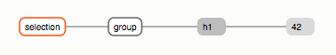
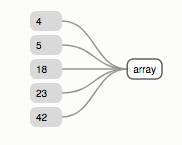

> 此篇为学习笔记
> 
> [how selection work](https://bost.ocks.org/mike/selection/)

# A subclass of array

有人说`selections`是DOM元素数组，这是错误的。`selections`是数组的子类；这个子类提供了一些操作selected elements的方法，例如设置`attributes`和`styles`。`selections`也继承了数组的原声方法,例如`Array.prototype.forEach`和`Array.prototype.map`。但是，由于D3提供了更方便的方法，例如`selection.each`(还有一些原生方法为了适应selections的行为被重写，比如`selection.filter`和`selection.sort`)，你并不会经常使用原生方法。

**这里的数组的子类是通过原型链实现的。**

# Grouping Elements

`selections`不是字面上的DOM元素数组的另一个原因是**他们是DOM元素数组的数组：一个selection是groups的数组，每个group是DOM元素数组(plain arrays)。** 

例如， `d3.select`返回包含一个group(包含selected element的数组)的`selection`:

```js
var selection = d3.select('body');
```


在JavaScript console中，运行上述命令并且查看`_group`是`selection[0]`, node是`selection[0][0]`。

同样的，`d3.selectAll`返回包含一个group(包含多个selected elements的数组)的`selection`:

```js
d3.selectAll('h2');
```


`d3.select`和`d3.selectAll`产生的`selection`都只返回一个group。一个selection包含多个group的唯一途径是`selection.selectAll`。栗子可看 [select tr td](https://bost.ocks.org/mike/selection/)

```js
d3.selectAll('tr').selectAll('td')
```

使用`selection.selectAll`后， **old selection中的每个元素都变成new selection中的一个group;** new selection中每个group包含相对应的旧元素的匹配后代元素。所以，如果每个table cell包含`span`元素，当第三次调用`selectAll`的时候，会得到[16个group](https://bost.ocks.org/mike/selection/).

每个group都有一个`parentNode`属性，它存储group中元素的共同的parent。parent节点在group创建的时候设置。因此，如果调用`d3.selectAll('tr').selectAll('td')`, 将返回包含groups（由`td` elements组成的）的selection,每个group的`parentNode`是`tr` elements。 通过`d3.select`和`d3.selectAll`返回的selections的parent element是[document element](https://developer.mozilla.org/en-US/docs/Web/API/document/documentElement).

大多数情况下，可以忽略掉selections是由group组成的。当使用`selection.attr`或者`selection.style`中定义的函数时，这些函数会被每个element调用；使用grouping的主要区别是这些函数的第二个参数`function(d, i)`是**within-group index**而不是within-selection index.

# Non-Grouping Operations
只有`selectAll`有与grouping相关的特殊行为；`select`方法会保留已经存在的grouping。`select`方法不同的原因是在old selection中的每个element准确的对应了new selection中的一个element。因此，`select`会将数据从父元素传给子元素，然后`selectAll`不会（这是需要 data-join的原因）。

`append`和`insert`方法包装在顶层select, 因此他们也需要保留grouping和传递数据。例如，给定一个包含四个sections的文档:

```js
d3.selectAll('section');
```


如果在每个section后面添加一个`p` element, new selection同样是拥有四个elements的单个group:

```js
d3.selectAll('section').append('p');
```


注意这个selection的`parentNode`仍然是ducument element，因为`selection.selectAll`没有被调用来重新组合selection.

# Null Elements
Groups可以包含空值来表示missing elements。对于大多数操作来说，Nulls会被忽略；例如，当引用styles和attributes时，D3会跳过null elements。

当`selection.select`找不到给定selector的匹配元素时，可能会出现Null elements。`select`方法必须保留grouping结构，所以对于没有匹配的情况使用null来补充。例如，如果只有最后两个`section`有`aside`:

```js
d3.selectAll('section').select('aside');
```


与grouping一样，通常可以忽略掉null elements, 但请注意它们是用来保留**selection的结构**和**within-group index**.

# Bound to Data
惊讶的是，`data`并不是selection的属性，而是它的元素的属性。这意味着当你绑定数据到selection上，数据被存储在DOM上而不是selection上: 数据被分配给每个元素的`__data__`属性。如果元素缺少这一属性说明相关联的数据未定义。**所以，数据是持久的，而selections可以是暂时的: 你可以从DOM中重新选择elements并且它们会保留之前绑定的数据。**

数据与elements绑定有以下几种途径：

* 使用`selection.data` joined到元素groups中。
* 使用`selection.datum`分配到单个元素。
* 通过`append`, `insert`, `select`从父元素继承。

当使用`selection.datum`时，虽然没有理由直接设置`__data__`属性，但是为了举例数据绑定是如何实现的，暂时先这么做：

```js
document.body.__data__ = 42;
```


d3与上面代码效果相同的代码是选择body并且调用datum:

```js
d3.select('body').datum(42);
```


如果我们现在向body `append`一个element, **子元素会自动继承来自父元素的data**:

```js
d3.select('body').datum(42).append('h1');
```



# What is Data?
D3中的data可以是任何值组成的数组。例如:

```js
var numbers = [4, 5, 18, 23, 42];

var letters = [
  {name: "A", frequency: .08167},
  {name: "B", frequency: .01492},
  {name: "C", frequency: .02780},
  {name: "D", frequency: .04253},
  {name: "E", frequency: .12702}
];

var matrix = [
  [ 0,  1,  2,  3],
  [ 4,  5,  6,  7],
  [ 8,  9, 10, 11],
  [12, 13, 14, 15]
];
```

我们用`selections`的表示方法来展示数据.下面是5个数值的普通数组：



`selection.data`可以接受常量或者函数。然而，和其他的selection methods不同，**`selection.data`把数据定义在per-group上而不是per-element**: 数据针对于group表示成数组，或者返回这种数组的函数。所以，grouped selection有相对应的grouped data!


> 因为在selection中有四个groups，这个data函数会被调用四次并且返回四个数组(每次生成一个数组)。返回的数组长度取决于data的长度。

# The Key to Enlightenment
join数据和元素重要的环节是必须知道哪个数据应该被分配给哪个元素。这是通过pairing keys完成的。

最简单的分配keys的方法是通过索引。

```js
var numbers = [4, 5, 18, 23, 42];
```


```js
d3.selectAll('div').data(number);
```


有些时候，你可以声明key function作为`selection.data`的第二个参数。D3会根据key function返回的key分配相应的数据。

**每个group的joined操作时独立的。所以只需要保证group中key的唯一性即可。**


#Enter, Update and exit
* Update - There was a matching element for a given datum.
* Enter - There was no matching element for a given datum.
* Exit - There was no matching datum for a given element.

具体操作可以查看[资料中的动画](https://bost.ocks.org/mike/selection/)

`enter selection`包含的是placeholders而不是DOM元素。这些placeholders是带有`__data__`属性的普通对象。`enter select`的实现实例化这些已经插入到group's parent的节点，这是为什么在data join前先调用`selection.selectAll`的关键: **为entering element建立了parent node.**

# Mergin Enter & Update
data join的正常更新模式：
1. appends entering elements, 
2. remove exiting elements，
3. modify dynamic attributes, styles and other properties of updating elements,

但是在updating element 和entering element之间会有重叠。为了减少重复代码，`enter.append`有一个hack skill(有副作用): 它会使用`enter.selection`中新建的elements来代替update seletion中的null elements。因此在`enter.append`之后， `update selection`被修改成同时包含entering elements和updating elements。`update selection`将会包含目前所有展示的elements。