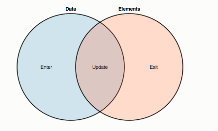

> 此篇为学习笔记.
> 
> [SVG和canvas的优缺点](https://www.zhihu.com/question/19690014)
> 
> [MDN SVG教程](https://developer.mozilla.org/zh-CN/docs/Web/SVG/Tutorial)
> 
> [d3官方文档](https://d3js.org/)
> 
> [d3 tutorials](https://github.com/d3/d3/wiki/Tutorials)

> [Let’s Make a Bar Chart](https://bost.ocks.org/mike/bar/), [Let’s Make a Bar Chart, II](https://bost.ocks.org/mike/bar/2/), [Let’s Make a Bar Chart, III](https://bost.ocks.org/mike/bar/3/)
> 
> [30 Awesome SVG Animation For Your Inspiration](http://www.hongkiat.com/blog/svg-animations/)


# svg的特点
 现在我们可以使用PNG, JPG来展示静态的图片，使用CSS3的animation、transition，JS或者搓的GIF来表示动画， 厉害的可以使用Canvas来绘图。那么我们为啥还要使用SVG呢？
 
* 和PNG,GIF比较起来，**文件体积更小，且可压缩性强；**
* 用于采用XML描述，可以**轻易的被读取和修改**，描述性更强；
* 在放大或改变尺寸的情况下其**图片质量不会损失**，与分辨率无关，是**可伸缩**的；
* SVG是**面向未来(W3C标准)**的，同时**浏览器兼容性好**；
* 使用CSS和JS能很**方便的控制**，同时可以很轻易的描述路径动画；

# svg和canvas

html5新增`<canvas>`元素，可以使用js脚本来画图。常用用途，画图，组合图片，制作动画，甚至是实时视频处理或者渲染。此外，还可以使用WEBGL在网页上绘制硬件加速的3D图形。canvas基于像素。

SVG(Scalable Vector Graphics)是基于XML的矢量图形语言。提供了一系列的图形元素(Rect, Path, Circle, Line...)，还有完整的动画，事件机制等。很早就是国际标准了。

## svg和HTML

**SVG与HTML不同的是:**

* HTML很大程度上受限于长方形，SVG支持很多图元，比如Bézier curves, gradients, clipping and masks。
* SVG支持CSS样式，但是会使用一些不同的属性名，例如使用`fill`代替`background-color`。SVG元素必须被放置在container的top-left corner， SVG不支持flow layout和text wrapping.

## Canvas适用场景

Canvas提供的功能更原始，适合像素处理，动态渲染和大数据量绘制

## SVG适用场景

SVG功能更完善，适合静态图片展示，高保真文档查看和打印的应用场景

### SVG坐标定位
SVG使用的坐标系统：以页面左上角(0, 0)为坐标点，坐标以像素为单位，x轴正方向向右，y轴正方向向下。

### SVG基本图形

* 矩形(rect)

```
// x: 矩形左上角的x位置
// y: 矩形左上角的y位置
// width: 矩形宽度
// height: 矩形高度
// rx: 圆角的x方位半径
// ry: 圆角的y方位半径
<rect x="60" y="10" rx="10" ry="10" width="30" height="30"/>
```
 
* 圆形(circle)

```
// r: 圆半径
// cx: 圆心的x位置
// cy: 圆心的y位置
<circle cx="25" cy="75" r="20"/>
```

* 椭圆(ellipse)

```
// rx: 椭圆x半径
// ry: 椭圆y半径
// cx: 椭圆心的x位置
// cy: 椭圆心的y位置
<ellipse cx="75" cy="75" rx="20" ry="5"/>
```

* 线条(line)

```
// x1: 起点x位置
// y1: 起点y位置
// x2: 终点x位置
// y2: 终点y位置
<line x1="10" x2="50" y1="110" y2="150"/>
```

* 折线(polyline)

```
// points:点集数列。每个数字用空白、逗号、终止符或者换行符分隔。
// 每个点必须包含两个数字，一个是x坐标，一个是y坐标。
// 点列表(0, 0), (1, 1), (2, 2)可以写成'0 0, 1 1, 2 2'
<polyline points="60 110, 65 120, 70 115, 75 130, 80 125, 85 140, 90 135, 95 150, 100 145"/>
```

* 多边形(polygon)
polygon的路径在最后一个点处会自动回到第一个点。

```
<polygon points="50 160, 55 180, 70 180, 60 190, 65 205, 50 195, 35 205, 40 190, 30 180, 45 180"/>
```

* 路径(path)
svg中最常见的形状。可以使用path元素绘制任何形状。

```
// d: 一个点集数列以及其他关于如何绘制路径的信息。是一个“命令+参数”的序列。

<path d="M 20 230 Q 40 205, 50 230 T 90230"/>
```

**直线命令**:

```
// 直线命令
// M: move to, 移动画笔位置，但不画线。  M x y (or m dx dy)
// L: line to, 会在当前位置和新位置之间画一条线段。 L x y (or l dx dy)
// H: 绘制平行线。 H x (or h dx)
// V: 绘制垂直线。 V y (or v dy)
// Z: 闭合路径命令。 Z (or z)
```

**曲线命令**： TODO

## 其他重要元素

* **svg**: SVG的根元素，并且可以相互嵌套；
* **g**: 用来将SVG中的元素进行分组操作，分组后可以看成一个单独的形状，统一进行转换，同时g元素的样式可以被子元素继承。
* **def**: 用于定于在SVG中可充用的元素。def元素不会直接展示出来，可以通过use元素来饮用。
* **use**: 通过它来复用def元素，使用<use xlink:href='#id'/>即可调用；
* **text**, **image**

# SVG样式
## 轮廓stroke
**stroke用来设置绘制对象线条的颜色。**
 * **常用的属性：storke-dasharray + storke-dashoffset**: stroke-dasharray用于使用虚线呈现SVG形状的描边，需要提供一个数值数组来描述，定义破折号和空格的长度；storke-dashoffset用于设置虚线模式中的开始点；

## 填充fill
**fill用来藐视SVG对象内部的颜色。**

## 变化transform
和css3中的transform类似，有`translate, rotate, scale, skew, matrix(矩阵变化，大学线代OMG)`,

## 还有渐变(linearGradient),遮罩(mask), 裁剪（cilpPath)

#SVG 使用方法
可以将svg转换成base64方式： 图片的base64编码就是可以将一幅图片数字编码成一串字符串，使用该字符串代替图像地址。对于极小或者极简单图片使用base64直接把图片编码成字符串写入css文件减少http请求。

* img标签。

```js

```

* 通过CSS background:

```js
.logo {
  background: url("data:image/svg+xml;base64,[data]");
}
```

* 通过object:

```js
<object type="image/svg+xml" data="data:image/svg+xml;base64,[data]">
  fallback
</object>
```

* 直接内置到HTML中：

```js
<svg xmlns="http://www.w3.org/2000/svg" viewBox="0 0 68 65">
  <path fill="#1A374D" d="M42 27v-20c0-3.7-3.3-7-7-7s-7 3.3-7 7v21l12 15-7 15.7c14.5 13.9 35 2.8 35-13.7 0-13.3-13.4-21.8-26-18zm6 25c-3.9 0-7-3.1-7-7s3.1-7 7-7 7 3.1 7 7-3.1 7-7 7z"/>
  <path d="M14 27v-20c0-3.7-3.3-7-7-7s-7 3.3-7 7v41c0 8.2 9.2 17 20 17s20-9.2 20-20c0-13.3-13.4-21.8-26-18zm6 25c-3.9 0-7-3.1-7-7s3.1-7 7-7 7 3.1 7 7-3.1 7-7 7z"/>
 </svg>
```

前三种方式常用于SVG图片已经定型，并且改动很少的情况，通过独立的SVG文件更好进行管理，同时可以减少HTML元素；内置的方式常用于SVG需要常修改或者还没有确定的情况，更加变化修改和维护

# 动画
在SVG中动画元素主要分为4类，同时也可以自由组合。

* **set**： 用于设置延迟，比如设置5s后元素位置颜色变化，但是此元素没有动画效果；
* **animate**: 基础动画属性，用于实现单属性的动画过度效果；
* **animateTransform**: 实现transform变换动画效果，可以类比css3中的transform;
* **aniamteMotion:** 实现路径动画效果，让元素沿着对于path运动。


# D3
D3是一个根据数据来操纵文档的js库。D3允许绑定任何数据到DOM上，然后将数据驱动转换应用到文档上。D3想要解决问题的症结在于：**基于数据高效的操纵文档**。

## 例子：selections: 改变段落元素的文本颜色

原生DOM操作（繁琐，命令式编程，手动迭代和保存临时变量):

```js
var paragraphs = doucment.getElementsByTagName('p');

for(var i = 0; i < paragraphs.length; i++) {
  paragraphs.style.setProperty("color", "white", null);
}
```

D3操作(声明式编程，主要好处还是容易上手):

```js
// operating arbitrary sets
d3.selectAll('p').style('color', 'white');

// operating individual node
d3.select('body').style('background-color', 'black');
```

D3提供了一些操作节点的方法： 设置attributes和styles，注册事件监听器，增加、删除和排序节点，改变HTML和text内容。

## Dynamic Properties
在D3中，styles, attributes,和其他一些特定的属性被定义为**数据函数**，而不是简单的常量。这种方式可以提供的功能更强大。例如`d3.geo.path`可以将地理坐标转换为SVG路径数据。此外，D3还提供了很多内置的复用函数和函数工厂。例如area, line, pie图的图形图元（这应该是D3使用最多的地方）。

举个栗子，修改奇偶节点的颜色：

```js
d3.selectAll('p').style('color', function(d, i) {
  return i%2 ? '#fff' : '#eee';
});
```

计算属性（computed properties)常常涉及到绑定数据。数据是数组的形式，数组中每一个值作为selection function【`argument(d)`】的第一个参数传入。节点和数据的绑定默认使用**join-by-index**，即第一个节点的selection function函数传入的一个参数为data数组中的第一个值。

举个栗子：

```js
d3.selectAll('p')
  .data([4, 8, 15, 16, 23, 42])
  .style('font-size', function(d) {
    return d + 'px';
  });
```

**一旦数据和文档进行绑定，当再次使用数据进行data operator, D3将会重新检索之前绑定的数据，这允许重新计算属性，不需要重新绑定。**

## Enter and Exit
D3将initial selection分成三部分：
1. 修改的updated nodes
2. 增加的entering nodes
3. 删除的exiting nodes

这也就对应了三种函数:

```js
//update...
var p = d3.select('body')
  .selectAll('p')
  .data([4, 8, 15, 16, 23, 42])
  .text(function(d) {return d;});
  
//enter...
p.enter().append('p')
    .text(function(d) {return d;});
    
//exit...
p.exit().remove();
```

一个实例是实现bar charts时，先使用old scale实例化entering bars，接来下使用new scale转移到uodating bar和exiting bars。

**enter selection**: 当数据和selection绑定时，如果数据数量大于节点数。额外的data元素将组成enter selection,可以通过添加*enter selection*进行实例化。例如：

```js
d3.select('body')
  .selectAll('p')
  .data([4, 8, 15, 16, 23, 42])
  .enter().append('p')
    .text(function(d) { return " I`m number" + d + "!"; });
```

### thinking with joins


数据和已存在节点joined产生*update selelction*。左侧未绑定的数据产生*enter selection*,代表未命中节点。右侧未绑定元素产生*exit selection*，代表将要被移除的元素。

#### 解析enter-append sequence

```js
svg.selectAll("circle")
  .data(data)
  .enter().append("circle")
    .attr("cx", function(d) { return d.x; })
    .attr("cy", function(d) { return d.y; })
    .attr("r", 2.5);
```

执行步骤:

1. `svg.selectAll('circle')`返回新的empty selection.
2. selection和一组数据joined获得表示三种可能状态的新的selection: *enter, update, exit*。
3. *update selection*通过`selection.data`返回，*enter selection*和*exit selection*会挂起*update selection*，`selection.enter`会返回enter selection.
4. missing elements可以通过`selection.append`添加到*enter selection*中。
5. 因为步骤一预设为empty selection, 所以data joins之后直接进入*enter selection*执行相关操作。

**data joins的好处在于强大的归纳能力，这足以使其应对各种各样的场景。可以用很小的代码来进行扩展。这意味着不仅可以生成静态可视化，还可以对实时数据可视化，进行交互式探索，数据间的平滑转移。**
