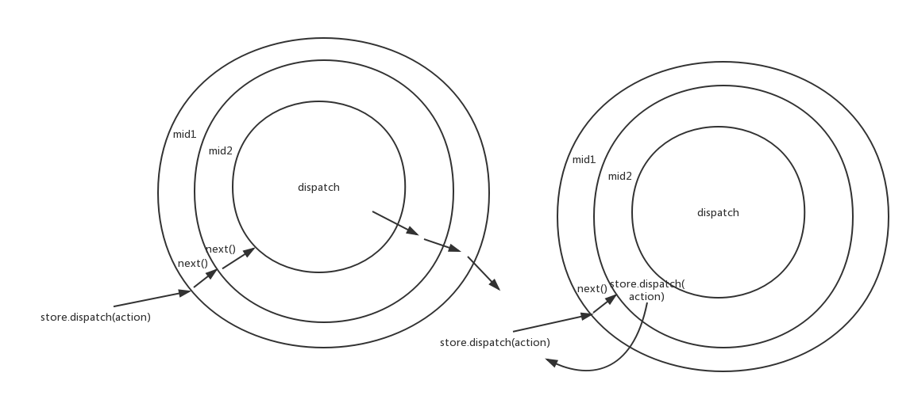

> 参考资料
> 
> * <<深入react技术栈>>
> * redux的applyMiddleware，compose源码
> * redux-thunk源码
> * 项目中用到的简化异步请求操作的中间件源码

# applyMiddleware

### applyMiddleware用法
我们先来看下`applyMiddleware`函数的常见用法：

```js
const finalCreateStore = compose(
  applyMiddleware(mid1, mid2, mid3, mid4),
  DevTools.instrument(),
)(createStore);
```

这里使用了`compose`函数来enhance `createStore`, 具体`compose`函数的实现可以看下面的源码。

### applyeMiddleware源码

`applyMiddleware`代码量很少，居然只有20几行的样子，还是大量用了`currying`的概念，`applyMiddleware`运用`currying`目的是**易串联**，因为`currying`函数具有**延迟执行**的特性。通过`currying`再配合`compose`函数, 可以很灵活的enhance `createStore`函数。

```js
／*
*
* @param {...Function} middlewares The middleware chain to be applied.
* @returns {Function} A store enhancer applying the middleware.
*
*／
export default function applyMiddleware(...middlewares) {
  return (createStore) => (reducer, initialState) => {
    // 根据createStore, reducer和initialState的值创建store
    let store = createStore(reducer, initialState);
    // 将store.dispatch赋值给dispatch是因为middleware执行后会enhance dispatch的功能
    let dispatch = store.dispatch;
    let chain = [];
    
    // 向每个middleware传入middlewareAPI，使所有的middleware只拿到这两个方法
    let middlewareAPI = {
      getState: store.getstate,
      dispatch: (action) => dispatch(action),
    };
    chain = middlewares.map((middleware) => middleware(middlewareAPI));
    // compose参数中使用store.dispatch为了防止和dispatch混合
    dispatch = compose(...chain)(store.dispatch);
    
    return {
      ...store,
      dispatch,
    };
  }
}
```

### 为什么middlewareAPI中的dispatch要使用匿名函数？

因为`middlwareAPI`对象是分发给每个`middleware`的，因为`middleware`都是`currying`函数，具有延迟执行的特点。所以如果要在每个`middleware`函数执行时使用`dispatch`函数(最常见的例子: `redux-thunk`)，就要保证传递给每个`middleware`的`dispatch`是最新的(因为`middleware`的目的就是为了增强`dispatch`功能)。 

**所以这里使用匿名函数，可以保证传递分发给每个`middleware`的`dispatch`函数指向最新的。(因为
`dispatch = compose(...chain)(store.dispatch)`会增强原生的`store.dispatch`的能力。)**

### compose函数

`compose`函数是函数式编程中的组合。这是`applyMiddleware`函数的精华所在.

```js
/*
 * @param {...Function} funcs The functions to compose.
 * @returns {Function} A function obtained by composing the argument functions
 * from right to left. For example, compose(f, g, h) is identical to doing
 * (...args) => f(g(h(...args))).
*/


function compose(...funcs) {
  return (arg) => funcs.reduceRight((composed, f) => f(composed), arg)
}
```

```js
dispatch = compose(...chain)(store.dispatch)
```

`compose`函数将chain中所有的`middleware`函数[f1, f2, f3, f4 ····， fn]组合成一个新的函数，假设n=3, 新函数的组成方式就是是` dispatch = f1(f2(f3(store.dispatch))))`

### middleware的写法
了解了`compose`的写法，接下来就要揭开`middleware`的真面目了。看了`applyMiddleware`和`compose`函数的实现，以及`dispatch = compose(...chain)(store.dispatch)`，想必你已经猜出`middleware`函数也是使用`currying`函数来实现。

`currying`结构的`middleware`函数有两个好处:

* **易串联**。 `currying`函数有延迟执行的特性，通过不断currying形成的middleware可以累积参数和逻辑，再配合`compose`的方式，很容易形成pipeline来处理数据流。
* **共享store**。在`applyMiddleware`执行的过程中，传入的`store`是旧的，但是由于闭包的存在，`applyMiddleware`执行后，所有`middleware`内部拿到的`store`是最新且相同的。


#### log middleware

```js
const logMiddleware = store => next => action => {
  console.log('diapatch', action);
  next(action);
  console.log('finish', action);
}
```

乍一看，这`middleware`函数是个什么东西，这么多层`currying`嵌套。但是不要着急，下面就一步步的分析`middleware`这么写的原因:

1. 第一个`store`是利用闭包的特性保证每个`middleware`拿到的`store`是相同的，这样可以获得相同的数据。
2. `next`则是为了`compose`函数将`middleware`函数串联起来，调用`next`函数代表进入下一个`middleware`函数。形成了pipeline处理方式。
3. `action`则是`dispatch`函数的参数。因为`middleware`归根到底是为了增强`dispatch`的功能。

##### 在middleware中调用next和调用dispatch的区别



看了上面的源码，我们知道因为`compose`和闭包的存在，调用`next`即调用下一个`middleware`的代码执行。上面也提到由于`middleware`中`currying`函数延迟执行的特点，以及`middlewareAPI`中的`dispatch`使用匿名函数编写就保证了`middleware`中的`dispatch`是最新的。所以在`middleware`中调用`dispatch`等于重新调用`mid1`的代码。

所以，如果在`middleware`中简单粗暴地调用`dispatch`会陷入死循环。

> 在middleware中使用dispatch的应用场景：一般接受一个定向的action，这个action并不希望到达原生的分发action, 所以往往用在异步请求的需求中。

#### redux thunk middleware

`redux-thunk`是为了解决redux异步请求的一种方案，在redux方案下，异步请求应该放在`action creator`中，`reducer`更关注于**数据转化**。`redux-thunk`主要利用了上面提到的**`store.dispatch`**方法。

```js
const createThunkMiddleware(extraArguments) {
  return ({dispatch, getState}) => next => action => {
    if(typeof action === 'function') {
      return action(dispatch, getState, extraArguments);
    }
    
    return next(action);
  }
}

const thunk = createThunkMiddleware();
thunk.withExtraArgument = createThunkMiddleware;
export default thunk;
```

`redux-thunk`的原理就是将异步请求action声明成函数，在`middleware`中判断action的类型，如果为函数，则直接执行异步请求action函数，这里注意：**正因为传进去的`dispatch`是最新的，这才可以在异步请求action返回后调用dispatch可以重新从`mid1`开始执行。**
如果不是函数，属于正常的action，则调用`next`函数进入下一个`middleware`。

下面是一个常见的使用`redux-thunk`实现的异步请求action:

```js
const getThenShow = (dispatch, getState) => {
  const url = 'http://xxx.json';
  fetch(url)
    .then(response => response.json())
    .then(response => {
      dispatch({
        type; 'SHOW_MESSAGE_FOR_ME',
        message: response,
      })
    })
    .catch((error) => {
      dispatch({
        type: 'FETCH_DATA_FAIL',
        message: error,
      })
    })
};
```

#### 项目中用到的client middleware

```js
export default function clientMiddleware() {
  return ({ dispatch, getState }) => next => action => {
    if(typeof action === 'function') {
      // 这是为了使用redux-thunk的逻辑
      return action(dispatch, getState);
    }
    
    const { promise, types, ...rest } = action;
    
    if(!promise) next(action);
    
    const [ REQUEST, SUCCESS, FAILURE ] = types;
    next(...rest, type: REQUEST);
    
    promise.then(
    	(payload) => next(...rest, ...payload, type: SUCCESS),
    	(error) => next(...rest, error, type: FAILURE)
    ).catch((error) => {
      console.log('middleware error', error);
      next({...rest, error, type: FAILURE});
    })
  }
}
```
