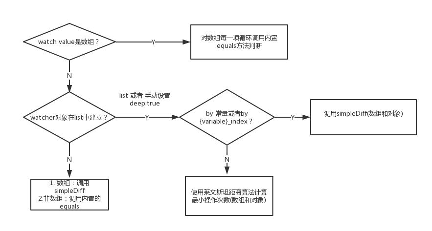

> 本文源码皆来源于搭建系统使用的regular 0.4.3版本
> 
> 参考资料:  
> 
>  * [regular官方文档](http://regularjs.github.io/guide)
>  * [regular@0.4.3](https://github.com/regularjs/regular/tree/v0.4.3)
> 
> Date: 2018/10/21

## 表达式

Regular里所有的绑定都与表达式有关，表达式编译结果是一个[**表达式对象**](http://regularjs.github.io/guide/reference/expression.html#setable)。**表达式对象**包含`get`和`set`两个关键方法。

> Regular的脏检查即通过比较get两次返回是否不同来判断数据是否变动。


## 数据监听

Regular内部的所有监听都是通过 [`$watch`](http://regularjs.github.io/guide/reference/api.html#watch)API

`$watch`接口产生的watcher对象:

```js
{
  get: function(context){...}  //获得表达式当前求值，此函数在解析时，已经生成
  set: function(){} // 有些表达式可以生成set函数，用于处理赋值，这个一般用于双向绑定的场景
  once: false // 此监听器是否只生效一次，如 {@(expression)}
  last: undefined// 上一次表达式的求值结果
  fn: function(newvalue, oldvalue){} // 即你传入$watch的第二个参数，当值改变时，会调用此函数
  force: options.force // 强制更新
  test: test // 当监听的表达式是数组时，test函数会在_checkSingleWatch方法中被调用，检查数组元素是否发生变化
  // don't use ld to resolve array diff
  diff: options.diff // 是否启用莱文斯坦编辑距离算法来计算最小变更DOM
  deep: options.deep //深度监听, 注意 Regular 目前只能监听一级属性,太复杂的属性建议使用不变数据结构，或 监听序列化后的值的方式 ( 通过JSON.stringify，这种方式仅针对数据不是太复杂的场景 )
 
  // 使用list语法糖会将diff和deep字段设置为true
  // ...
}
```

## 脏检查

> 脏检查即一种不关心你如何以及何时改变的数据，只关心在特定的检查阶段数据是否改变的数据监听技术。

文本插值`{post.title}`为例子:

```js
// regular version: 0.4.3

walkers.expression = function(ast, options){
  var node = document.createTextNode("");
  this.$watch(ast, function(newval){
    dom.text(node, "" + (newval == null? "": "" + newval) );
  },{init: true})
  return node;
}
```

上例中的`$watch`直接通过`init:true`参数，强制触发当前监听器的脏检查，而不用等待下一轮 `$digest`流程。


## 脏检查如何进行 - digest流程


digest处理流程：

1. 标记`dirty: false`
2. 先遍历当前组件所有watcher，再遍历所有子元素的watcher，使用`_checkSingleWatch`方法判断watcher是否发生变化，发生变化时标记`dirty: true`
3. 检查一轮后，如果 dirty===true ，我们重新进入步骤1. 否则进入步骤4.
4. 完成脏检查

##  _checkSingleWatch

简化版`_checkSingleWatch`:

```js
function _checkSingleWatch( watcher ){
  let dirty = false;
  let newValue = watcher.get( this )

  if( !isEqual(newValue, watcher.last) ) {

    watcher.fn( newValue, watcher.last )
    watcher.last = newValue
	 dirty = true;
  }

  return dirty;
}
```

感觉脏检查最难处理的就是上述的`isEqual`方法，也是最容易踩坑的。

regular内置的`equals`判断方法:

```js
_.equals = function(now, old){
  var type = typeof now;
  if(type === 'number' && typeof old === 'number'&& isNaN(now) && isNaN(old)) return true
  return now === old;
}
```

判断逻辑:



1. `$watch`的第一个参数是否是数组，对数组中的每个元素建立表达式，调用内置的`equals`方法来判断。
2. 如果`$watch`的表达式在`{#list}{/list}`中建立，会将watcher对象的`deep`属性设置为true，这种情况需要再向下检查一层。
3. 其他类型调用内置的`equals`方法来判断。

* 对象：`options: deep`多比较一层， 否则比较引用。
* 数组：先比较长度和每个位置是否相等。
* list中的对象或数组用**莱文斯坦距离**

