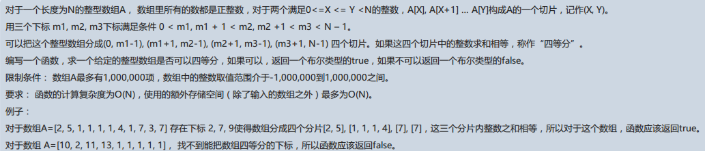

```js
var array = [2, 5, 1, 1, 1, 1, 4, 1, 7, 3, 7];
var array1 = [10, 2, 11, 13, 1, 1, 1, 1, 1];

function getHashMap(arr) {
  let hash = {};
  arr.reduce( (acc, val) => {
    hash[acc] = val;
    return acc+val;
  });
  return hash;
}


function isQuarter(hashMap) {
  let keys = Object.keys(hashMap);
  for(let index=0; index < keys.length; index++) {
    let quarter = parseInt(keys[index]);
    // console.log("round"+index +"  quarter:" +  parseInt(keys[index]));
    let half = quarter * 2 + hashMap[quarter];
    // console.log("    half:"+half);
    if(!half)  continue;
    let threeQuarters = half + quarter + hashMap[half];
    // console.log("    threeQuarters:"+threeQuarters);
    if(!threeQuarters) continue;
    let full = threeQuarters + quarter  + hashMap[threeQuarters];
    // console.log("    full:"+full);
    if(!full) continue;
    console.log(keys[index], half, threeQuarters, full);
    return true;
  }
  return false;
}

console.log(isQuarter(getHashMap(array)));
console.log(isQuarter(getHashMap(array1)));
```