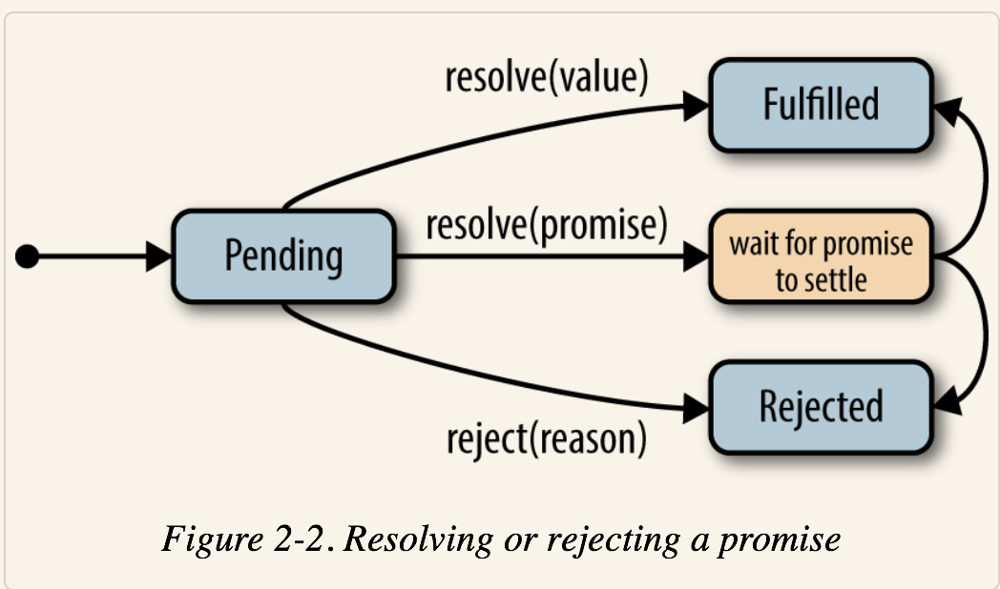

## 背景

写`callback`函数的异步JavaScript代码有两个挑战:

1. 流程管理
2. 处理可能引起的错误

`Promise`想要解决这两个问题：

1. 将`callback`变成分离的step更容易阅读和维护。
2. 可以在主程序逻辑之外处理发生的错误，可以不用在每个step都写模版形式的check code(个人认为，写check code还是很有必要的，防御式编程)。

## 特点

1. promise通常是一个异步操作结果的占位符(placeholder).

2. promise三个状态：pending, fulfilled, rejected.

3. 一旦某promise被fulfilled或者rejected，他的状态将永远不会改变.

## 状态变换




在`promise`的链式调用中，如果其中某一step返回了`promise`而不是value，则接下来的step接受的是该`promise`被fulfill的值。

## promise的`callback`执行顺序

分两种情况:

1. 传递给`Promise`构造函数的`resolver`函数**同步执行(execute synchronously)**。
2. 传递给`then`和`catch`的回调函数是**异步调用(invoked asynchronously)**

```js
var promise = new Promise(function (resolve, reject) {
  console.log('inside the resolver function');
  resolve();
})

promise.then(function () {
  console.log('inside the onFulfilled handler');
});

console.log('this is the last line of the script');

// Console output:
// Inside the resolver function
// This is the last line of the script
// Inside the onFulfilled handler
```

## error propagation

`Rejections` 和 `error` 通过promise chains传播。当其中一个promise被reject, 在一个`onRejected`处理函数被发现前，promise chains中接下来的promised都被reject.

```js
Promise.reject(Error('bad news')).then(
    function step2() {
        console.log('This is never run');
    }
).then(
    function step3() {
        console.log('This is also never run');
    }
).catch(
    function (error) {
        console.log('Something failed along the way. Inspect error for more info.');
        console.log(error); // Error object with message: 'bad news'
    }
);

// Console output:
// Something failed along the way. Inspect error for more info.
// [Error object] { message: 'bad news' ... }
```
