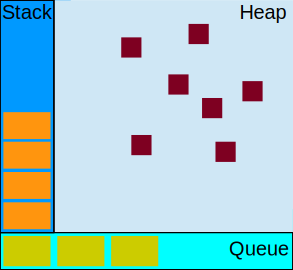
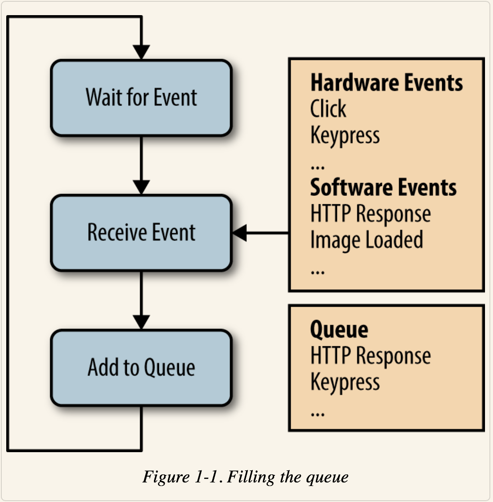
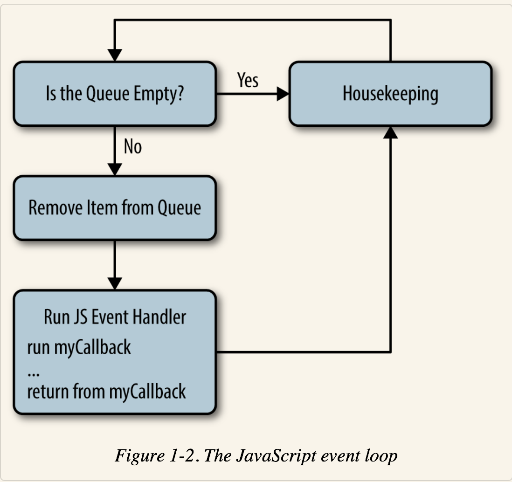

## 并发(concurrency) 和 并行(parallelism)

* **并行**是指运算中的两件或更多件事情在同一时刻发生。
* **并发**意味着至少两件事务在同一时间段发生。

## JavaScript并发模型

在不讨论`web worker`的情况下，我们可以认为你所编写的JavaScript代码是**单线程的**，这就决定了你编写的JavaScript代码不能实现并行，实现了并发。

JavaScript的并发模型基于`Event Loop`。


### 运行时概念



#### 栈

函数调用形成了一个栈帧。就是函数上下文调用栈。

```js
function foo(b) {
  var a = 10;
  return a+b+11;
}

function bar(x) {
  var y = 3;
  return foo(x * y);
}

console.log(bar(7));
```

栈中永远有全局上下文`globalContext`。

当调用`bar`时，创建了相关的帧，帧中包含了`bar`的参数和局部变量，作用域链，`arguments`和`this`指向。

当`bar`调用`foo`时，`foo`相关的帧被创建，并被压在`bar`帧上。

当函数执行完成返回时，最上层的帧就被弹出栈。

#### 堆

对象被分配在一个堆中，一个用以表示一个内存中大的未被阻止的区域。

#### 队列

一个JavaScript运行时包含了一个待处理的消息队列（即`macro-task queue`）。每一个消息都与一个函数相关联，当栈为空时，从队列中取出一个消息进行处理。



* `macrotasks: setTimeout setInterval setImmediate I/O UI渲染`
* `microtasks: Promise process.nextTick Object.observe MutationObserver`


### event loop



`event loop`执行模型。当执行栈为空时，开始依次执行：

1. 把消息队列(`macro-task queue`)中的队首任务(task A)取出放入执行栈执行
2. 执行完毕后，执行`micro-task queue`中所有可用的任务，然后移除
5. 下一个循环，执行下一个`macro-task queue`中的任务

### run-to-completation

每个消息完整的执行后，其他消息才会被执行。包括每当一个函数运行时，他就不能被抢占，并且在其他代码运行之前完全运行。

### 多个运行时相互通信

一个`web worker`或者一个跨域的`iframe`都有它们自己的栈，堆和消息队列。两个不同的运行时只有通过`postMessage`方法进行通信。