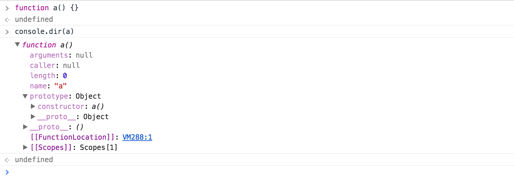

# 函数对象
JavaScript中的函数就是对象。对象是“名／值”对的集合并拥有一个连接到原型对象的隐藏连接。**对象字面量产生的对象连接到`Object.prototype`, 函数对象连接到`Function.prototype`(这个原型对象自身又连接到`Object.prototype`).** 每个函数在创建时会附加两个隐藏属性：函数的上下文和[实现函数行为的代码](https://www.ecma-international.org/ecma-262/5.1/#sec-13.2)。

每个函数对象在创建时会有一个`prototype`属性，它的值是一个拥有`constructor`的对象，且`constructor`属性值为该函数（详见下图）。这和隐藏连接到`Function.prototype`完全不同。


# 调用
调用函数时，被调用的函数会接受两个附加的参数: `this`和`arguments`. 在JavaScript中有四种调用方式：方法调用模式，函数调用模式，构造器调用模式，apply调用模式。

## 方法调用模式
> 当一个函数被保存为对象的一个属性时，我们称这个函数为方法。

当一个对象的方法被调用时，`this`绑定到该对象上。方法可以使用`this`访问自己所属的对象，所以可以对对象进行修改。`this`到对象的绑定发生在调用的时候，这个 **very late binding** 使函数可以对`this`高度复用。

## 函数调用模式
> 当一个函数不是一个对象的函数时，那么它被当成这个函数来调用。

这种模式下，`this`被绑定到全局对象。**这是JavaScript的设计错误。比如当内部函数被调用时，按理说`this`应该绑定到外部函数的`this`变量才对。**

```js
// 给myObject增加一个double方法。

myObject.double = function() {

  // 解决方法
  var that = this;
  var helper = function(that) {
    that.value = add(that.value, that.value);
  };
  
  helper();
}

myObject.value = 3;
myObject.double();
myObject.writeln(myObject.value); // 6
```
所以这个设计错误在ES6中的箭头函数纠正了，**箭头函数的 this 的值是它的 lexical scope(js中函数才会产生lexical scope) 的 this 的值。Ps：箭头函数还有一个特征是箭头函数并没有绑定 arguments，看如下代码：**

```js
function foo() {
   let arg = '1';
   setTimeout( (arg) => {
      console.log("args:", arguments);
   },100);
}

foo(2, 4, 6, 8);  // args: [2, 4, 6, 8]
```

## 构造器调用模式

如果在一个函数前加上`new`来调用，背地里会创建一个连接到该函数`prototype`成员的新对象，同时`this`会绑定到这个新对象上。

## Apply调用模式
> apply() 方法在指定 this 值和参数（参数以数组或类数组对象的形式存在）的情况下调用某个函数。

apply方法可以构造一个参数数组传递给调用函数。它允许选择`this`的值。apply方法接受两个参数，第一个是要绑定给`this`的值，第二个是一个参数数组。

```js
var statusObject = {
  status: 'A-OK',
};

get_status() {
  return this.status;
}

var status = get_status.apply(statusObject); // 'A-ok'
```

# currying
> currying, 把多参数函数转换为一系列单参数函数并进行调用的技术。

