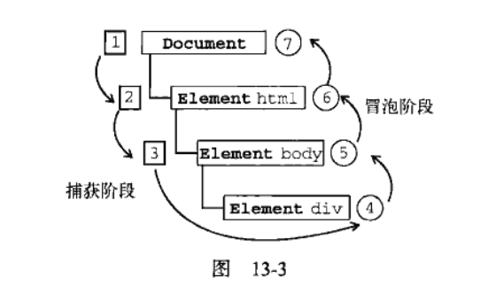

* **事件冒泡**，即事件开始时由最具体的元素(文档中嵌套层次最深的那个节点)接收，然后逐级向上传播到较为不具体的节点(文档).
* **事件捕获**，即不太具体的节点应该更早接收到事件，而最具体的节点应该最后接受到事件。事件捕获的用意在于在事件到达预定目标之前捕获它。

### DOM事件流
“DOM2级事件”规定的事件流包括三个阶段：事件捕获阶段、处于目标阶段和事件冒泡阶段。



如上图，在DOM事件流中,实际的目标(`<div>`元素)在捕获阶段不会接收到事件。这意味着在捕获阶段，事件从document到`<html>`再到`<body>`就停止了。接下来是“处于目标”阶段，事件在`<div>`上发生，并在事件处理中被看成冒泡阶段的一部分。然后，冒泡阶段发生，事件又传播回文档。 实际上，浏览器都会在捕获阶段出发事件对象上的事件，结果，就有两个机会在目标对象上面操作事件。

### 通过HTML指定event handlers的缺点：

1. 存在时差问题。用户可能会在HTML元素一出现在页面就触发相应事件，但当时的event handlers可能尚不具备执行条件。比如把js函数放在`</body>`上方，在页面解析到js函数之前就触发事件会报错。
2. HTML与Js代码紧耦合。要更换event handlers需要同时修改HTML代码和Js代码。

### 通过Js指定event hanlders.

```js
//DOM 0级事件
var btn = document.getElementById('myBtn');

btn.onclick = function() {
  alert(this.id);  // 'myBtn'
}
```
注意，在这段代码运行以前也不会指定event handlers.

### DOM 2级事件处理程序
"DOM2级事件"定义了两个方法：
`addEventListener(type, listener[, useCapture]);`和`removeEventListener(type, listener[, useCapture]);`

三个参数含义为事件名，event handlers, 是否在捕获阶段调用event handlers.如果为false，表示在冒泡阶段调用event handlers.

好处：可以为元素同时添加多个事件处理程序。

大多数情况下是将event handler添加到事件流的冒泡阶段，可以最大限度兼容各种浏览器。

```js

var parent = document.getElementById("parent");
var child = document.getElementById("child");

document.body.addEventListener("click",function(e){
    console.log("click-body");
},false);

parent.addEventListener("click",function(e){
    console.log("click-parent---事件传播");
},false);
　　　　 
　　　　 //新增事件捕获事件代码
parent.addEventListener("click",function(e){
    console.log("click-parent--事件捕获");
},true);

child.addEventListener("click",function(e){
    console.log("click-child");
},false);

```
点击child元素后的结果：

```js
//先捕获后冒泡
click-parent--事件捕获
click-child
click-parent---事件传播
click-body
```

### 事件委托
对“事件处理程序过多”问题的解决方案是**事件委托**。事件委托利用了事件冒泡的思想。试想如果有一个复杂的web应用程序，对所有可单击的元素都采用这种方式，结果就会有数不清的代码用于添加event handlers。使用事件委托，只需在DOM树中尽量最高的层次上添加一个事件处理程序。例如:

```js
<ul id=myLinks>
  <li id="goSomewhere">Go somewhere</li>
  <li id="doSomething">Do somewhere</li>
  <li id="sayHi">Say hi</li>
</ul>

var list = document.getElementById('myLinks');

EventUtil.addHandler(lisrt, "click", function(){
  event = EventUtil.getEvent(event);
  var target = EventUtil.getTarget(event);
  
  switch(target.id) {
    case "doSomething":
      document.title = "hahaha";
      break;
    
    case "goSomewhere":
      location.href = "http://www.wrox.com";
      break;
      
    case "sayHi":
      alert("h1");
      break;
  }
});
```
在这段代码中，使用事件委托只为`<ul>`元素添加了一个onclick event handler.由于所有的`<li>`元素都是这个元素的字节点，而且它们的onclick事件会冒泡，所以单击事件最终会被这个函数处理。常用的适合采用事件委托的事件包括`click, mousedown, mouseup, keyup, keypress`。
