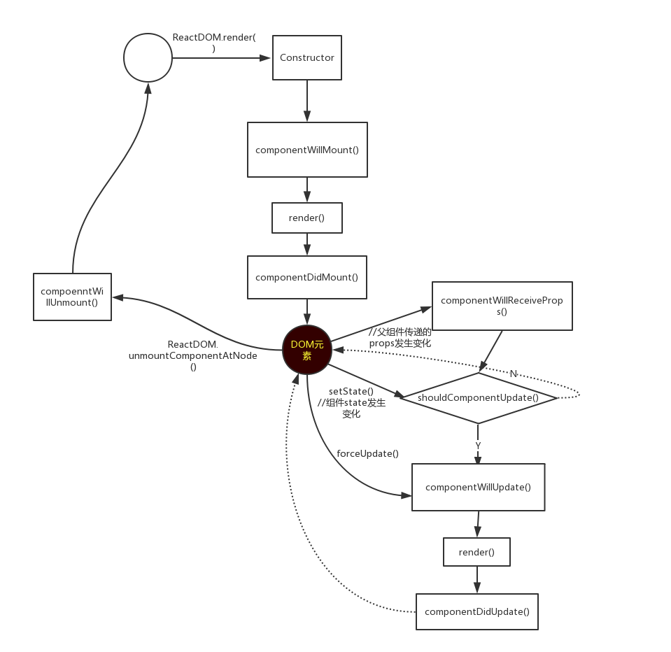

# react简介
virtual DOM: 每次数据更新后，重新计算virtual DOM，与上次生成的virtual DOM做对比，对发生变化的部分
做批量更新。提供了shouldComponentUpdate生命周期回调，来减少变化后不必要的virtual DOM对比过程。(看源码）

Virtual DOM的渲染方式比传统的DOM操作好一些，但不明显，因为对比DOM节点也需要计算资源。Virtual DOM的最大
好处在于 **方便和其他平台集成**，输出为web DOM／Android／iOS控件由平台本身决定。

react组件的三种构建方法:

* React.createClass
* ES6 classes
* stateless function

```js
function Button({ color = 'blue', text = 'comfirm' }) {
    return (
        <button className = {`btn btn-${color}`}>
            <em> {text} </em>
        </button>
    );
}
```
现在官方颇为推崇这种写法。stateless function只传入 props 和 context 两个参数，不存在state,没有生命周期方法。它创建时始终保持了一个实例，避免了不必要的检查和内存分配，做到了内部优化。

**注意**：stateless function中传入的参数是props对象，如果传入的不是对象，react会报错。

setState是异步方法，一个生命周期内所有的setState方法会合并操作。

## 组件挂载

componentWillMount 方法会在render方法之前执行，componentDidMount在render方法之后执行。

如果在componentWillMount方法中执行setState方法，组件会更新state,但组件只渲染一次。这是无意义的执行，初始化时的
state都可以放在this.state中。

如果在componentDidMount方法中执行setState方法，组件会再次更新，在初始化时渲染了两次组件。

## 组件卸载

componentWillUnmount方法中，会执行清除方法，如事件回收或清除计时器。

## 组件更新

如果组件自身state更新，依次执行shouldComponentUpdate, componentWillUpdate, render和componentDidUpdate.

如果是父组件传递的props更新，会在shouldComponentUpdate之前先执行componentWillReceiveProps方法。



##组件设计视角

组件设计有两种常见的视角。拿Tabs组件为例。

1. 当我们切换tab标签时，可以看作是组件内部的交互行为，被选择后通过回调函数来返回具体选择的索引。这种组件被称为smart component.
2. 切换tab标签时，可以看作是组件外部在传入具体的索引，组件根据props的变化而变化，就像“木偶“一样被操控着。这种组件被称为dumb component.

