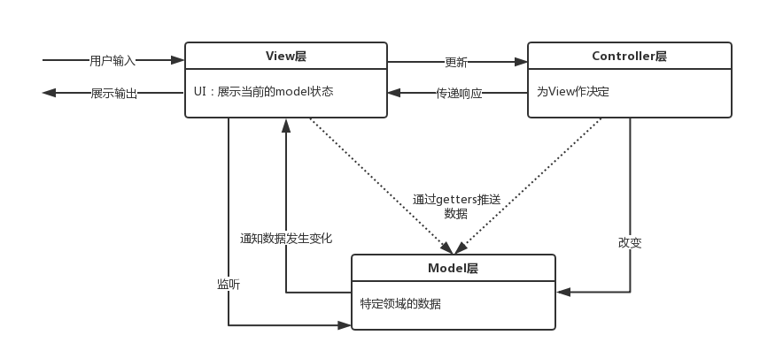
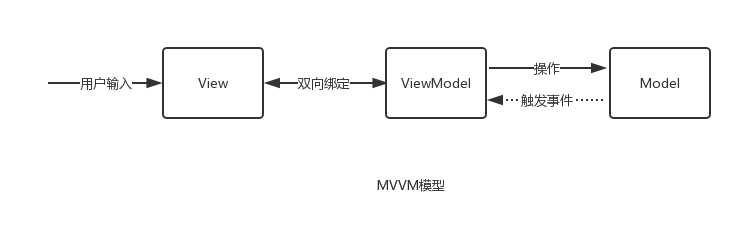
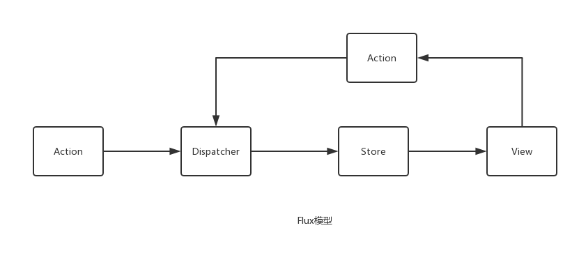

# MVC/MVVM



上图为经典的MVC模型。

* **Model**：负责保存应用数据，和后端交互同步应用数据，或者校验数据。
* **View**: 对应js模版语言，React具备这一特性。
* **Controller**: 负责连接View和Model，Model的任何改变都会应用到View中，View的操作会通过Controller应用到Model中。 Controller管理了应用程序中Model和View之间的逻辑和协调。

## MVVM的演变
`TODO:认真研究一下MVVM模型.`

MVVM关键“改进”在于数据绑定。View的数据状态发生变化可以直接影响VM，反之亦然。



## MVC的问题
MVC的问题是：随着项目变大，逻辑变复杂，混乱的数据流动方式。

解决方案：如果渲染函数只有一个，统一放在Controller中，每次更新重渲染页面，这样的话，任何数据的更新都只用调用重渲染就行，并且数据和当前页面的状态是唯一确定的。这样可以保证数据的流动清晰。然而重渲染会带来严重的性能和用户体验问题。

# Flux的解决方案
讲道理这货应该叫ADSV（Action Dispatcher Store View）.Flux的核心思想是:**数据和逻辑永远单向流动。** 强调单向数据流，强调谨慎可追溯的数据变动。在Flux应用中，数据从Action到Dispatcher，再到Store,最终到View的路线是单向不可逆的。



Flux的dispatcher定义了严格的规则来限定对数据的修改操作，Store中不能暴露setter的设定也强化了数据修改的纯洁性，保证了Store的数据确定应用唯一的状态。

Flux的每次view渲染都是**重渲染**，但是对性能影响不大，因为它重渲染的是Virtual DOM, 并且PureRender可以保障从重渲染到局部渲染的转换。

## Flux基本概念

* **dispatcher**: 负责分发事件；
* **store**：负责保存数据，同时响应事件并更新数据了；
* **view**：负责订阅store中的数据，使用这些数据渲染页面；
* **controller-view**：负责将view与store进行绑定。

### dipactcher与action

Flux中的事件会由若干个中央处理器来进行分发，就是dispatcher.核心的API有`register()`和`dispatch()`。`register()`用来注册一个监听器，`dispatch()`用来分发action.

action就是普通的JavaScript对象，一般包含type, payload等字段，描述一个事件和需要改变的相关数据。

### store

store会调用dispatcher的`register()`方法将自己注册为一个监听器。每当使用dispatcher的`dispatch()`方法分发一个action时，store注册的监听器会被调用，同时得到这个action作为参数。

此外，Flux中store对外只暴露`getter`而不暴露`setter`,这意味着在store外只能读取store中的数据而不能做任何修改。

### controller-view

controller-view是整个应用的最顶层view, 这里不会涉及具体的业务逻辑，主要进行store与React组件(即view层)之间的绑定，定义数据更新及传递的方式。

controller-view会调用store暴露的`getter`方法获取存储其中的数据并设置为自己的state,在render的时候以props的形式传给自己的子组件(this.props.children).

### view

Flux有一个特殊的约定：如果洁面操作需要修改数据，则必须使用dispatcher分发一个action.

### actionCreator

使用actionCreator的原因是在很多时候，分发action的代码是冗余的。例如分发一个下面的action:

```js
{
  type: 'CLICK_UPVOTE',
  payload: {
    weiboId: 123,
  }
}
```
包含完整分发逻辑的代码更复杂：

```js
import appDispatcher from '../dispatcher/appDispatcher';

//响应点赞的onClick方法

handleClickUpdateVote(weiboId) {
  appDispatcher.dispatch({
    type: 'CLICK_UPVOTE',
    payload: {
      weiboId: 123,
    }
  })
}
```
在分发action的6行代码里面，只有1行是变化的。所以创建一个actionCreator减少冗余代码，方便重用逻辑,这是软件工程的基本思想：

```js
//actions/AppAction.js
import appDispatcher from '../dispatcher/appDispatcher';

function upvote(weiboId) {
	appDispatcher.dispatch({
		type: 'CLICK_UPVOTE',
		payload: {
		  weiboId: 123,
		}
	})
}


//components/weibo.js

//响应点赞的onClick方法
handleClickUpdateVote(weiboId) {
  upvote(weiboId);
}
```

# Flux应用实例

## 设计store
单纯的react程序中，数据都是保存在组件的state中。在Flux模式下，数据都迁移到了store中。

首先，store的一个功能是缓存数据:

```js
let comment = [];
```

其次，需要在state中定义数据的修改逻辑。store中数据的修改需要调用dispatcher的`register()`方法注册一个监听器，用于响应分发的action.

```js
import AppDispatcher from '../dispatcher/AppDispatcher';
import CommentConstants from '../constants/CommentConstants';

const CommentStore = {
  //...
}

AppDispatcher.register((action) => {
  switch(action.type) {
    case CommentConstants.LOAD_COMMENT_SUCCESS: {
      comment = action.payload.comment.commentList;
      CommentStore.emitChange();
    }
  }
})

export default CommentStore;
```

大家可能注意到了上述代码中的`CommentStore.emitChange()`函数，但是目前的store没有导出的功能,因此store需要一个统一的出口：

```js
//store/CommentStore.js

import { EventEmitter } from 'event';
import assign from 'object-assign';

const CommentStore = assign({}, EventEmitter.prototype, {
  getComment() {
    return comment;
  }
  
  emitChange() {
    this.emit('change');
  }
  
  addChangeListener(callback) {
    this.on('change', callback);
  }
  
  removeChangeListener(callback) {
    this.removeListener(callback);
  }
});

export default CommentStore;
```

这样store就拥有了事件触发和监听的功能。


## 设计actionCreator

一个action的触发意味着需要修改数据，评论框程序中有两个修改数据的方法：一个是提交新评论，一个时从服务器获取评论列表。

```js

// actions/CommentActions.js

import AppDispatcher from '../dispatcher/AppDispatcher';
import CommentConstants from '../constants/CommentConstants';

const CommentAction = {
  loadComment() {
    AppDospatcher.dispatch({
      type: CommentConstants.LOAD_COMMENT,
    });
    
    fetch('/api/response.json')
      .then((res) => {
        return res.json();
      })
      .then((value) => {
        AppDispatcher.dispatch({
          type: CommentConstants.LOAD_COMMENT_SUCCESS,
          payload: {
            comment: value,
          },
        });
      })
      .catch((err) => {
        AppDispatcher.dispatch({
          type: CommentConstants.LOAD_COMMENT_ERROR,
          error: err,
        });
      });
  }
  
  addComment(text) {
    AppDispatcher.dispatch({
      type: CommentConstants.ADD_COMMENT,
    });
    
    fetch('/api/submit.json', {
      method: 'POST',
      body: JSON.stringify({ value: encodeURI(text)}),
      headers: {
        'Accept': 'application/json',
        'Content-Type': 'application/json',
      },
    })
    .then((res) => {
      return res.json();
    })
    .then((value) => {
      if (value.ok) {
        AppDispatcher.dispatch({
          type: CommentConstants.ADD_COMMENT_SUCCESS,
          payload: {
            comment: value,
          },
        });
        this.loadComment();
      }
    })
    .catch((err) => {
      AppDispatcher.dispatch({
        type: CommentConstants.ADD_COMMENT_ERROR,
        error: err,
      });
    });
  }
  
};

export default CommentActions;
```
仔细观察会发现，定义的两个actionCreator有着相同的套路，都使用fetch来发送ajax请求，在发送请求前分发一个action，在请求成功响应后分发一个action, 在请求出现异常时分发一个action.注意：我们的store监听了AppDispatcher，所以AppDispatcher的`dispatch()` action后，store会根据CommentConstants type的作出响应，然后emit event使Controller-view作出响应。

## 构建controller-view

```js

// components/CommentBox.js

import React, { Component } from 'react';
import CommentStore from '../store/CommentStore';
import CommentList from './CommentList';
import CommentForm from './CommentForm';

class CommentBox extends Component {
  construtor(props) {
    super(props);
    
    this._onChange = this._onChange.bind(this);
    
    this.state = {
      comment: commentStore.getComment(),
    }
  }
  
  _onChange() {
    this.setState({
      comment: commentStore.getComment(),
    })
  }
  
  componentDidMount() {
    CommentStore.addChangeListener(this._onChange);
  }
  
  componentWillUnmount() {
    CommentStore.removeChangeListener(this._onChange);
  }
  
  
  render() {
    return (
      <CommentList comment = { this.state.comment}/>
      <CommentForm/>
    );
  }
} 

export default CommentBox;
```

在Controller-view中，有3处值得注意的地方：
 
1. 定义了组件初始化的状态——使用store暴露给我们的getComment方法从CommentStore中获取评论列表。
2. 在componentDidMount和componentWillUnmount中分别对store中的change事件做了绑定和解绑，这也是store为什么需要EventEmitter。
3. 定义了一个store变化的回调函数。在这个回调函数中，重新调用了store的getComment方法获取最新的评论并调用this.setState更新Controller-view的state,最终state会由props传递到子组件。

## 重构view

```js
// components/CommentList.js
import React, { Component } from 'react';
import CommentActions from '../actions/CommentActions';
import { dispatch } from '../dispatcher/AppDispatcher';

class CommentList extends Component {
  componentDidMount() {
    CommentActions.loadComment();
  }

  render() {
    const list = this.props.comment;

    return (
      <ul className="comment-box">
        {list.map((entry, i) => (
          <li key={`reponse-${i}`} className="comment-item">
            <p className="comment-item-name">{entry.name}</p>
            <p className="comment-item-content">{entry.content}</p>
          </li>
         ))}
      </ul>
    );
  }
}

export default CommentList;


// components/CommentForm.js
import React, { Component } from 'react';
import CommentActions from '../actions/CommentActions';
import { dispatch } from '../dispatcher/AppDispatcher';

class CommentForm extends Component {
  constructor(props) {
    super(props);

    this.state = {
      value: '',
    };

    this.handleChange = this.handleChange.bind(this);
    this.handleAddComment = this.handleAddComment.bind(this);
  }

  handleChange(event) {
    this.setState({ value: event.target.value });
  }

  handleAddComment() {
    CommentActions.addComment(this.state.value);
  }

  render() {
    return (
      <div>
        <textarea
          value={this.state.value}
          onChange={this.handleChange}
        />
        <button
          className="comment-confirm-btn"
          onClick={this.handleAddComment}
        >评论</button>
      </div>
    );
  }
}

export default CommentForm;

```

注意到view层中对数据有影响的操作都是通过CommentActions产生action,例如`addComment()`和`loadComment()` action。但是在修改textarea中的值仍然使用了`setState()`方法， 这是设计上的一种权衡，如果明确知道了某个局部状态不会影响整个应用中的其他部分，也不需要初始化的时候赋值，可以把这个状态保存在组件中。

# Flux核心思想

Flux中心化控制的好处可以让view保持高度简洁，不需要关心太多的逻辑，只需要关心传入的数据。Flux将action做了同一归纳，提高了系统抽象程度。

## Flux的不足

Flux的冗余代码太多。Flux源码中几乎只有dispatcher的实现，但是在每个应用中都需要手动创建一个dispatcher实例。