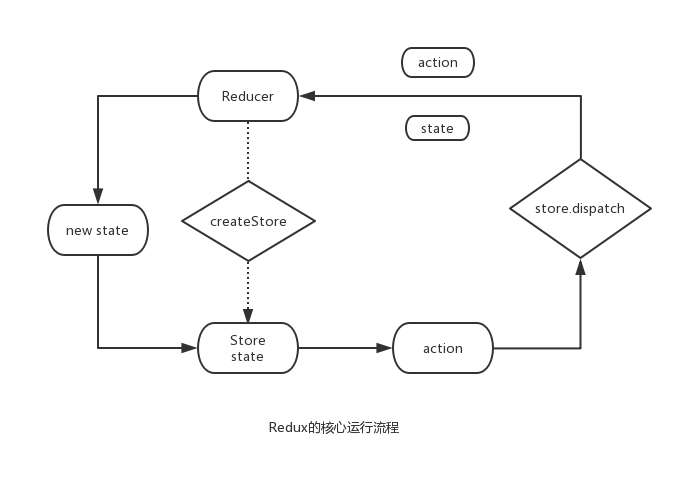
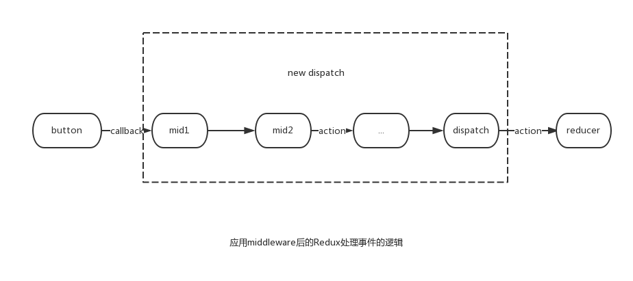
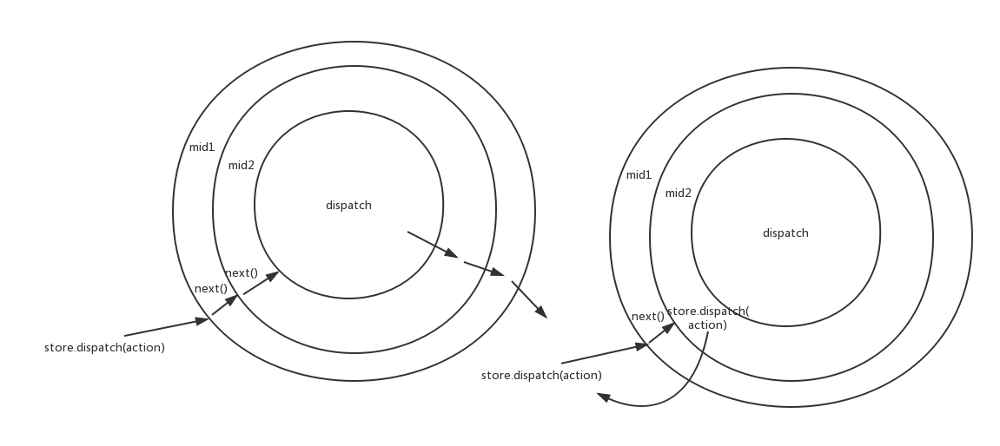

# Redux
Redux本身把自己定位成"可预测的状态容器"。



## Redux三大原则：

1. **单一数据源**
 
 好处是整个应用状态都保存在一个对象中，随时可以提取出整个应用的状态进行持久化。Redux提供的工具函数`combineReducers`解决了单一数据源可能会产生一个特别庞大的JavaScript对象。
 
2. **状态是只读的**

  在Redux中会定义个reducer, 功能是根据当前触发的action对当前应用的state进行迭代。

3. **状态修改由纯函数完成**

  Flux中，在actionCreator里调用AppDispatcher.dispatch方法来触发action,这样不仅会有冗余的代码，还因为直接修改了store中的数据，将导致无法保存每次数据变化前后的状态。Redux中采用纯函数来编写reducer，无函数副作用。
  
## Redux核心API

Flux的核心思想之一是**不直接修改数据，而是分发一个action来描述发生的变化**。在Redux中，负责响应action并修改数据的角色是**reducer**。

```js
//MyReducer.js

const initialState = {
  todos: [],
};


//todos这个reducer在第一次执行时，会返回{ todos: [] }作为初始化状态  
function todos(previousState = initialState, action) {
  switch(action.type) {
    case 'xxx': {
      //具体的业务逻辑
    }
    
    default: 
      return previousState;
  }
}
```

Redux最核心的API —— **createStore**，通过`createStore`方法创建一个store对象，它本身包含4个方法：

* `getState()`: 获得当前的状态；
* `dispatch(action)`: 分发一个action, 并返回这个action,这是唯一改变store中数据的方式。
*  `subscribe()`: 注册一个监听者，它在store发生变化时被调用。
*  `replaceReducer()`: 更新当前store中的reducer。

## 与React绑定

react-redux提供了一个组件和一个API帮助Redux和React绑定，一个是`<Provider/>`，一个是`connect()`.（据说只是语法糖，抽空研究下源码), `<Provider/>`接收store作为props, 它是整个Redux应用的顶层组件（类似于Flux中的controller-view ?), `connect()`提供了在React应用中的任意组件中获取store中数据的功能。

## Redux middleware

> It provides a third-party extension point between dispatching an action, and the moment it reaches the reducer.

### 为什么会有middleware

在同步数据流动场景中，点击button,在回调中分发action,reducer收到action后，更新state并通知view重新渲染，单向数据流，看起来没什么问题。 **但是，如果需要打印出每一个action信息来调试，就要去改`dispatch`或者`reducer`的实现。或者我们需要`dispatch`或者`reducer`具有异步请求的功能**，面对多样的业务，单单修改`dispatch`或者`reducer`不具普适性，我们需要可以组合的、自由插拔的插件机制。**Redux中`reducer`更关心的是数据的转化逻辑，middleware是为了增强`dispatch`出现的**。



### 理解middleware机制

Redux提供了applyMiddleware方法来加载middleware,源码如下：

```js

import compose from './compose';

export default function applyMiddleware(...middlewares) {
  return (next) => (reducer, initialState) => {
    let store = next(reducer, initialState);
    let dispatch = store.dispatch;
    let chain = [];
    
    var middlewareAPI = {
      getState: store.getState,
      dispatch: (action) => dispatch(action),
    };
    
    chain = middlewares.maps( middleware => middleware(middlewareAPI) );
    dispatch = compose(...chain)(store.dispatch);
    
    return {
      ..store,
      dispatch,
    };
  }
}
```

`applyMiddleware`代码虽然很少，但却使用函数式编程思想写的非常精炼。

接下来看一个`logging middleware`的实现：

```js

export default store => next => action => {
  console.log('dispatch:', action);
  next(action);
  console.log('finish', action);
}

```

接下来分四步来深入解析middleware的运行原理。

#### 1.函数式编程思想设计

middleware的设计是层层调用的匿名函数，这用到了函数式编程中的**currying**, 它是一种使用匿名函数来实现多参数函数的方式。`applyMiddleware`会对logger middleware进行层层调用，动态将store和next进行复制。

**currying结构的middleware的好处**:

* **易串联**: currying函数剧中延迟执行的特性，通过不断currying形成的middleware可以累积参数，再配合组合(compose)的方式，很容易形成pipeline来处理数据流。
* **共享store**: 在`applyMiddlware`执行的过程中，因为闭包的存在（TODO:这个闭包体现在哪里）,applyMiddleware完成后，所有的middleware内部拿到的store是最新且相同的。

另外，因为`applyMiddleware`的结构也是一个多层currying的函数。借助`compose`, `applyMiddleware`可以用来和其他插件来加强`createStore`函数:

```js

import { createStore, applyMiddleware, compose } from 'Redux';
import rootReducer from '../reducers';
import DevTools from '../containers/DevTools';

const finalCreateStore = compose(
  //在开发环境中使用的middleware
  applyMiddleware(d1, d2, d3),
  //启动Redux DevTools
  DevTools.instrument()
)(createStore);
```

#### 2. 给middleware分发store

通过下列方式创建一个普通的store:

```js
let newStore = applyMiddleware(mid1, mid2, mid3, ...)(createStore)(reducer, null)
```

我们可以看到`applyMiddleware`利用`createStore`和`reducer`创建了一个store。而store的`getState`方法和`dispatch`方法又分别被直接和间接地赋值给middlewareAPI变量store:

```js
const middlewareAPI = {
  getState: store.getState,
  dispatch: (action) => dispatch(action),
}

chain = middlewares.map(middleware => middleware(middlewareAPI));
```

然后，让每个middleware带着middlewareAPI这个参数分别执行一遍。执行完后，获得chain数组[f1, f2, ..., fx, ..., fn], 它保存的对象是第二个箭头函数返回的匿名函数。因此在第二个匿名函数中访问`store`形成了闭包，即每个匿名函数都可以访问相同的`store`，这里指middlewareAPI.

> **middlewareAPI** 中的`dispatch`为什么要用匿名函数包裹？

我们使用`applyMiddleware`是为了改造`dispatch`，所以`applyMiddleware`执行完后，`dispatch`是变化了的，middlewareAPI是`applyMiddleware`执行中分发到各个middleware的，所以必须使用匿名函数包裹`dispatch`，利用闭包的特性，只要`dispatch`更新了，`middlewareAPI`中的`dispatch`应用也会发生变化。

#### 3. 组合串联middleware

这一层只有一行代码，是applyMiddleware的精华所在：

```js
dispatch = compose(...chain)(store.dispatch);
```

`compose`是函数式编程中的组合，它将chain中所有匿名函数[f1, f2, ..., fx, ..., fn]组装成一个新的函数，即新的dispatch。当新的dispatch执行时，[f1, f2, ..., fx, ..., fn]从左到右依次执行。Redux中`compose`的实现是这样的：

```js
function compose(...funcs) {
  return arg => funcs.reduceRight((composed, f) => f(composed), arg);
}
```

`compose(...funcs)`返回的是一个匿名函数，其中funcs就是chain数组，当调用reduceRight时，依次从funcs数组的右端取一个函数fx拿来执行，fx的参数composed就是前一次f(x+1)执行的结果。注意，第一次执行的fn(n代表chain的长度)的参数arg就是`store.dispatch`.所以当compose执行完后，我们得到的`dispatch`的这样的，假设n=3:

```js
dispatch = f1(f2(f3(store.dispatch))));
```

#### 4. 在middleware中调用dispatch会发生什么

经过compose后，所有的middleware算是串联起来了。
> 但是还有一个问题，在分发store时，每个middleware都可以访问store,即middlewareAPI这个变量，也可以拿到store.dispatch属性。那么，在middleware中调用store.dispatch()会发生什么，和调用next()有区别？

```js
const logger = store => next => action => {
  console.log('dispatch', action);
  next(action);
  console.log('finish', action);
}

const logger = store => next => action => {
  console.log('dispatch', action);
  store.dispatch(action);
  console.log('finish', action);
}
```

 之前分发store到middlewareAPI时已经解释过，middleware中store的dispatch通过匿名函数的方式和最终的compose结束后的新dispatch保持一致。所以，在middleware中调用store.dispatch()和在其他任何地方调用的效果一样。而在middleware中调用`next()`，效果是进入下一个middleware。
 
 
 
 如果某个middleware使用`store.dispatch(action)`来分发action,就会出现右图所示情况，相当于重新来一遍。如果这个middleware一直调用`store.dispatch(action)`,就会形成无限循环。
 
> 那么middlewareAPI中的`dispatch`的用武之地在哪里？

在middleware中使用`dispatch`的场景一般是接受到一个定向action, 这个action并不希望到达发生的分发action, 往往用在异步请求的需求里。(书中这里讲了**Redux Thunk和一个异步请求getThenShow的例子，看完Redux异步流后回看**)

## Redux异步流

TODO: 这里讲的太深了，先跳过。实际中需要学习异步时再看。


