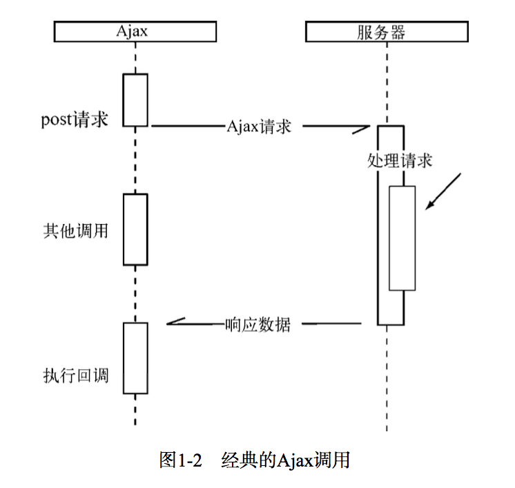
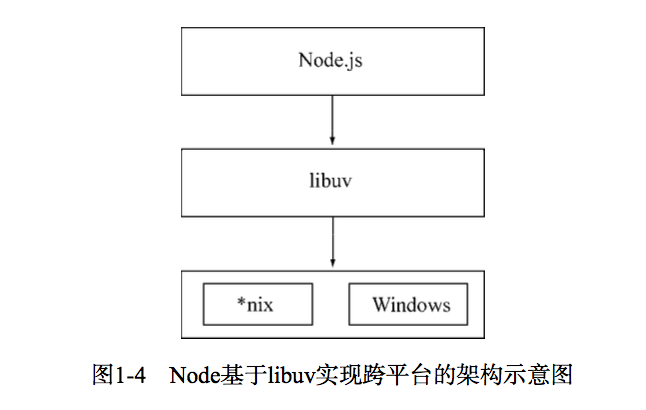
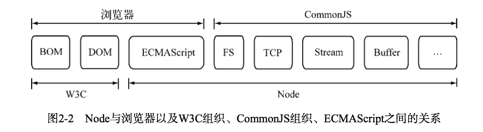
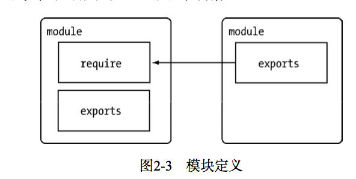

# node简介
node.js不是一个JavaScript应用程序，而是一个JavaScript运行环境，使用C++编写，基于V8引擎。

node特点：

* 异步I/O

 

* 事件与回调函数

Ajax异步提交的服务器端处理过程。

```js
var http = require('http');
var querystring = require('querystring');

//侦听服务器的request事件
http.createServer(function(req, res) {
  var postData = '';
  res.setEncoding = 'utf8';
  
  //侦听请求的data事件
  req.on('data', function(trunk) {
    postData += trunk;
  });
  //侦听请求的end事件
  req.on('end', function(){
    res.end(postData);
  });
}).listen(8080);
console.log('服务器启动完成');


//相应的前端ajax请求绑定了success事件
$.ajax({
  'url': '/url',
  'method': 'POST',
  'data': {},
  'success': function(data) {
    //success事件
  }
});
```
JavaScript中将函数作为第一等公民来对待，可以将函数作为对象传递给方法作为实参进行调用，所以回调函数无处不在。

* 单线程

好处：不用像多线程编程处处在意状态的同步问题，没有死锁，没有线程上下文切换带来的性能开销。

弱点：
	1. 无法利用多核CPU.
	2. 错误会引起整个应用程序退出，健壮性值得考验.
	3. 大量计算占用CPU导致无法继续调用异步I/O.

* 跨平台



# node应用场景
毫无疑问，IO密集型node非常强，因为Node面向网络并且擅长执行并行IO，能够有效的组织起更多的硬件资源。

对于CPU密集型的应用，其实v8的深度优化导致计算能力实际上很强，只不过js为单线程应用，长时间计算会阻塞而已，但是通过拆分分解还是不错的。可以使用一些c++的扩展方式，或者通过子进程将一部分的node进程当做常驻服务进行计算。

所以CPU密集型不可怕，合理的调度才是诀窍

# 模块机制
## commonJS的出发点
对于JavaScript自身而言，他的规范依然薄弱，有以下缺陷：

* 没有模块系统
* 标准库较少。对去文件系统，I/O流等没有标准API。W3C标准化推进仅限于浏览器端。
* 没有标准接口
* 缺乏包管理系统。


##commonJS的模块规范
### 模块引用
```js
var math = require('math');
```
require()方法接收模块标识，引入一个模块的API到当前上下文中。
### 模块定义
Node中，一个文件是一个模块，模块中存在一个module对象，代表模块本身。exports是module的属性，exports对象用于到处当前模块的方法或变量。

exports和module.exports内部大概是这样:
```
exports = module.exports = {};
```  

* exports是module.exports的一个引用

* require引用模块后，返回给调用者的是module.exports而不是exports

* `exports.xxx=`相当于在导出对象上挂属性，该属性对调用模块直接可见

* `exports =`相当于给exports对象重新赋值，调用模块不能访问exports对象及其属性

* 如果此模块是一个类，就应该直接赋值`module.exports`，这样调用者就是一个类构造器，可以直接new实例


### 模块标识
require()方法的参数，必须是符合小驼峰明明的字符串，以.、..开头的相对路径，或者绝对路径，可以没有文件后缀名.js。

模块的意义：**将类聚的方法和变量等限定在私有的作用域上，支持引入和导出功能来连接上下文依赖。**

## node模块实现
node引入模块经历步骤：

  1. 路径分析
  2. 文件定位
  3. 编译执行
  
### 路径分析  
node模块路径的生成规则,与JavaScript的原型链或作用域链的查找方式类似：

* 当前文件目录下的node_modules目录。
* 父目录下的node_modules目录。
* 沿路径向上逐级递归，直到根目录下的node_modules目录。

### 文件定位
require()中文件扩展名：

* 诀窍一：如果是.node和.json文件，在传递给require()的标识符中带上扩展名，会加快速度。
* 诀窍二: 同步配合缓存，可以大幅度缓解Node单线程中阻塞式调用的缺陷。

### 模块编译
在Node的API文档中，每个模块存在require, exports, module, __filename, __dirname这些变量, 但是在模块文件中并没有定义,这些变量从何而来？
> 在编译的过程中，Node对获取的JavaScript文件内容进行了头尾包装。
> 头部添加了:`(function (exports, require, module, __filename, __dirname) {\n`
> 尾部添加了:`\n});`

## 包与NPM
包的结构目录：

* package.json: 包描述文件。
* bin: 用于存放可执行二进制文件的目录。
* lib: 用于存放js代码的目录。
* doc: 用于存放文档的目录。
* test: 用于存放单元测试用例的代码。

包描述文件(package.json):

* name: 小写字母和数字
* description
* version
* keywords: 数组，帮助别人搜索。
* maintainers: 维护者列表。NPM通过该属性进行权限认证。[{"name":"qixin","email":"xx@qq.com","web":"cc.com"}]
* contributors: 贡献者列表，格式同上。
* bugs: 反馈bug的网页或者邮件地址。
* licenses
* repositories: 源代码位置。
* dependencies: 依赖的包列表。非常终于熬，NPM通过这个属性自动加载依赖的包。
* homepage
* os: 支持的os列表。
* cpu: 支持的cpu列表。
* engine: 支持的js引擎列表。
* builtin：是否是内建在底层系统的标准组件。
* directories: 包目录说明。
* implements: 实现规范列表。
* scripts: 脚本说明对象。包含了install，uninstall，test等等，这其实是个`钩子命令`，在执行install的时候，preinstall指向的会被先触发。

NPM多了4个字段：

* author
* bin: 这个字段设置了之后就可以作为命令行工具使用。
* main: 模块引入方法`require()`在引入包时，会优先检查这个字段，并将其作为包中其余模块的入口。如果不存在这个字段，`require()`方法会查找包目录下的`index.js`、`index.node`、`index.json`文件作为默认入口。
* devDependencies: 开发时需要的依赖。

NPM实际上是CommonJS包规范的一种实践。

## 前后端共用模块
浏览器端的js需要经历从同一个服务器端分发到多个客户端执行，服务器端js则是相同的代码需要多次执行。**前者的瓶颈在于带宽，后者的瓶颈则在于CPU和内存等资源。**前者需要通过网络加载代码，后者从磁盘中加载，加载速度不在一个量级。

### AMD规范
AMD需要define方法来申明一个模块，并且在申明的时候得将依赖都写进去。

CMD的话就更类似Conmonjs了，使用的时候再进行require就行了。


  

  